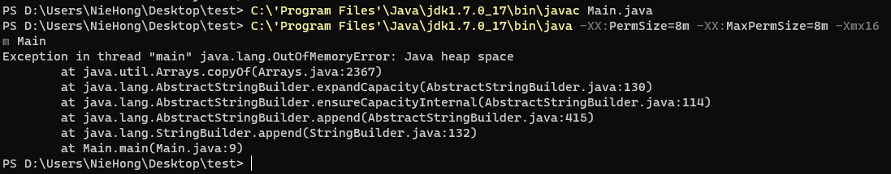

# JVM

## 前言

### JVM是什么？

​		广义上指的是一种规范，狭义上的是JDK中的JVM虚拟机（Hotspot、zing、j9等等）。


### 为什么要学习JVM？

- 面试高频考点。
- 研发中重难点问题与总会与JVM有关系。例如：线程死锁、内存溢出、项目性能优化等等。
- 基础不牢，地动山摇：想深入掌握Java这门语言，JVM是始终绕不过去的那座大山，早晚得攀登。


### 怎么学习JVM？

​	JVM基本常识→类加载系统→运行时数据区→一个对象的一生→GC收集器→实战


### JAVA与JVM的关系


## 类加载系统

### 		类加载器

> JVM的类加载是通过ClassLoader及其子类来完成的。

​		

​		**启动类加载器(BootstrapClassLoader)：**负责加载JAVAHOMElib目录的或通过-Xbootclasspath参数指定路径中的且被虚拟机认可（rt.jar）的类库。

​		**扩展类加载器(ExtensionClassLoader)：**负责加载JAVAHOMEilib.ext目录或通过iava.ext.dirs系统变量指定路径中的类库。

​		**应用程序类加载器(ApplicationClassLoader)：**负责加载用户路径classpath上的类库。

​		**自定义类加载器（User ClassLoader)：**加载应用之外的类文件，举个栗子：JRebel。


### 执行顺序

​	1.检查顺序是自底向上：加载过程中会先检查类是否被已加载，从Custom到BootStrap逐层检查，只要某个类加载器已加载就视为此类已加载，保证此类所有ClassLoader只加载一次。

​	2.加载的顺序是自顶向下：也就是由上层来逐层尝试加载此类。

​	


### 加载时机与过程

#### 类加载的四时机

- 遇到new、getStatic、putStatic、invokeStatic四条指令时。

- 02-使用java.lang.reflect包方法时，对类进行反射调用。

- 03-初始化一个类时，发现其父类还没初始化，要先初始化其父类。

- 04-当虚拟机启动时，用户需要指定一个主类main,需要先将主类加载。

  

#### 一个类的一生(类的生命周期) 


#### 类加载做了什么

- 类全限定名称 		→二进制字节流加载class文件

- 字节流静态数据	 →方法区（永久代，元空间)

- 创建字节码Class对象

  

#### 类加载途径

1. jar/war
2. jsp生成的class
3. 数据库中的二进制字节流
4. 网络中的二进制字节流
5. 动态代理生成的二进制字节流


## 双亲委派模型与打破双亲委派

### 	什么是双亲委派？

- **当一个类加载器收到类加载任务，会先交给父类加载器去完成。**因此，最终加载任务都会传递到顶层的启动类加载器，**只有当父类加载器无法完成加载任务时，子类才会尝试执行加载任务。**


### 为什么需要双亲委派？

- 主要考虑安全因素，双亲委派可以避免重复加载核心的类，当父类加载器已经加载了该类时，子类加载器不会再去加载。

  ​	比如：要加载位于rt.jar包中的类java.lang.Object,不管是哪个加载器加载，最终都委托给顶层的启动
  类加载器进行加载，这样就可以保证使用不同的类加载器最终得到的都是同样的Object对象。


### 为什么还需要打破双亲委派？

- 在实际应用中，**双亲委派解决了Java基础类统一加载的问题，但是却存在着缺陷。** JDK中的基础类作为典型的API被用户调用，但是也存在**API调用用户代码**的情况，典型的如：SPI代码。这种情况就需要打破双亲委派模式。

  > Java SPI（Service Provider Interface）是Java提供的一个标准框架，允许模块化应用程序的扩展点由第三方实现。在实践中，这通常意味着开发人员可以插入自定义的实现到现有的系统中。 在Java SPI中，服务提供商是一个实现了特定接口或抽象类的类，并且在资源包的 META-INF/services 文件夹下的文本文件中声明了自己的存在。 当客户端应用程序需要使用某个功能时，它可以通过ServiceLoader类从资源包中查找并加载所有已注册的服务提供商。客户端可以选择其中一个提供商进行操作，也可以遍历所有的提供商并根据需要选择不同的提供商。 Java SPI的主要优点是它提高了模块化的程度，使得第三方能够轻松地添加自己的实现，而无需更改现有代码。此外，由于所有提供商都是通过相同的接口进行交互的，因此客户端应用程序可以在不修改代码的情况下切换提供商，从而增强了系统的灵活性和可扩展性。
  >
  > 代码示例：
  >
  > ```java
  > // 1、 首先，我们需要定义一个接口
  > package com.example.spi;
  > 
  > public interface ExampleService {
  >     String sayHello(String name);
  > }
  > 
  > // 2、 然后，我们创建两个实现了该接口的服务提供者
  > // Service Provider A
  > package com.example.spi.provider.a;
  > 
  > import com.example.spi.ExampleService;
  > import com.example.spi.ServiceProvider;
  > 
  > @ServiceProvider("providerA")
  > public class ExampleServiceProviderA implements ExampleService {
  > 
  >     @Override
  >     public String sayHello(String name) {
  >         return "Hello from provider A: " + name;
  >     }
  > }
  > 
  > // Service Provider B
  > package com.example.spi.provider.b;
  > 
  > import com.example.spi.ExampleService;
  > import com.example.spi.ServiceProvider;
  > 
  > @ServiceProvider("providerB")
  > public class ExampleServiceProviderB implements ExampleService {
  > 
  >     @Override
  >     public String sayHello(String name) {
  >         return "Hello from provider B: " + name;
  >     }
  > }
  > 
  > // 3、 最后，我们可以通过ServiceLoader来加载并使用这些服务提供者
  > import java.util.ServiceLoader;
  > 
  > import com.example.spi.ExampleService;
  > 
  > public class Main {
  > 
  >     public static void main(String[] args) {
  >         ServiceLoader<ExampleService> serviceLoader = ServiceLoader.load(ExampleService.class);
  > 
  >         for (ExampleService exampleService : serviceLoader) {
  >             System.out.println(exampleService.sayHello("World"));
  >         }
  >     }
  > }
  > ```
  >
  > 

  如：数据库驱动DriverManager。以Driver接口为例，Driver接口定义在JDK中，**其实现由各个数据库的服务商来提供**，**由系统类加载器加载。**这个时候就需要**启动类加载器**来**委托**子类来加载其Driver的实现，这就破坏了双亲委派。


### 如何破坏双亲委派？

1. 重写ClassLoader的loadClass方法。

2. SPI，父类委托子类加载器加载Class，一数据库驱动DriverManager为例。

3. 热部署和不停机更新用到的OSGI技术。

   > Java OSGi（Open Services Gateway Initiative）是一种Java框架，用于开发模块化应用程序和服务。它的主要目标是在Java环境中实现动态发现、安装、更新和卸载模块化组件的能力。 OSGi的核心思想是将应用程序划分为一组相互独立的模块，每个模块都可以独立地加载、更新和卸载，而不会影响其他模块。这种模块化的设计方式使得开发者可以根据需要动态地组合和拆分应用程序的功能，从而提高软件的可维护性和灵活性。 在OSGi环境中，每个模块都被封装在一个名为Bundle的小型容器中，Bundle之间通过接口进行通信，并且可以在运行时动态地安装、启动、停止、更新和卸载。同时，OSGi还提供了丰富的服务机制，允许Bundle之间共享数据和功能，从而实现更复杂的交互。 Java OSGi的应用非常广泛，包括移动设备、嵌入式设备、物联网设备、云计算平台等许多领域。它的优势在于能够极大地简化软件的开发、部署和维护过程，并且能够很好地支持模块化的架构设计。


## 运行时数据区

​	整个JVM构成里面，主要分为三部分组成：类加载系统、**运行时数据区**、执行引擎。 

​	按照线程使用情况和职责分成两大类：

​		- 线程独享(程序执行区域)：虚拟机栈、本地方法栈、程序计数器。【不需要垃圾回收】

		- 线程共享(数据存储区域)：堆和方法区、储存类的静态数据和对象数据。【需要垃圾回收】


### 堆

​	Java堆在jvm启动时创建内存区域去实现对象、数组与运行时常量的内存分配，它是虚拟机管理最大的，也是垃圾回收的主要内存区域。

**内存划分：** **核心逻辑就是三大假说，基于程序运行情况进行不断的优化设计。**


### 虚拟机栈

> Java虚拟机栈，也被称为Java栈，是每个线程在创建时都会生成的一个区域。它主管Java程序的运行，保存方法的局部变量、部分结果，并参与方法的调用和返回。具体来说，每当有一个新的Java方法调用发生时，JVM就会在该线程的虚拟机栈中生成一个新的栈帧（Stack Frame）来存储这个方法的局部变量等信息。
>
> 这个栈的特点是快速有效的分配存储方式，访问速度仅次于程序计数器。JVM对Java栈的操作只有两个：每个方法执行时伴随着进栈（入栈、压栈），以及执行结束后的出栈工作。需要注意的是，对于栈来说不存在垃圾回收问题GC，但存在内存溢出问题OOM。

#### 栈帧是什么？

​	栈帧(Stack Frame)是用于支持虚拟机进行方法执行的数据结构。

​	栈帧存储了方法的<font color=#FF0000>**局部变量表、操作数栈、动态连接和方法返回地址**</font>等信息。每一个方法从调用至执行完成的过程，都对应着一个栈帧在虚拟机栈里从入栈到出栈的过程。

​	栈内存为线程私有的空间，每个线程都会创建私有的栈空间，生命周期与线程相同，每个Java方法在执行的时候都会创建一个栈帧(Stack Frame)。栈内存大小决定了方法调用的深度，栈内存过小则会导致方法调用的深度较小如递归嗲用的次数较少。


#### 当前栈帧

​	一个线程中方法的调用链可能会很长，所以会有很多栈帧。只有位于jvm虚拟机栈栈顶的元素才是有效的，即称为**当前栈帧**，与这个栈帧相关连的方法称为当前方法，定义这个方法的类叫做当前类。

​	执行引擎运行的所有字节码指令都只针对当前栈帧进行操作。如果当前方法调用了其它方法，或者当前方法执行结束，那这个方法的栈帧就不再是当前栈帧了。


#### 什么时候创建栈帧？

​	调用新的方法时，新的栈帧也会随之创建。并且随着程序控制权移到新方法，新的栈帧成为了当前栈帧。方法返回之际，原栈帧会返回方法的执行结果给之前的栈帧(返回给方法调用者)，随后虚拟机将会丢弃此栈帧。


#### 栈异常的两种情况

- 如果线程请求的栈深度大于虚拟机所允许的深度(Xss默认1m)，会抛出StackOverflowError异常。
- 如果在创建新的线程时，没有足够的内存去创建对应的虚拟机栈，会抛出OutOfMemoryError异常【不一定】


### 本地方法栈

​	本地方法栈和虚拟机栈相似，区别就是虚拟机栈为虚拟机执行Java服务(字节码服务)，而本地方法栈为虚拟机使用到的**Native**方法(比如C++方法)服务。

> Java Native Interface (JNI) 是一种框架，允许 Java 代码与其他语言（如 C、C++ 和汇编语言）编写的代码交互。它的主要作用包括：
>
> 1. 访问特定平台的功能：通过 JNI，Java 程序可以在不同的平台上访问特定的操作系统功能。
> 2. 提高性能：对于计算密集型任务，使用 JNI 可以比使用纯 Java 代码更快地执行。
> 3. 调用现有库：使用 JNI，Java 程序可以调用现有的 C 或 C++ 库，从而复用已有的代码和技术。
>
> 总之，Java Native Interface 使得 Java 程序能够更好地与底层操作系统交互，从而提供了更高的灵活性和性能。


### 方法区

​	方法区(Method Area) 是可供各个线程共享的运行时内存区域，方法区本质上是Java语言编译后代码储存区域，它储存每一个类的结构信息，例如：**运行时常量池**、成员变量、方法数据、构造方法和普通方法的字节码指令等内容。

方法区的具体实现有两种：永久代(PermGen)、元空间(MetaSpace)

#### 方法区存储什么数据？

	

主要有如下三种类型

- 第一：Class
  1. 类型信息，比如Class(com.demo.User类)。
  2. 方法信息，比如Method(方法名称、方法参数列表、方法返回值信息)。
  3. 字段信息，比如Field(字段类型，字段名称需要特殊设置才能保存得住)。
  4. 类变量(静态变量)：JDK1.7之后，转移到堆中存储。
  5. 方法表(方法调用的时候)  在A类的main方法中却调用B类的method1方法，是根据B类的方法表去查找合适的方法，进行调用的。


- 第二：运行时常量池(字符串常量池)：从class的常量池加载而来，JDK1.7之后，转移到堆中储存
  - 字面量类型
  - 引用类型 -> 内存地址


- 第三：JIT编辑器编译之后的代码缓存


如果需要访问方法区中类的其它信息，都必须先获得Class对象，才能去访问该Class对象关联的方法信息或者字段信息。


#### 永久代和元空间的区别是什么？

1. JDK1.8之前的方法区实现是**永久代**，jdk1.8及以后使用的方法区实现是元空间。
2. **储存位置不同**
   - **永久代**所使用的内存区域是**JVM进行所使用的区域**，他的大小受整个jvm的大小所限制。
   - **元空间**所使用的内存区域是物理内存区域。那么元空间的使用大小只会受物理内存大小的限制。
3. **存储内容不同**
   - 永久代储存的信息基本上就是上面方法区存储内容中的数据。
   - 元空间只存储类的元信息，而**静态变量和运行时常量池都挪到堆中。**


#### 为什么要使用元空间来代替永久代？

1. 字符串存在永久代中，容易出现性能问题和永久代内存溢出。
2. 类及方法的信息等比较难确定其大小，因此对于永久代的大小指定比较困难，太小容易出现永久代溢出，太大则容易导致老年代溢出。
3. 永久代会为GC带来不必要的复杂度，并且回收效率偏低。
4. Oracle计划将HotSpot与JRockit合二为一。

> HotSpot和JRockit都是Java虚拟机的实现。其中，HotSpot是由Sun Microsystems开发并被Oracle收购的，而JRockit则是由BEA Systems开发，后来也被Oracle收购。在Oracle收购BEA之后，原本打算将JRockit的功能整合进HotSpot，但由于两者的架构差异太大，只有一部分优秀的功能被整合到了HotSpot中。 目前，HotSpot已经成为Oracle官方推荐使用的Java虚拟机，并且是OpenJDK项目的参考实现。而JRockit则已经停止维护和发展，已经被HotSpot取代。 HotSpot采用的是热点编译的方式，即首次运行代码时使用解释器不编译，但当同一段代码被执行多次时，则以方法为单位编译成字节码。而JRockit则采用了一种名为“即时编译”的方式，它可以立即把字节码编译成本地机器码，并且可以在后台持续优化代码。 总的来说，虽然HotSpot和JRockit都是Java虚拟机的实现，但它们之间存在一些技术上的差异和优缺点，最终导致了Oracle选择了HotSpot作为其主要的Java虚拟机发展路线。

#### 字符串OOM异常案例

```java
import java.util.ArrayList;
import java.util.List;

public class Main {
    public static void main(String[] args) {
        String base = "string";
        List<String> list = new ArrayList<String>();
        for (int i = 0; i < Integer.MAX_VALUE; i++) {
            String str = base + base;
            base = str;
            list.add(str.intern());
        }
    }
}
```

> `intern()`方法是Java中字符串类的一个方法，用于将字符串对象添加到全局字符串池中。全局字符串池是一个由Java虚拟机维护的内存区域，其中存储了所有已经创建的字符串对象。当一个字符串对象被创建时，如果它与全局字符串池中的某个对象相等（即它们的内容相同），那么Java虚拟机就会返回那个对象的引用，而不是创建一个新的对象。 `intern()`方法的具体使用场景包括：
>
> 1. 优化内存使用：如果你需要频繁地比较字符串，那么使用`intern()`方法可以减少内存使用。因为全局字符串池中的对象是共享的，所以如果你创建了两个内容相同的字符串对象，那么它们实际上指向的是同一个对象，而不是两个不同的对象。这样可以节省内存，并且在比较字符串时也可以更快地找到匹配的对象。
> 2. 提高性能：如果你需要在多个地方使用同一个字符串，那么使用`intern()`方法可以提高性能。因为全局字符串池中的对象是共享的，所以如果你在多个地方使用同一个字符串，那么Java虚拟机就可以直接返回那个对象的引用，而不需要每次都创建一个新的对象。这样可以减少对象的创建和销毁，从而提高性能。
> 3. 一致性：如果你需要确保字符串的唯一性，那么使用`intern()`方法可以确保字符串的唯一性。因为全局字符串池中的对象是共享的，所以如果你创建了两个内容相同的字符串对象，那么它们实际上指向的是同一个对象，而不是两个不同的对象。这样可以确保字符串的唯一性，避免在不同的地方使用相同的字符串导致的问题。
>
> 需要注意的是，`intern()`方法并不是所有的字符串对象都可以调用的，只有那些由字符串字面量创建的字符串对象才能调用`intern()`方法。例如，`"hello".intern()`是有效的，而`new String("hello").intern()`是无效的。


程序运行截图：

JDK1.6：


JDK1.7:



JDK1.8


#### 字符串常量池

##### 	三种常量池

1. **class文件常量池：一个class文件只有一个class常量池**
   - 字面量：int、float、long、double、双引号字符串等。
   - 符号引用：Class、Method、Field等。
2. **运行时常量池：一个class对象有一个运行时常量池**
   - 字面量：int、float、long、double、双引号字符串等。
   - 符号引用：Class、Method、Field等。
3. **字符串常量池：全局只有一个字符串常量池**
   - 双引号引起来的字符串值。


##### 字符串常量池存储数据的方式

​	字符串常量池使用的是StringTable的数据结构储存数据，类似于HashTable(哈希表)

> 哈希表(散列表) 示根据关键码值(K-V)而直接进行访问的数据结构。本质上就是数组+链表


##### 字符串常量池案例

```java

public class Main {
    public static void main(String[] args) {
        testString();
    }

    private static void testString() {
        String s1 = "abc";
        String s2 = new String("abc");
        System.out.println("s1 == s2:" + (s1 == s2));

        String s3 = new String("abc");
        System.out.println("s3 == s2:" + (s3 == s2));

        String s4 = "a" + "b";
        System.out.println("s4 == ab:" + (s4 == "ab"));

        String str1 = "a";
        String str2 = "b";
        String str6 = str1 + str2;// 运行期确定的
        System.out.println("str6 == ab:" + (str6 == "ab"));


        String str7 = "abc".substring(0,2);// 运行期确定的
        System.out.println("str7 == ab: " + (str7 == "ab"));

        String str8 = "abc".toUpperCase();// 运行期确定的
        System.out.println("str8 toUpperCase: " + (str8 == "ABC"));

        String s5 = "a";
        String s6 = "abc";
        String s7 = s5 + "bc";// s7字符串的内存地址是堆当中的
        System.out.println(s6 == s7.intern());// 调用方法后动态添加到字符串常量池中，也就是指向了s6的引用地址
    }
}
```

 **结论：**

- 单独使用""引号创建的字符串都是常量，编译器就已经确定存出到StringPool中。
- 使用new String("")创建的对象会储存到heap中，是运行期新创建的。
- 使用只包含常量的字符串连接符如"aa" + "bb"创建的也是常量，编译器就能确定已经储存到StringPool中。
- 使用包含变量的字符串连接如"aa" + s创建的对象是运行期才创建的，存储到heap中。
- 运行期调用String的intern()方法可以向String Pool中动态添加对象。


### 程序计数器

​		**程序计数器，也叫PC寄存器，**当前线程所执行的字节码指令的行号指示器。

> ​		JVM程序计数器（Program Counter Register）是一块较小的内存区域，是每个线程私有的。它是一块非常小的内存空间，通常只有几个字节，用于存储当前线程所执行的字节码的行号指示器。
>
> 当一个线程被创建时，JVM就会为该线程创建一个程序计数器，并且每个方法执行时都会使用这个计数器。每当线程调用一个方法时，JVM就会将程序计数器的值设置为该方法所在的位置，然后开始执行该方法。在方法执行过程中，每当执行完一条指令后，程序计数器的值就会自动加1，指向下一条要执行的指令。
>
> 需要注意的是，程序计数器是线程私有的，因此每个线程都有自己的程序计数器。此外，程序计数器是一个非线程安全的内存区域，因此在多线程环境下需要特别注意对其进行同步操作。


#### 为什么需要程序计数器？

- 线程切换(系统上下文切换)后准备恢复执行位置	


#### 存什么数据？

- Java方法：记录虚拟机字节码指令地址
- Native方法：记录为空


### 直接内存

​	**直接内存不是虚拟机运行时数据区的一部分，也不是《Java虚拟机规范》中定义的内存区域。**

​	在JDK1.4中，新加入了NIO，引入了Channel和Buffer的IO方式，可以使用native方法直接分片对外内存，然后通过**DirectByteBuffer** 对象可以操作直接内存


#### 为什么需要直接内存？

​	性能优于Java堆

> ​	直接内存并不属于JVM的内存结构，它是物理机的内存，但是JVM虚拟机可以调用该部分内存。直接内存是在Java堆外的、直接向系统申请的内存空间，通常用于数据缓冲区。它来源于NIO，通过存在堆中的DirectByteBuffer操作Native内存。
>
> 访问直接内存的速度会优于Java堆，原因在于虚拟内存读写都要经历从用户态到内核态的过程，将虚拟内存映射到物理内存，而直接内存就省略了此过程，所以速度较快。


#### 直接内存和堆内存比较

从数据流的角度看：

- ​	非直接内存作用链： 本地IO ->直接内存->分直接内存->本地IO
- ​	直接内存作用链： 本地IO->直接内存->本地IO


#### 直接内存的使用场景

- 有很大的数据需要存储，他的生命周期很长
- 适合频繁的IO操作，例如：网络并发场景


**案例：**

```java
    /**
     * 堆内存与直接内存分配空间比较
     * 结论：在数据量提升时，直接内存相比非直接内存的空间申请，有很严重的性能问题
     */
    private static void compareMemoryAllocate() {
        long st = System.currentTimeMillis();
        int count = 1000 * 10000;
        for (int i = 0; i < count; i++) {
            // 分配一个新的字节缓冲区(堆内存)
            ByteBuffer buffer = ByteBuffer.allocate(2);
        }

        long et = System.currentTimeMillis();
        System.out.println("非直接内存，执行" + count + "次，耗时：" + (et - st) + "ms");

        st = System.currentTimeMillis();
        for (int i = 0; i < count; i++) {
            ByteBuffer buffer = ByteBuffer.allocateDirect(2);
        }
        et = System.currentTimeMillis();
        System.out.println("直接内存，执行" + count + "次，耗时：" + (et - st) + "ms");
    }

    /**
     * 堆内存与直接内存读写性能比较
     * 结论：在频繁的读写时，直接内存的读写比非直接内存的读写更快
     */
    private static void compareMemoryReadWrite() {
        long st = System.currentTimeMillis();
        int count = 10000 * 100000;
        ByteBuffer allocate = ByteBuffer.allocate(count * 2);
        for (int i = 0; i < count; i++) {
            allocate.putChar('A');
        }
        // 切换读模式
        allocate.flip();

        for (int i = 0; i < count; i++) {
            allocate.getChar();
        }

        long et = System.currentTimeMillis();
        System.out.println("非直接内存进行2亿次的读写操作，总共耗时：" + (et - st) + "ms");


        st = System.currentTimeMillis();
        allocate = ByteBuffer.allocateDirect(count * 2);
        for (int i = 0; i < count; i++) {
            allocate.putChar('A');
        }
        // 切换读模式
        allocate.flip();

        for (int i = 0; i < count; i++) {
            allocate.getChar();
        }

        et = System.currentTimeMillis();
        System.out.println("直接内存进行2亿次的读写操作，总共耗时：" + (et - st) + "ms");
    }
```


## 对象的一生


### 对象的生命周期


**常量池检查：** 检查new指令是否能在**常量池中定位到这个类的符号引用，**检查类之前是否被加载过。

**分配内存空间：**

- 指针碰撞：GC不带压缩功能，Serial和ParNew
- 空闲列表：GC带压缩功能，CMS

**必要信息设置：**对象类的元数据，对象哈希吗，GC分代年龄->对象头


### 对象的内存分配方式

- 指针碰撞(Bump the Pointer)
- 空闲列表(Free List)

> ​	指针碰撞是Java中堆内存分配的一种方式，主要在垃圾收集（GC）的标记/整理（标记/压缩）算法执行后出现。该算法通过一个指针将堆内存分为两个区域，分别是已用区域和未用区域。然而，多个线程可能同时操作一个指针，从而造成线程安全问题。

| 说明                     | 分配方法                   | 收集器          |
| ------------------------ | -------------------------- | --------------- |
| 内存地址是连续的(新生代) | 指针碰撞(Bump the Pointer) | Serial和ParNew  |
| 内存地址不连续(老年代)   | 空闲列表(Free List)        | CMS和Mark-Sweep |

**指针碰撞方式里的内存分配安全问题如何解决？**

- **CAS乐观锁：**JVM虚拟机采用CAS失败重试的方式保证更新操作的原子性【并发编程CAS原理详解】
- **TLAB (Thread Local Allocation Buffer)** 本地线程分配缓存，预分配


**分配主流程：**首先从TLAB里面分配，如果分配不到，再使用CAS从堆里面划分


### 对象如何进入到老年代


**Eden和Survivor的区别：**

> ​	在Java的内存分区中，Eden区和Survivor区是新生代GC的主要组成部分。新生代GC（Minor GC）频繁地发生在新生代，一般采用复制算法，因此回收速度相对较快。具体地说，新生代分为三个部分：1个Eden区和2个Survivor区（分别称为From和To），默认比例为8:1。
>
> 新生成的对象首先会被存放在年轻代的Eden区。当Eden空间被占满时，将会触发一次Minor GC。在这次GC中，存活下来的对象会被移动到名为“From”的Survivor区。如果Survivor0区也被填满，则会再次触发Minor GC。在这次GC后，Survivor0区中仍然存活的对象会被移动到名为“To”的Survivor区。
>
> 值得注意的是，在GC开始的时候，对象只会存在于Eden区和名为“From”的Survivor区，而Survivor区的“To”是空的。GC过程中，Eden区和“From”区中存活的对象会被复制到“To”区。而在“From”区中仍然存活的对象会根据他们的年龄值来决定去向。这样设计的目的是保证在一段时间内总会有一个Survivor区是空的，从而减少对象的移动次数，提高GC效率。
>
> 总体而言，Eden区和Survivor区的设计是为了更高效地进行新生代对象的垃圾回收。

- 新对象大多数默认都进入Eden区
- 对象进入老年代的四种情况
  - **年龄太大**<font color=#ff0000>**MinorGC15次**</font> [-XX:MaxTenuringThreshold]
  - **动态年龄判断：**MinorGC后会动态判断年龄，将符合要求的对象移入老年代
  - **大对象**直接进入老年代**<font color=#ff0000>1M</font>** [-XX:PretenureSizeThreshold] **(前提是Serial和ParNew收集器)**
  - **MinorGC后存活对象太多无法放入Survivor区**


空间担保机制：当新生代无法分配内存的时候，我们想把新生代的对象转移到老年代，然后把新对象放入腾空的新生代，此种机制我们称之为**内存担保**。

- MinorGC前，判断老年代可用内存是否小于新生代对象全部对象大小，如果小于则继续判断
- 判断老年代可用内存大小是否小于之前每次MinorGC后进入老年代的对象平均大小
  - 如果是，则会进行一次FullGC，判断是否放得下，放不下OOM
  - 如果否，则会进行一些MinorGC：
    - MinorGC后，剩余存活对象小于Survivor区大小，直接进入Survivor区
    - MinorGC后，剩余存活对象大于Survivor区大小，但是小于老年代可用内存，直接进入老年代
    - MinorGC后，剩余存活对象大于Survivor区大小，也大于老年代可用内存，进行FullGC
    - FullGC之后，仍然没有足够内存存放MinorGC的剩余对象，就会OOM


### 年轻代和老年代的内存占用比例

​	在Java虚拟机（JVM）的内存分代模型中，堆空间被划分为年轻代和老年代两部分。年轻代内部再细分为Eden区和Survivor From、Survivor To三个区域。大部分在新生代中生成的对象都是朝生夕死的，存活时间比较短。因此，Minor GC（发生在新生代的垃圾回收）非常频繁并且速度快。

默认情况下，新生代与老年代的比例约为1:2，但也可以根据需要通过参数-XX:NewRatio进行修改，其默认值是2。例如，如果设置-XX:NewRatio=3，则新生代与老年代的比例将为1:3。

老年代主要用于存放存活时间较长的对象。当老年代空间不足时，会触发Major GC（也称为Full GC），用于清理整个堆内存空间。为了确保应用的性能和稳定性，通常需要根据实际应用场景和对象生命周期来调整年轻代和老年代的比例以及各个区域的大小。


### 案例演示

#### 	对象分配过程

```java
// JVM启动参数：-Xmx60m -Xms60m -XX:NewRatio=2 -XX:SurvivorRatio=8 -XX:+PrintGCDetails
public class YoungOldArea {
    public static void main(String[] args) {
        byte[] bytes = new byte[1024 * 1024 * 20];
    }
}
```

```java
// JVM启动参数：-Xms600m -Xmx600m -XX:+PrintGCDetails
public class HeapInstance {
    public static void main(String[] args) {
        List<Picture> list = new ArrayList<>();

        while (true) {
            try {
                Thread.sleep(70);
            }catch (Exception e) {
                e.printStackTrace();
            }

            list.add(new Picture(new Random().nextInt(1024 * 2048)));
        }
    }
}

class Picture {
    private byte[] pixels;

    public Picture(int length) {
        this.pixels = new byte[length];
    }
}

```

-XX:NewRatio：年轻代与老年代的比值

-XX:SurvivorRatio: 年轻代中，Eden与两个Survivor区域比值

-XX:+PrintGCDetails: 打印详细GC日志

-XX:PretenureSizeThreshold: 对象超过多大直接在老年代分配，默认值为0，不限制

-Xms20m：设置jvm堆初始值

-Xmx20m：设置jvm堆最大值

-Xmn10m：设置年轻代大小

-XX:+PrintTenuringDistribution：每当进行一次Minor GC，JVM就会输出一段关于当前Survivor空间中对象年龄的统计信息。这些信息包括各个年龄段的对象数量、总大小以及所占百分比等。 通过分析这些信息，我们可以了解到哪些年龄段的对象比较多，从而有针对性地对代码进行优化以减少内存消耗。

-XX:+PrintGCDateStamps： 用于开启垃圾收集事件的时间戳打印。当启用此选项时，JVM 会在每次垃圾收集事件发生时打印出时间戳以及其他相关信息，如使用的 GC 算法名称、GC 持续时间和回收的内存量等。


#### 	内存担保机制

```java
// -Xms20m -Xmx20m -Xmn10m -XX:+PrintGCDetails -XX:SurvivorRatio=8 -XX:+UseSerialGC
public class MemoryAllocation {
    private static final int _1MB = 1024 * 1024;
    public static void main(String[] args) {
        byte[] allocation1, allocation2, allocation3, allocation4;
        allocation1 = new byte[1 * _1MB];
        allocation2 = new byte[1 * _1MB];
        allocation3 = new byte[1 * _1MB];
        allocation4 = new byte[5 * _1MB];
    }
}
```

**小结：**

- 当Eden区存储不下新分配的对象时，会触发minorGC
- GC之后，还存活的对象，按照正常逻辑，需要存入到Survivorl区。
- 当无法存入到幸存区时，此时会触发担保机制
- 发生内存担保时，需要将Eden区GC之后还存活的对象放入老年代。后来的新对象或者数组放入Eden区。


### 对象里的三个区

​		

- **01-对象头(Header)：**8字节，如果是数组12字节，需要多四个字节来存储数组的长度

  - **标记字段(MarkWord)：**存储对象运行时自身数据

    - 默认储存：对象HashCode，GC分代年龄，锁状态
    - 存储数据结构并不是固定的

    

    

  - **类型指针(KlassPoint)：**对象指向类元数据的指针

    - 虚拟机通过这个指针来确定这个对象时哪个类的实例
    - 开启指针压缩占4字节，不开启8字节(JDK1.6+默认开启)

  - 对其填充：保证数组的大小永远是8字节的整数倍

  - 数组长度：如果对象是数组，则记录数组长度，占4个字节。

- **实例数据(Instance Data)：**对象内部的成员变量，生成对象的时候，对象的非静态成员变量也会存入对空间

- **对其填充(Padding)：**JVM内对象都采用8byte对齐，不够8byte的会自动补齐


基本数据类型和包装类的内存占用情况：

| 数据类型 | 内存占用(byte) | 数据类型  | 内存占用(byte) |
| -------- | -------------- | --------- | -------------- |
| boolean  | 1              | Boolean   | 4              |
| byte     | 1              | Byte      | 4              |
| Short    | 2              | Short     | 4              |
| char     | 2              | Character | 4              |
| int      | 4              | Integer   | 4              |
| float    | 4              | Float     | 4              |
| long     | 4              | Long      | 4              |
| double   | 8              | Double    | 4              |


对象内部信息解析案例：

```java
// 引入maven依赖：
 <dependency>
     <groupId>org.openjdk.jol</groupId>
     <artifactId>jol-core</artifactId>
     <version>0.9</version>
 </dependency>
     
 // 通过jol相关API查看类信息
 public class ObjLock01 {
    public static void main(String[] args) {
        Object object = new Object();
        Picture picture = new Picture(1024);
        System.out.println(ClassLayout.parseInstance(object).toPrintable());

        System.out.println(ClassLayout.parseInstance(picture).toPrintable());
        byte[] bytes = new byte[]{0,1,0,1,0};
        picture.setPixels(bytes);
        System.out.println(ClassLayout.parseInstance(picture).toPrintable());
    }
}

```

结论：jvm在为对象开辟内存空间的时候，对象所占的内存大小就已经固定了，对于引用数据类型的属性，存的只是它的引用，并不会因为属性值的变化而变化。


#### 	如何访问一个对象

1. 句柄：稳定，对象被移动只要修改句柄中的地址
2.  直接指针：访问速度快，节省了一次指针定位的开销


## JVM垃圾收集器

### 为什么需要垃圾回收？

​	如果不进行垃圾收集，内存数据很快就会被占满

​	


### 什么是垃圾对象？

​	没有被引用的对象 

- **对象引用有哪些**：

  - JDK1.2之后，Java对象的引用进行了扩充：**强引用，软引用，**弱引用，虚引用

  

  


### GC基本原理-如何找到垃圾？ 

​	主要是2种：**引用计数法**和**根可达算法**

- 引用计数法(Reference Counting)

  - 当对象引用消失后，对象就称为垃圾

    > **堆内存中主要存在三种引用关系：**
    >
    > - 单一引用
    > - 循环引用
    > - 无引用 -> [垃圾对象]

- 根可达分析算法(GCRooting Tracing)

  - 通过GCRoots作为对象起点向下搜索，当一个对象到GCRoots没有任何**引用链**时，**此对象就是垃圾**
  - **引用链(ReferenceChain)：**GCRoots搜索走过的路径
  - **什么是GCRoots呢？**
    - 虚拟机栈中，栈帧本地变量表引用的对象
    - 方法区中，类静态属性引用的对象
    - 方法区中，常量引用对象
    - 本地方法栈中，JN川引用的对象
    - 虚拟机内部的引用

- **垃圾对象死亡前至少经历两次标记：**

  - 第一次：可达性分析后，没有引用链会被第一次标记
  - 第二次：标记后的对象会经历筛选，如果筛选不通过，则会被第二次标记，两次标记成功的对象将会被JVM回收

```java
public class FinalizeEscapeGC {
    public static FinalizeEscapeGC SAVE_HOOK = null;

    public void isAlive(){
        System.out.println("你瞅啥，哥还活着");
    }

    public static void main(String[] args) throws InterruptedException {
        SAVE_HOOK = new FinalizeEscapeGC();// 强引用

        // 对象第一次成功拯救自己
        SAVE_HOOK = null; // 对象没有引用
        System.gc(); // 触发GC

        Thread.sleep(500);
        if (SAVE_HOOK != null) {
            SAVE_HOOK.isAlive();
        } else {
            System.out.println("哥已经凉了");
        }

        SAVE_HOOK = null;
        System.gc(); // 触发GC

        Thread.sleep(500);
        if (SAVE_HOOK != null) {
            SAVE_HOOK.isAlive();
        } else {
            System.out.println("哥已经凉了");
        }

    }

    @Override
    protected void finalize() throws Throwable {
        super.finalize();
        System.out.println("执行finalize方法");
        FinalizeEscapeGC.SAVE_HOOK = this;
    }
}

```


### 如何清除垃圾

​	**三种清除垃圾算法：**

- 标记-清除算法(Mark-Sweep)：分为**标记**和**清除**两个阶段

  - 标记：标记出所有需要回收对象

  - 清除：统一回收掉所有对象

    > 缺点：1、执行效率不稳定，2、空间碎片：会产生大量不连续内存碎片
    >
    > 

- 复制算法(Copying)

  - 内存分为两块，清除垃圾时，将存活对象复制到另一块，然后再将原先那块整个内存区域都清空，在存活对象少，垃圾多的时候，效率是很高效的

  - S0和S1区就是基于这个算法诞生的

    > 优点：没有内存空间碎片化
    >
    > 缺点：存在空间浪费

- 标记-整理算法(Mark-Compact)

  - 标记：标记出所有需要回收对象

  - 清除：统一回收掉所有对象

  - 整理：将所有存活对象向一端移动

    > 优点：空间没有浪费，没有内存碎片化问题
    >
    > 缺点：性能较低


### 分代回收(Generational Collection)

> ​	分代收集是一种用于管理计算机系统中内存的技术。它基于一个假设，即大部分对象在创建后会很快变得不再需要，并且可以在较短的时间内释放回系统的内存池中。分代收集的基本思想是将内存划分为不同的世代，每个世代都有其特定的收集策略。 以下是分代收集理论的一些要点：
>
> - 分代收集的基础是弱分代假说，该假说认为大多数对象都会很快变得不再需要并可以被回收。
> - 在分代收集理论中，内存通常被划分为年轻代和老年代两个部分。
> - 年轻代通常包含最近创建的对象，而老年代则包含了长期存在的对象。
> - 对象从年轻代迁移到老年代的过程被称为晋升（Promotion），这个过程通常是由某种阈值触发的，例如对象的年龄或占用的空间大小。
> - 不同世代采用不同的垃圾收集策略，以最大限度地提高性能。年轻代通常使用效率较高的收集策略，如复制算法；而老年代则可能使用效率较低但稳定性更高的收集策略，如标记-清除算法。 分代收集理论的实施需要仔细考虑各种因素，包括内存分配、垃圾收集频率以及系统负载等。然而，通过合理应用分代收集理论，可以帮助减少内存碎片化、提高内存利用率和优化系统的整体性能。

- 新生代：选择**复制算法**，<font color=#F00>**弱分代假说**</font>
- 老年代：选择**标记-清除**或**标记-整理算法**，<font color=#f00>**强分代假说**</font>


### 用什么清除垃圾

​	有8种不同的垃圾回收器，他们分别用于不同分代的垃圾回收

​	**新生代(复制算法)：**Serial，ParNew，Parallel Scavenge

​	**老年代(标记-清除、标记-整理)：**SerialOld、Parallel Old、CMS

​	**整堆：**G1、ZGC


### 串行收集器-Serial与SerialOld

配置参数：<font color=#f00>**-XX:+UseSerialGC**</font>

**特点：**

- Serial新生代收集器，单线程执行，使用复制算法
- SerialOld老年代收集器，单线程执行，使用标记-整理算法
- 进行垃圾收集时，必须暂停用户线程


### 并行收集器-Parallel Scavenge(Stop)

配置参数：<font color=#f00>**-XX:+UseParallelGC**</font>

简称：PS

**特点：**

- **吞吐量优先收集器**，垃圾收集需要暂停用户线程

  > 在 JVM 中，吞吐量定义为：应用程序实际运行时间 / (应用程序实际运行时间 + 垃圾收集时间) * 100%。

- 新生代使用并行回收器，采用复制算法

- 老年代使用串行收集器，采用标记-整理算法


### 并行收集器-Parallel Old

配置参数：**<font color=#f00>-XX:UseParallelOldGC</font>**

**特点：**

- PS收集器的老年代版本
- **吞吐量优先收集器**，垃圾收集需要暂停用户线程
- 老年代使用并行收集器，采用标记-整理算法


### 并行收集器-ParNew

配置参数：<font color=#f00>**-XX:+UseParNewGC**</font>

配置参数：**<font color=#f00>-XX:ParallelGCThreads=n</font>** **垃圾收集线程数**

**特点：**

- **新生代并行ParNew，老年代串行SerialOld**
- Serial的多线程版
- 单核CPU不建议使用


### 并行收集器-CMS

 配置参数：**<font color=#f00>-XX:+UseConcMarkSweepGC</font>**

 CMS 是一款针对老年代的并发低延迟垃圾收集器

**特点：**

- 低延时，减少STW对用户的影响
- 并发收集，用户线程与收集线程一起执行，对CPU资源敏感
- 不会等待堆填满再收集，到达阈值就开始收集
- 采用标记-清楚算法，所以会产生垃圾碎片


### 并行收集器-Garbage-First(G1)

​	G1是一款面向服务端应用的全功能型垃圾收集器，大内存企业配置的主要是G1

配置参数：**<font color=#f00>-XX:+UseG1GC</font>**

**特点：**

- 吞吐量和低延时都兼顾的**整堆垃圾收集器**
- G1最大堆内存32M\*2048=64GB，最小堆内存1M\*2048=2GB，低于此值不建议使用
- 全局使用**标记-整理算法**收集，局部采用**复制算法**收集
- 可预测的停顿：能让使用者指定GC小号时间，默认是200ms


### 并行收集器-ZGC

​	ZGC(Z Garbage Collector)在JDK11中引入的一种**可扩展的低延迟垃圾收集器**，在JDK15中发布稳定版。

配置参数：**<font color=#f00>-XX:UseZGC</font>**

**特点：**

- **<1ms最大暂停时间(JDK16是10ms，JDK16+是<1ms)，不会随着堆内存增加而增加**
- **适合内存8MB，16TB**
- 并发，基于Region，压缩，NUMA感知，使用色彩指针，使用负载屏障
- 垃圾收集算法：**标记-整理算法**
- 主要目标：低延时


## JVM调优

### JDK工具包

​	

| 工具名称  | 说明                                                         | 运行方式 |
| --------- | ------------------------------------------------------------ | -------- |
| jps       | (JVM Process status tool) JVM进程状态工具，查看进程基本信息  | 命令行   |
| jstat     | (JVM statistics monitoring tool) JVM统计监控工具，查看堆，GC详细信息 | 命令行   |
| jinfo     | (Java Configuration Info) 查看配置参数信息，支持部分参数运行时修改 | 命令行   |
| jmap      | (Java Memory Map) 分析堆内存工具，dump堆内存快照             | 命令行   |
| jhat      | (Java Heap Analysis Tool) 堆内存dump文件解析工具             | 命令行   |
| jstack    | (Java Stack Trace) Java堆栈跟踪工具                          | 命令行   |
| jVisualVm | 性能分析可视化工具                                           | GUI      |

#### jps

​	查看Java进程，相当于Linux下的PS命令，只不过她只列出Java进程

```java
jps // 列出java程序进程ID和Main函数名称
jps -q // 只输入进程ID
jps -m // 输出传递给Java进程(主函数)的参数
jps -l // 输出主函数的完整路径
jps -v // 显示传递给Java虚拟的参数
```


#### jstat

​	查看Java程序运行时相关信息，可以通过它查看运行时堆信息的相关情况

```java
jstat -<options> [-t] [-h<lines>] <vmid> [<interval>] [<count>]

-class // 显示classLoader的相关信息
-compiler // 显示JIT编译的相关信息
-gc // 显示与GC的相关信息
-gccapacity // 显示各个代的容量和使用情况
-gccause // 显示垃圾收集相关信息（同-gcutil）,同时显示最后一次或当前正在发生的垃圾收集的诱发原因
-gcnew // 显示新生代信息
-gcnewcapacity //显示新生代容量和使用情况
-gcold // 显示老年代信息
-gcoldcapacity // 显示老年代容量和使用情况
-gcpermcapacity // 显示永久代大小
-gcutil // 显示垃圾收集情况

使用示例：
jstat -gc PID 150 4 // 输出进程内存区域及GC详细信息，150为采样间隔(默认是毫秒)，4为采样数
```


#### jinfo

​	查看正在运行的Java程序的扩展参数，甚至支持修改运行过程中的部分参数

```java
jinfo [option] <pid>

-flags // 打印虚拟机vm参数
-flags <name> // 打印指定虚拟机vm参数

使用示例：
jinfo -flags PID
```


#### jmap

​	查看堆内存使用状况，一般结合jhat使用

##### **示例一：no option**

- 命令：jmap PID

  描述：查看进程的内存映像信息。使用不带选项参数的jmap打印共享对象映射，将会打印目标虚拟机中加载的每个共享对象的起始地址、映射大小以及共享对象文件的路径全称。

##### 示例二：heap

- 命令：jmap -heap PID

  描述：显示Java堆详细信息：打印堆的摘要信息，包括使用的GC算法、堆配置信息和各内存区域内存使用信息

##### 示例三：histo[:live]

- 命令：jmap -histo:live PID

  描述：显示堆中对象的统计信息：其中包括每个Java类、对象数量、内存大小(单位：字节)、完全限定的类名。打印虚拟机内部的类名称将会带有一个‘*’前缀。如果jar指定列live子选项，则只统计活动的对象。

##### 示例四：clstats

- 命令：jmap -clstats PID

  描述：打印类加载器信息：打印Java堆内存的方法区的类加载器的只能统计信息。对于每个类加载器而言，它的名称、活跃度、地址、父类加载器、它所加载的类的数量和大小都会被打印。此外，包含的字符串数量和大小也会被打印。

##### 示例五：finalizerinfo

- jmap -finalizerinfo PID

  描述：打印等待终结的对象信息

##### 示例六：dump

- 命令：jmap -dump:format=b,file=heapdump.hprof PID

  描述：生成堆转储快照dump文件：以二进制格式转储Java堆到指定文件中。如果指定列live子选项，堆中只有活动的对象会被转储。浏览heap dump 可以使用jhat读取生成的文件，也可以使用MAT等堆内存分析工具。

  <font color=#f00>**注意：**</font>这个命令执行，JVM会将整个heap的信息dump写入到一个文件，heap如果比较大的话，就会导致这个过程比较耗时，并且执行的过程中为了保证dump的信息是可靠的，所以会暂停应用，线上系统慎用！


#### jhat

- jhat命令会解析Java堆转储文件，并启动一个web server。然后用浏览器来查看/浏览dump出来的heap二进制文件。
- jhat命令支持预先设计的查询，比如：显示某个类的所有实例。还支持对象查询语言(OQL)。OQL有点类似SQL，专门用来查询对转储。

> Java上传堆转储的方式有多种
>
> - 使用jmap -dump选项可以在JVM运行时获取dump。
>
> - 使用jconsole选项通过HotSpotDiagnosticMXBean从运行时获得堆转储。
>
> - 在虚拟机启动时指定`-XX:+HeapDumpOnOutOfMemoryError`选项，在虚拟机触发OutOfMemoryError时，会自动执行堆转储。
>
>   ```java
>   jhat [options] heap-dump-file
>   ```


访问对应的7000端口就能看到堆中的相关对象信息


#### jstack

​	jstack是Java虚拟机自带的一种堆栈跟踪工具，用于生成Java虚拟机当前时刻的线程快照。

​	线程快照是当前Java虚拟机内每一条线程正在执行的方法堆栈的集合，生成线程快照的主要目的是定位线程出现长时间停顿的原因，如线程间死锁、死循环、请求外部资源导致的长时间等待等等。

​	

线程快照里留意下面几种状态

- **死锁，Deadlock（重点关注）**
- **等待资源，Waiting 欧尼condition（重点关注）**
- **等待获取管程，Waiting on monitor entry（重点关注）**
- **阻塞，Blocked（重点关注）**
- 执行中：Runnable
- 暂停：suspended
- 对象等待中，Object.wait()或TIMED_WAITING
- 停止，Parked


**使用方式**

```
jstack [option] PID // 查看当前时间点，指定进程的dump堆栈信息
jstack [option] PID > 文件 // 将当前时间点指定进程的dump堆栈信息，写入到指定文件中

```


### 第三方工具

##### GCEasy

​	免费GC日志可视化分析Web工具，业界首先采用机器学习算法解决GC日志分析问题，GCeasy内置机器智能可以自动检测JVM和Android GC日志中的问题，并推荐解决方案。

https://gceasy.io/

GC日志分析是免费的，**Machine Learning**收费

- 几秒内解决GC和内存问题
- JVM堆优化建议
- 机器学习


##### MAT

​	可视化内存分析工具，MAT是一个强大的可视化内存分析工具，可以快捷、有效地帮助我们找到内存泄露，减少内存消耗分析工具。MAT是MemoryAnalyzer tool的缩写，是一种快速，功能丰富的Java堆分析工具，能帮助你查找**内存泄漏**和**减少内存消耗**。

​	**功能：**

- 找到最大的对象，因为MAT提供显示合理的累积大小（retained size）
- 探索对象图，包括inbound和outbound引用，即引用此对象的和此对象引出的
- 查找无法回收的对象，可以计算从垃圾收集器根到相关对象的路径
- 找到内存浪费，比如冗余的String对象，空集合对象

**安装：**

​	在MAT的官方文档中有相应的安装文件下载，下载地址为：https://www.eclipse.org/mat/downloads.php

**相关概念说明：**

**1、内存泄露与内存溢出**

- 内存泄露：对象是垃圾了，还存在被GCRoots引用的情况，无法被垃圾收集器回收
  - 解决方案：找出泄漏的代码位置和原因，具体问题具体解决

- 内存溢出：内存中的对象非常多，堆空间不足，就会出现

  - 解决方案：检查堆大小设置是否合理，检查是否存在对象生命周期太长、持有状态时间过长的情况

  

**2、shallow heap和retained heap**

- shallow heap：对象本身占用内存的大小，也就是对象内存区域的总和
- retained heap：对象及对象引用链中所有对象的大小总和，如果一个对象被释放掉，因为该对象的释放而被释放的所有的对象 的大小。相对于shallow heap，Retained heap可以更精确的反映一个对象实际占用的大小


**3、outgoing references与incoming references**

- outgoing references：表示该对象的出节点(被该对象引用的对象)
- incoming references：表示该对象的如节点(引用到该对象的对象)


**4、Dominator Tree**

- Dominator Tree对象的支配树：帮助我们快速的发现占用内存最大的块，也能帮我们分析对象之间的依赖关系。


**MAT工具能做什么？**

- 分析内存溢出 
- 分析内存泄露 
- 查看对象个数及对象内存占用 
- 观察对象回收后释放空间大小 
- 观察线程栈


##### GCViewer

​	开源的GC日志分析工具，项目的 GitHub 主页对各个指标提供了完整的描述信息 需要安装JDK才能使用。借助 GCViewer日志分析工具，可以非常直观地分析出待调优点。

可从以下几方面来分析：

- Memory：分析Totalheap、Tenuredheap、Youngheap内存占用率及其他指标，理论上内存占用率越小越好； 

- Pause：分析Gc pause、Fullgc pause、Total pause三个大项中各指标，理论上GC次数越少越好，GC时长越小越好；


下载地址：https://github.com/chewiebug/GCViewer/releases


##### Arthas

​	是一款线上监控诊断产品，通过全局视角实时查看应用 load、内存、gc、线程的状态信息，并能在不修改应用代码的情况下， 对业务问题进行诊断，包括查看方法调用的出入参、异常，监测方法执行耗时，类加载信息等，大大提升线上问题排查效率。

官网地址：https://arthas.aliyun.com


### JVM参数

​	主要分为三种：标准参数、非标准参数、不稳定参数

- **标准参数：**不会随着JVM变化而变化

  - 以**-开头**，如：-version -jar，可通过java -help查看相关标准参数集合

- **非标准参数：**

  - 以**-X开头**，如：-Xms、-Xmx、-Xmn、-Xss，可通过java -X查看相关非标准参数集合

- **不稳定参数：**也是非标准的参数，主要用于JVM调优与Debug

  - 以**-XX开头**，如：-XX+UseG!GC、-XX:+PrintGCDetails

  > 不稳定参数以-XX 开头，此类参数的设置很容易引起JVM 性能上的差异，使JVM存在极大的不稳定性。如果此类参数设置合理将大大提 高JVM的性能及稳定性。

  - 不稳定参数分为三类：

    - **性能参数：**用于JVM的性能调优和内存分配控制，如内存大小的设置
    - **行为参数：**用于改变JVM的基础行为，如GC的方式和算法的选择
    - **调试参数：**用于监控、打印、输出jvm的信息

    不稳定参数语法规则：

    ​	**1、布尔类型参数值：**

    ​	**<font color=#f00>-XX:+</font>** : '+'表示启用改选项

    ​	**<font color=#f00>-XX:-</font>** : '-'表示关闭该选项

    ​	示例：-XX:+UseG1GC：表示启用G1垃圾收集器

    ​	

    ​	**2、数字类型参数值：**

    ​	<font color=#f00>**-XX:\<options\>=数字值**</font>，**可跟随单位**，例如：'m'或'M'表示兆字节;'k'或'K'千字节;'g'或'G'千兆字节。32K与32768是相同大小的。

    ​	示例：-XX:MaxGCPauseMillis=500 ：表示设置GC的最大停顿时间是500ms

    ​	

    ​	**3、字符串类型参数值**

    ​	**<font color=#f00>-XX:\<options\>=字符串值</font>**，通常用于指定一个文件，路径或一系列命令列表

    ​	示例：-XX:HeapDumpPath=/usr/local/soft/dump/


#### 常用的JVM启动参数

```java
-Xms20m：设置jvm堆初始值
-Xmx20m：设置jvm堆最大值
-Xmn10m：设置年轻代大小
 
-XX:NewRatio=<number>：年轻代与老年代的比值
-XX:SurvivorRatio=<number>: 年轻代中，Eden与两个Survivor区域比值
-XX:+PrintGCDetails: 打印详细GC日志
-XX:PretenureSizeThreshold: 对象超过多大直接在老年代分配，默认值为0，不限制
-XX:HeapDumpPath=<path_to_directory>: 指定堆转储文件的位置，注意后面以/结尾，例如：/usr/local/dump/
-XX:+HeapDumpOnOutOfMemoryError: 出现内存溢出错误时自动触发堆转储
```


  


 
