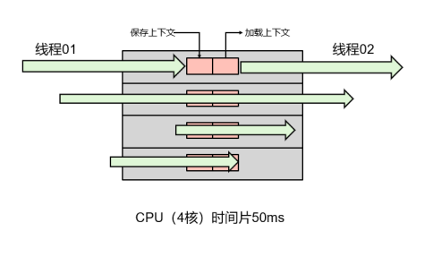
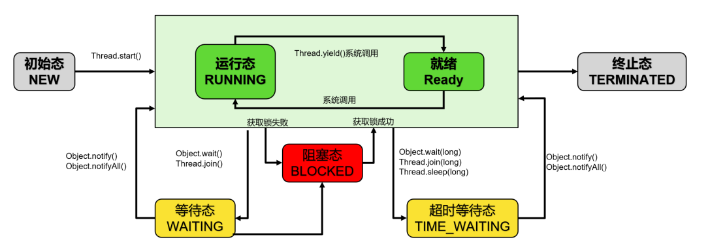
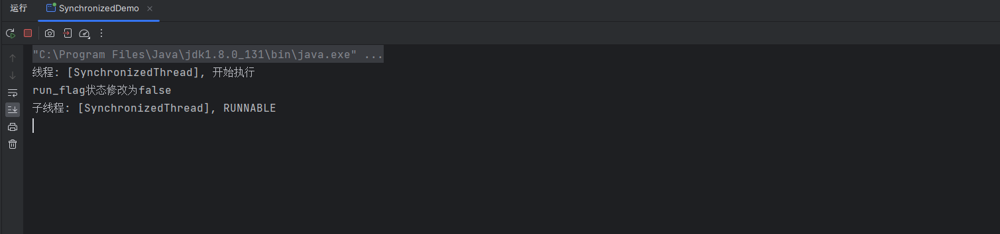
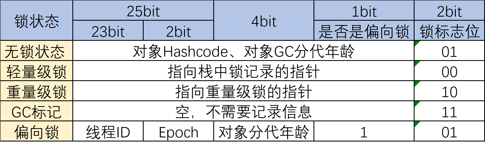
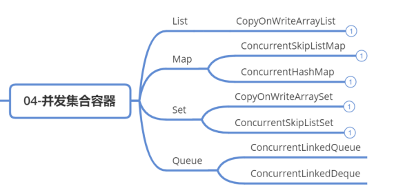
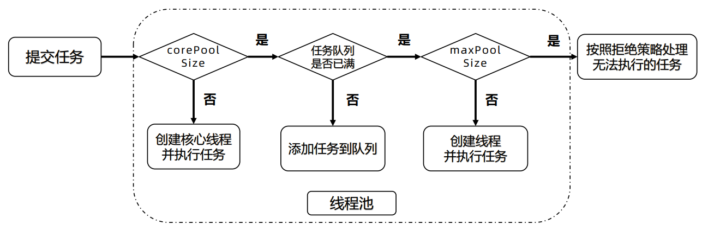
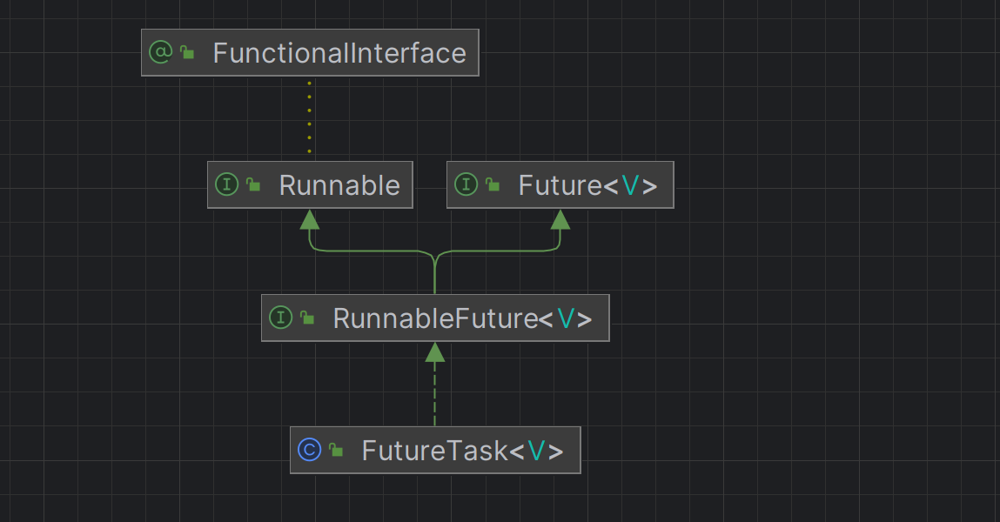

# 并发编程


[TOC]


## 前言

### 什么是并发编程？

​	并发编程：编写多线程(MultiThreading)代码，解决多线程带来的线程安全问题。

​	多线程是指从软件和硬件上实现多个线程并发执行的技术，多线程可以使计算机同一时间执行多个线程。


### 为什么要学习？

​	开启应用高性能的一把钥匙，应用程序的翅膀

​	Java基础知识的重点、难点

​	中间件几乎都是多线程应用：MySQL、ES、Redis、Tomcat、Druid、HikariCP等


### 怎么学习并发编程？

​	<font color=#f00>多线程基础核心 -> Synchronized实现原理 -> Volatile实现原理 ->  JMM和指令重排</font>

​	<font color=#f00>JUC → 原子类与CAS实现原理 → 锁与AQS实现原理→ 并发工具类→ 并发容器→ 阻塞队列→ 线程池</font>


## 多线程重要概念

### 进程和线程

- **进程：**是指内存运行的一个应用程序，是**系统运行程序的基本单位**，是程序的一次执行过程
- **线程：**是进程中的一个执行单元，** 负责当前进程中的任务执行，一个进程会产生很多线程
- **主要区别：**每个**进程都有独立内存空间**。线程之间的**堆空间和方法区共享**，线程**栈空间和程序计数器是独立的**。线程消耗资源比进程小得多


### 并发和并行

​	**并发Concurrency：** 统一时间段，多个任务都在执行，单位时间内不一定是同时执行

​	**并行Parallel：** 单位时间内，多个任务同时执行，单位时间内一定是同时执行的

​	**并发是一种能力，并行是一种手段**


### 线程上下文切换

​	一个CPU内核，同一时刻只能被一个线程使用。为了提升CPU利用率，CPU采用了时间片算法将CPU时 间片轮流分配给多个线程，每个线程分配了一个时间片（几十毫秒/线程），线程在时间片内，使用CPU 执行任务。当时间片用完后，线程会被挂起，然后把 CPU 让给其它线程。

​	其中引出的问题如下：**线程下次运行时，怎么知道上次运行到哪个位置了呢？**

- CPU切换前会把当前任务状态保存下来，用于下次切换回任务时再次加载
- **任务状态的保存及再加载的过程就叫做上下文切换**

​	**任务状态信息保存在哪里呢？**

- 程序计数器：用来存储CPU正在执行的指令的位置，和即将执行的下一条指令的位置
- 他们都是CPU在运行任何任务前，必须依赖的环境，被叫做CPU上下文

​	**上下文切换过程：** 

1. 挂起当前任务任务，将这个任务在 CPU 中的状态（上下文）存储于内存中的某处
2. 恢复一个任务，在内存中检索下一个任务的上下文并将在 CPU 的寄存器中恢复
3. 跳转到程序计数器所指定的位置（即跳转到任务被中断时的代码行）




### 线程的一生

​	**线程的状态：** 查看Thread源码，能够看到java的线程有六种状态：

```java
// 线程状态枚举类位置：java.lang.Thread.State
public enum State {
    NEW,
    RUNNABLE,
    BLOCKED,
    WAITING,
    TIMED_WAITING,
    TERMINATED;
}
```

- **NEW(新建) ：** 线程刚被创建，但是并未启动 
- **RUNNABLE(可运行)：** 线程可以在Java虚拟机中运行的状态，可能正在运行自己代码，也可能没 有，这取决于操作系统处理器 
- **BLOCKED(锁阻塞)：** 当一个线程试图获取一个对象锁，而该对象锁被其他的线程持有，则该线程 进入Blocked状态；当该线程持有锁时，该线程将变成Runnable状态 
- **WAITING(无限等待)：** 一个线程在等待另一个线程执行一个（唤醒）动作时，该线程进入Waiting 状态。进入这个状态后是不能自动唤醒的，必须等待另一个线程调用notify或者notifyAll方法才能够唤醒 
- **TIMED_WAITING(计时等待)：** 同waiting状态，有几个方法有超时参数，调用他们将进入Timed Waiting状态。这一状态将一直保持到超时期满或者接收到唤醒通知。带有超时参数的常用方法有 Thread.sleep 、Object.wait 
- **TERMINATED(被终止)：** 因为run方法正常退出而死亡，或者因为没有捕获的异常终止了run方法 而死亡




**常用属性：**

- 线程名称 
- 线程ID：ThreadID = tid 
- 线程优先级：Priority

**常用方法：**

- 线程让步：yield() 
- 让线程休眠的方法：sleep() 
- 等待线程执行终止的方法： join()
-  线程中断interrupt() 
- 等待与通知系列函数wait()、notify()、notifyAll()

**wait()和sleep()的区别：**

- 主要区别：**sleep()方法没有释放锁，而wait()方法释放了锁**
- 两者都可以暂停线程的执行
- wait()通常用于线程间的交互/通信，sleep()通常用于暂停线程执行
- wait()方法被调用后，线程不会自动苏醒，需要别的线程调用同一个对象的notify或notifyAll。sleep()方法执行完成后，线程会自动苏醒。或者可以使用wait(long)超时后，线程也会自动苏醒


### 多线程创建流程

​	流程小结：

- 线程类被JVM加载时会绑定native方法与对应的C++方法
- start()方法执行：
  - ➢ start()➔native start0()➔JVM_Thread➔ 创建线程JavaThread::JavaThread
- 创建OS线程，指定OS线程运行入口：
  - ➢ 创建线程构造方法➔ 创建OS线程➔指定OS线程执行入口，就是线程的run()方法
- 启动OS线程，运行时会调用指定的运行入口run()方法。至此，实现一个的线程运行
- 创建线程的过程是线程安全的，基于操作系统互斥量（MutexLocker）保证互斥，所以说创建线程性能很差


### 线程安全问题

​	多个线程同时执行，可能会运行同一行代码，如果程序每次运行结果与单线程执行结果一致，且变量的 预期值也一样，就是线程安全的，反之则是线程不安全。

​	**引发线程安全问题的根本原因：**<font color=#f00>**多个线程共享变量**</font>

- 如果多个线程对共享变量只有读操作，无写操作，那么此操作是线程安全的
- 如果多个线程同时执行共享变量的读写操作，则操作不是线程安全的

#### 如何解决线程安全问题

​	Java给出了各种方法：

- 同步机制：Synchronized
- Volatile关键字：内存屏障
- 原子类：CAS
- 锁：AQS
- 并发容器


#### 线程同步

​	为了保证不出现线程安全问题，Java引入了**线程同步机制（synchronized）。那么怎么完成同步操作呢？**

> JUC的起源是因为早期同步机制的性能问题比较严重，在Java早期版本中，synchronized属于重量级锁，效率低下。这是因为其监视器锁（monitor）实现依赖于底层操作系统的Mutex Lock，而这种依赖关系导致了一系列性能问题。当线程需要被挂起或恢复时，都需要转入内核态去完成，阻塞或唤醒一个Java线程需要操作系统切换CPU状态来完成。这种状态切换需要耗费处理器时间，如果同步代码块中内容过于简单，这种切换的时间可能比用户代码执行的时间还长，因此导致了相对较高的时间成本。
>
> 为了解决这个问题，Java 5.0版本引入了JUC包。JUC包中的锁实现都是基于CAS（比较并交换）操作，这显著提高了并发编程的效率。然而，虽然JUC提供了更高效的工具，但其使用也需要更加谨慎，因为如果使用不当可能会出现死锁、饥饿等问题。


**使用示例**

```java
// 同步代码块 
synchronized(同步锁){
	// 需要同步操作的代码
}

// 同步方法
public synchronized void method(){
	// 可能会产生线程安全问题的代码
}

// Lock锁
Lock lock = new ReentrantLock(); // 创建可重入锁对象
lock.lock(); // 获取锁

try {
    // 需要同步操作的代码
    // ...
} finally {
    lock.unlock(); // 释放锁
}

// 注意：在使用锁时，应该确保在finally块中释放锁，以确保无论是否发生异常，锁都能被正确释放
```


## 线程安全三大特性

- **原子性：** 一个线程的一个或多个操作，要么全部执行，要么都不执行，执行过程不能被打断
- **有序性：** 程序代码按照先后顺序执行
  - **为什么会出现无序问题呢？因为指令重排**
- **可见性：** 当多个线程访问同一个变量时，一个线程修改了共享变量的值，其它线程能够立即看到
  - **为什么会出现不可见问题？因为Java内存模型(JMM)**

### 有序性

​	**什么是指令重排？**

​		编译器和处理器会对执行指令进行重排优化，目的是提高程序运行效率。现象是，我们编写的Java代码语句的先后顺序，不一定是按照我们写的顺序执行。

​	**为什么要指令重排？**

​		同步变异步，系统指令层面的优化，无论编译器和处理器怎么重排指令，都会考虑到数据间的依赖性，并不会影响**单线程**最终执行效果，保证程序执行的正确性

### 可见性

​	**CPU和缓存一致性**：在多核CPU中每个核都有自己的缓存，同一个数据的缓存与内存可能不一致

​		**为什么需要CPU缓存？**随着CPU技术发展，CPU执行速度和内存读取速度差距越来越大，导致CPU每次操作内存都要耗费很多等待时间。为了解决这个问题，在CPU和物理内存上新增高速缓存。程序在运行过程中会将运算所需数据**从主内存复制到CPU高速缓存中**，CPU计算直接操作高速缓存数据，**运算结束将结果刷回主内存**

​	**Java内存模型(Java Memory Model)**

- Java为了保证满足原子性、可见性和有序性，诞生了一个重要的规范JSR133，Java内存模型简称JMM
- JMM定义了共享内存系统中**多线程应用读写操作行为的规范**
- JMM规范定义的规则，规范了内存的读写操作，从而保证指令执行的正确性
- JMM规范解决了CPU多级缓存、处理器优化、指令重排等导致的内存访问问题
- Java实现了JMM规范因此有了Synchronized、Volatile、锁等概念
- JMM的实现屏蔽各种硬件和操作系统的差异，在各种平台下对内存的访问都能保证一致


## synchronized简介

​	保证方法或代码块在多线程环境运行时，同一个时刻只有一个线程执行代码块，还可以保证共享变量的内存可见性，也可以保证修饰的代码块重排序也不会影响其执行结果。

- JDK1.6之前，synchronized是一个重量级锁相比于JUC的锁显得非常笨重，存在性能问题
- JDK1.6及之后，Java对synchronized进行了一系列优化，性能与JUC的锁不相上下
- 一句话：有了synchronized，线程就安全了，保证了原子性、可见性、有序性


​	**作用范围：** 修饰方法(静态和非静态)，代码块

- 同步代码块的锁：当前对象，字节码对象，其它对象
- 非静态同步方法：锁当前对象
- 静态同步方法：锁是当前类的Class对象


可见性的案例：

```java
public class SynchronizedDemo {
    public static void main(String[] args) throws InterruptedException {
        Thread thread = new Thread(new SynchronizedThread(), "SynchronizedThread");
        SynchronizedThread.run_flag = true;
        System.out.println("线程: [" + thread.getName() + "], 开始执行");
        thread.start();
        Thread.sleep(500);
        SynchronizedThread.run_flag = false;
        System.out.println("run_flag状态修改为false");
        System.out.println("子线程: [" + thread.getName() +  "], " + thread.getState());
    }

    static class SynchronizedThread implements Runnable {
        static boolean run_flag;
        @Override
        public void run() {
            while (run_flag) {

            }
            System.out.println("子线程结束");
        }
    }
}

```

运行效果：



按照main方法的逻辑，我们已经把flag设置为false，那么从逻辑上讲，子线程就应该跳出while死循环，因为这个时候条件不成立，但是我们可以看到，程序仍旧执行中，并没有停止。

原因是：线程之间的变量是不可见的，因为读取的是副本，没有及时读取到主内存结果

**怎么解决？**

- 使用Synchronized同步代码块
- happens-before规则：按需使用重排序和本地内存副本，前提是需要满足happens-before规则

> happens-before原则是Java内存模型（JMM）中的一个重要概念，它描述了线程之间的可见性规则。根据happens-before原则，一个线程中的写操作对另一个线程中的读操作具有可见性，即当一个线程修改了一个共享变量的值后，其他线程可以立即看到这个修改。
>
> happens-before原则主要包括以下几种情况：
>
> 1. 程序顺序规则：在一个线程中按照程序顺序执行的语句，对于该线程之后的任意操作都可以看到之前的操作结果。
> 2. 锁规则：对于一个锁的解锁操作，必须发生在后续对该锁加锁操作之前。
> 3. volatile变量规则：对于一个volatile变量的写操作，必须发生在后续对该变量的读操作之前。
> 4. 传递性规则：如果A happens-before B，B happens-before C，那么A happens-before C。
> 5. start()方法规则：一个线程的start()方法调用必须发生在该线程的每一个动作之前。
> 6. 线程中断规则：一个线程的所有操作都必须在被中断之后才能响应中断。
> 7. 对象终结规则：一个对象的构造函数的结束，必须发生在该对象从构造函数开始到被赋值给一个引用变量之间发生的所有操作之前。
> 8. 线程同步规则：所有线程同步操作都必须在主线程中所有的操作之前执行。
>
> 这些规则确保了多线程环境下的可见性和有序性，从而避免了数据竞争和不一致的问题。


### 如何解决可见性？

​	JMM对于synchronized的两条规定：

- 线程解锁前：必须把自己本地内存中共享变量的最新值刷新到主内存中
- 线程加锁前：将清空本地内存中共享变量的值，从而使用共享变量时需要从主内存中重新读取最新的值

在可见性案例中，修改如下：

```java
while (run_flag) {
    synchronized (this) {

    }
}
```

synchronized实现可见性的过程

1. 获得互斥锁（同步获取锁）
2. 清空本地内存

3. 从主内存拷贝变量的最新副本到本地内存
4. 执行代码
5. 将更改后的共享变量的值刷新到主内存
6. 释放互斥锁

### 同步原理剖析

​	 同步操作主要是monitorenter和monitorexit这两个jvm指令实现的，背后原理是Monitor，先写一段简单的代码：

```java
public class SynchronizedPrinciple {

    public synchronized void method() {
        System.out.println("method");
    }

    public void syncBlock() {
        synchronized (this) {
            System.out.println("sync block");
        }
    }
}
```

在cmd命令行执行javac编译和 javap -v ***.class 生成class文件对应的字节码指令

```java
  Last modified 2023-11-18; size 601 bytes
  MD5 checksum eb0e7a1f34a46d939222ac0866266f97
  Compiled from "SynchronizedPrinciple.java"
public class SynchronizedPrinciple
  minor version: 0
  major version: 52
  flags: ACC_PUBLIC, ACC_SUPER
Constant pool:
   #1 = Methodref          #7.#20         // java/lang/Object."<init>":()V
   #2 = Fieldref           #21.#22        // java/lang/System.out:Ljava/io/PrintStream;
   #3 = String             #12            // method
   #4 = Methodref          #23.#24        // java/io/PrintStream.println:(Ljava/lang/String;)V
   #5 = String             #25            // sync block
   #6 = Class              #26            // SynchronizedPrinciple
   #7 = Class              #27            // java/lang/Object
   #8 = Utf8               <init>
   #9 = Utf8               ()V
  #10 = Utf8               Code
  #11 = Utf8               LineNumberTable
  #12 = Utf8               method
  #13 = Utf8               syncBlock
  #14 = Utf8               StackMapTable
  #15 = Class              #26            // SynchronizedPrinciple
  #16 = Class              #27            // java/lang/Object
  #17 = Class              #28            // java/lang/Throwable
  #18 = Utf8               SourceFile
  #19 = Utf8               SynchronizedPrinciple.java
  #20 = NameAndType        #8:#9          // "<init>":()V
  #21 = Class              #29            // java/lang/System
  #22 = NameAndType        #30:#31        // out:Ljava/io/PrintStream;
  #23 = Class              #32            // java/io/PrintStream
  #24 = NameAndType        #33:#34        // println:(Ljava/lang/String;)V
  #25 = Utf8               sync block
  #26 = Utf8               SynchronizedPrinciple
  #27 = Utf8               java/lang/Object
  #28 = Utf8               java/lang/Throwable
  #29 = Utf8               java/lang/System
  #30 = Utf8               out
  #31 = Utf8               Ljava/io/PrintStream;
  #32 = Utf8               java/io/PrintStream
  #33 = Utf8               println
  #34 = Utf8               (Ljava/lang/String;)V
{
  public SynchronizedPrinciple();
    descriptor: ()V
    flags: ACC_PUBLIC
    Code:
      stack=1, locals=1, args_size=1
         0: aload_0
         1: invokespecial #1                  // Method java/lang/Object."<init>":()V
         4: return
      LineNumberTable:
        line 1: 0

  public synchronized void method();
    descriptor: ()V
    flags: ACC_PUBLIC, ACC_SYNCHRONIZED
    Code:
      stack=2, locals=1, args_size=1
         0: getstatic     #2                  // Field java/lang/System.out:Ljava/io/PrintStream;
         3: ldc           #3                  // String method
         5: invokevirtual #4                  // Method java/io/PrintStream.println:(Ljava/lang/String;)V
         8: return
      LineNumberTable:
        line 4: 0
        line 5: 8

  public void syncBlock();
    descriptor: ()V
    flags: ACC_PUBLIC
    Code:
      stack=2, locals=3, args_size=1
         0: aload_0
         1: dup
         2: astore_1
         3: monitorenter
         4: getstatic     #2                  // Field java/lang/System.out:Ljava/io/PrintStream;
         7: ldc           #5                  // String sync block
         9: invokevirtual #4                  // Method java/io/PrintStream.println:(Ljava/lang/String;)V
        12: aload_1
        13: monitorexit
        14: goto          22
        17: astore_2
        18: aload_1
        19: monitorexit
        20: aload_2
        21: athrow
        22: return
      Exception table:
         from    to  target type
             4    14    17   any
            17    20    17   any
      LineNumberTable:
        line 8: 0
        line 9: 4
        line 10: 12
        line 11: 22
      StackMapTable: number_of_entries = 2
        frame_type = 255 /* full_frame */
          offset_delta = 17
          locals = [ class SynchronizedPrinciple, class java/lang/Object ]
          stack = [ class java/lang/Throwable ]
        frame_type = 250 /* chop */
          offset_delta = 4
}
```

从结果可以看出，同步代码块使用的是monitorenter和monitorexit这两个jvm指令，从上述字节码指令看的到，同步代码块和同步方法的字节码是不同的

- 对于synchronized同步块，对应的monitorenter和monitorexit指令分别对应synchronized同步块的进入和退出。
  - 为什么会多一个monitorexit？编译器会为同步块添加一个隐式的try-finally，在finally中会调用monitorexit命令释放锁
- 对于synchronized方法，对应ACC_SYNCHRONIZED关键字，JVM进行方法调用时，发现调用的方法被ACC_SYNCHRONIZED修饰，则会先尝试获得锁，方法调用结束了释放锁。在JVM底层，对于这两种synchronized的实现大致相同。都是基于monitorenter和monitorexit指令实现，底层还是使用 标记字段MarkWord和Monitor（管程）来实现重量级锁。


### 什么是Monitor？

​	Monitor意译为管程，直译为监视器。所谓管程，就是管理共享变量及对共享变量操作的过程。让这个过程可以并发执行。

​	**Java所有对象都可以作为锁，为什么？**

​		因为每个对象都有一个Monitor对象与之关联。然后线程对monitor执行lock和执行unlock操作，相当于对对象执行上锁和解锁操作

> 在Java中，每个对象都有一个与之关联的monitor。这个monitor是作为锁机制的关键元素来实现synchronized的。Monitor被翻译为监视器或管程，它内置在每一个Java对象中，与对象的Mark Word信息相关联。
>
> 底层实现上，synchronized是通过成对的MonitorEnter和MonitorExit指令来实现的。当一个线程尝试获取monitor的所有权时，它会执行MonitorEnter指令。如果monitor没有被其他线程占用，那么当前线程就会成功获取monitor的所有权并执行同步代码块；否则，该线程会被阻塞，直到monitor被释放。同样地，当一个线程完成对monitor的占用后，它会执行MonitorExit指令来释放monitor的所有权，以便其他线程可以获取monitor的所有权并执行同步代码块。
>
> 因此，synchronized和monitor之间的关系非常密切：synchronized是Java中的关键字，用于实现线程同步；而monitor则是Java对象中的一个数据结构，用于实现锁的功能。二者共同构成了Java中的线程同步机制。

Synchronized里面不可以直接使用lock和unlock方法，但当我们使用了synchronized之后，JVM会自动加入两个指令monitorenter和monitorexit，对应的就是lock和unlock的操作

**Monitor的实现原理：将共享变量和对共享变量的操作同一封装起来**


### synchronized锁优化

​	加了锁之后，不一定就是好的，盲目使用Synchronized，虽然解决了线程安全问题，但也给系统埋下了迟缓的隐患

- 并发编程的几种情况：
  - 只有一个线程运行
  - 两个线程交替执行
  - 多个线程并发执行
- 经过实践经验总结：前两种情况可以针对性优化
- JDK1.6基于这两个场景，设计了两种优化方案：<font color=#f00>**偏向锁**</font>和 **<font color=#f00>轻量级锁</font>**
- **同步锁一共有四种状态：无锁，偏向锁，轻量级锁、重量级锁**
- **JVM会视情况来逐渐升级锁，这就是JDK1.6对于锁的优化**
- 偏向锁：只有一个线程访问锁资源，偏向锁就会把整个同步措施消除
- 轻量级锁：只有两个线程交替运行时，如果线程竞争锁失败了，先不立即挂起，而是让它飞一会儿（自旋），在等待过程中，可能锁就被释放了，这时该线程就可以重新尝试获取锁，同时记录持有锁资源的线程和锁的类型。

### 锁信息存在哪里

​	同步锁锁定资源是对象，那无疑存储在对象信息中，由对象直接携带，是最方便管理和操作的。




## Volatile简介

​	Java语言允许线程访问共享变量，为了确保共享变量能被准确的一致地更新，线程应该确保通过互斥锁单独获取这个变量。Java语言提供了volatile，在某些情况下，它比锁更方便。如果一个变量被声明成volatile，JMM确保所有线程看到这个变量的值是一致的

​	一句话；volatile可以保证多线程场景下共享变量的可见性，有序性


### 实现原理

​	volatile实现内存可见性的原理是内存屏障(Memory Barrier)是一种CPU指令，用于控制特定条件下的重排序和内存可见性问题。Java编译器会根据内存屏障的规则禁止重排序

​	Volatile变量**写操作**时：在**写操作后**加一条**store屏障指令**，让本地内存中变量的值能够刷新到主内存

​	Volatile变量**读操作**时：在**读操作前**家一条load屏障指令，及时读取到变量在主内存中的值


### volatile缺陷

​	存在原子性的问题：虽然volatile可以保证可见性，但是不能满足原子性


## JUC简介

​	从JDK1.5起，Java API提供了java.util.concurrent(简称JUC)包，在此包中定义了并发编程中很常用的工具


### 什么是原子类？

​	JUC的atomic包中，提供了一系列**用法简单、性能高效、线程安全的更新一个变量的类**，这些称之为原子类

​	作用：保证共享变量操作的原子性、可见性，可以解决volatile原子性操作变量的bug

**AtomicInteger主要API：**

```
get() // 直接返回值
getAndAdd(int) // 增加指定的数据,返回变化前的数据
getAndDecrement() // 减少1，返回减少前的数据
getAndIncrement() // 增加1，返回增加前的数据

addAndGet(int) // 增加指定的数据后返回增加后的数据
decrementAndGet() // 减少1，返回减少后的数据
incrementAndGet() // 增加1，返回增加后的数据
lazySet(int) // 仅仅当get时才会set

compareAndSet(int, int) // 尝试新增后对比，若增加成功则返回true，否则返回false 
```


### CAS(compare and swap) 

​	**compare and swap（比较再替换）**，同步组件中大量使用CAS技术实现了Java多线程的并发操作。整个AQS、Atomic原子类底层操作，都可以看见CAS。甚至ConcurrentHashMap在1.8的版本中也调整为了CAS加Synchronized。可以说CAS是整个JUC的基石

​	CAS的本质就是一个方法， 伪代码：执行函数(V,E,N)

- V：要读写的内存地址
- E：进行比较的值(预期值)
- N：拟写入的新值

​	当且仅当**内存地址的V**中的值等于**预期值E**时，将**内存地址的V**中的值改为N，否则会进行自旋操作，即不断的重试

CAS本质是一条CPU的原子指令，可以保证共享变量修改的原子性


#### CAS的缺陷

​	循环事件不可控：如果CAS一直不成功，那么CAS自旋就是个死循环。会给CPU造成负担

​	只能保证一个共享变量原子操作

​	ABA问题：CAS检查操作的值有没有发生改变，如果没有则更新。但如果在检查待操作的值之前，原先的值被篡改过后有还原了，那么CAS检测也还是通过的


### JUC锁简介

​	JUC包提供了种类丰富的锁，根据每种锁的特性和应用场景各不相同

​	**ReentrantLock重入锁：** 它具有与使用synchronized相同的一些基本行为和语义，但是它的API功能更强大，重入锁相当于synchronized的增强版，具有synchronized很多没有的功能。它是一种**独享锁（互斥锁），**可以是**公平锁**，也可以是**非公平锁**。

​	**ReentrantReadWriteLock读写锁：** 它维护了一对锁，ReadLock读锁和WriteLock写锁。读写锁适合读多写少的场景。基本原则：<font color=#f00>**读锁可以被多个线程同时次有进行访问，而写锁只能被一个线程持有。**</font>可以理解为：读写锁是个混合体，它既是共享锁，也是独享锁。

​	**StampedLock重入读写锁**：JDK1.8引入的锁类型，是对读写锁ReentrantReadWriteLock的增强版


##### 锁分类

​	按上锁方式划分

- **隐式锁：synchronized**，不需要显式加锁和解锁
- **显式锁：JUC包中提供的锁**，需要显式加锁和解锁


​	 按特性划分

- **悲观锁/乐观锁：** **<font color=#f00>按照线程在使用共享资源时，要不要锁住同步资源</font>**，划分为悲观锁和乐观锁
  - 悲观锁：JUC锁，synchronized
  - 乐观锁：CAS，关系型数据库的版本号机制
- **重入锁和不可重入锁：** **<font color=#f00>按照同一个线程是否可以重复获取一把锁</font>**，划分为重入锁和不可重入锁
  - 重入锁：ReentrantLock]、synchronized
  - 不可重入锁：线程获取锁之后不可以重复获取锁，重复获取会发生死锁
- **公平锁和非公平锁：** <font color=#f00>**按照多个线程竞争同一锁时需不需要排队，能不能排队**</font>，划分为公平锁和非公平锁
  - 公平锁：new ReentrantLock(true) 多个线程按照申请锁的顺序获取锁
  - 非公平锁：new ReentrantLock(false) 多个线程获取锁的顺序不是按照申请锁的顺序(可以插队)
- 独享锁/共享锁：**<font color=#f00>按照多个线程能不能同时共享同一个锁</font>**，锁被划分为独享锁和共享锁
  - 独享锁：独享锁也叫排他锁，synchronized，ReentrantLock，ReentrantReadWriteLock的WriteLock写锁
  - 共享锁：ReentrantReadWriteLock的ReadLock读锁


​	其他类型的锁

- 自旋锁：

  - 实现：CAS，轻量级锁

- 分段锁：

  - 实现：ConcurrentHashMap，所使用的的锁分段技术，首先将数据分成一段一段的存储，然后给每一段数据配一把锁，当一个线程占用锁访问其中一个段数据的时候，其它段的数据也能被其它线程访问

    > 在JDK1.7中，ConcurrentHashMap的实现采用了一种叫做分段锁的技术。这种技术将数据分成一段一段进行存储，每一段数据都配备了一把锁，当一个线程在访问其中一段数据时，其他段的数据也能被其他线程访问，从而实现了真正的并发访问。具体来说，ConcurrentHashMap中的分段锁被称为Segment，它是一个类似于HashMap的内部结构，即包含了一个Entry数组，数组中的每个元素都是一个链表，并且也是一个ReentrantLock。
    >
    > 然而，到了JDK1.8版本，ConcurrentHashMap的数据结构进行了一些调整。取消了Segment分段锁的数据结构，取而代之的是数组、链表和红黑树的结构。在保证线程安全方面，JDK1.8版本的ConcurrentHashMap采用了synchronized+CAS的组合来代替了JDK1.7版本中的ReentrantLock。

- 无锁/偏向锁/轻量级锁/重量级锁

  - JDK1.6为了synchronized的性能优化而设计出来的synchronized独有的四种状态，级别从低到高
  - 它们是JVM为了提高synchronized锁的获取与释放效率而做的优化
  - 四种状态会随着竞争的情况组件升级，而且是不可逆的过程，即只能升级不能降级


### Synchronized和JUC锁对比

​	Synchronized的缺陷：

- **<font color=#f00>第一：Synchronized无法控制阻塞时间，阻塞时间不可中断</font>**
  - 使用Synchronized，假如占有锁的线程被长时间阻塞(IO、sleep、join)，由于线程阻塞时没法释放锁，会导致大量线程堆积，轻则影响性能，重则服务雪崩
  - **JUC的锁可以解决这两个缺陷**
- **第二：读多写少的场景中，多个读线程同时操作共享资源时不需要加锁**
  - Synchronized不论是读还是写，均需要同步操作，这种做法并不是最优解
  - **JUC的ReentrantReadWriteLock锁可以解决这个问题**


### ReentrantLock原理分析之AQS

​	在重入锁ReentrantLock类关系图中，可以看到NonFairSync和FairSync都继承自抽象类Sync，而**Sync继承自抽象类AbstractQueuedSynchronizer（简称AQS）**。不仅重入锁用到了AQS，JUC中绝大部分的同步工具也都是基于AQS

​	AQS即队列同步器，是JUC并发包中的核心基础组件，其本身只是一个抽象类。AQS中用到了CAS和Volatile 


### ReentrantReadWriteLock

​	**读写锁：维护着一对锁(读锁和写锁)，**通过分离读锁和写锁，使得并发能力比一般的互斥锁有较大提升。**<font color= 
#f00>同一时间，可以允许多个读线程同时访问，但在写线程访问时，所有读写线程都会阻塞</font>**，所以说，读锁是共享的，写锁是排他的(独享)

​	**主要特性：**

- 支持公平和非公平锁
- 支持重入
- 锁降级：写锁可以降级为读锁，但是读锁不能升级为写锁


读写锁ReentrantReadWriteLock实现接口ReadWriteLock，该接口维护了一对相关的锁，一个用于只读操作，另一个用于写入操作。只要没有write，读取锁可以由多个reader线程同时保持。写入锁是独占的。

```java
// 读写锁代码示例
/**
 * 可重入读写锁演示
 *
 */
public class ReentrantReadWriteLockDemo {

    private volatile static int count;
    public static void main(String[] args) {
        ReentrantReadWriteLock lock = new ReentrantReadWriteLock();

        ReentrantReadLock reentrantReadLockThread = new ReentrantReadLock(lock);
        ReentrantWriteLock reentrantWriteLockThread = new ReentrantWriteLock(lock);

        for (int i = 0; i < 15; i++) {
            new Thread(reentrantWriteLockThread).start();
        }

        for (int i = 0; i < 150; i++) {
            new Thread(reentrantReadLockThread).start();
        }
    }

    /**
     * 可重入读锁
     *
     */
    static class ReentrantReadLock implements Runnable {
        public ReentrantReadWriteLock lock;

        public ReentrantReadLock(ReentrantReadWriteLock lock) {
            this.lock = lock;
        }

        @Override
        public void run() {
            lock.readLock().lock();
            System.out.println("读锁：" + count);
            lock.readLock().unlock();
        }
    }

    /**
     * 可重入写入锁
     *
     */
    static class ReentrantWriteLock implements Runnable {
        public ReentrantReadWriteLock lock;

        public ReentrantWriteLock(ReentrantReadWriteLock lock) {
            this.lock = lock;
        }

        @Override
        public void run() {
            lock.writeLock().lock();
            count++;
            System.out.println("写锁：" + count);
            lock.writeLock().unlock();
        }
    }
}
```


### 锁的优化

- 减少锁的持有时间
- 减少锁粒度
  - 将大对象拆分为小对象，增加并行度，降低锁的竞争
  - 例如：早期ConcurrentHashMap的分段锁
- 锁分离
  - 根据功能场景进行锁分离
  - 例如：读多写少的场景，使用读写锁可以提高性能


------


### 线程协作工具类

​	控制线程协作的工具类，帮助程序员让线程之间的协作变得更加简单


#### 计数门闩-CountDownLatch

- 倒数结束之前，一直处于等待状态，直到数到0，等待线程才开始执行
- 方法：
  - new CountDownLatch(int count)
  - await()：调用此方法的线程会阻塞，支持多个线程调用，当计数为0，则唤醒线程
  - countdown()：其它线程调用此方法，计数减1

```java
    /**
     * 计数门闩的使用
     * - 让老板必须加班到最晚
     *
     * @param downLatch 计数门闩
     */
    private static void countDownLatch(CountDownLatch downLatch) {

        for (long i = 0; i < downLatch.getCount(); i++) {
            new Thread(() -> {
                try {
                    TimeUnit.MILLISECONDS.sleep(20);
                } catch (InterruptedException e) {
                    throw new RuntimeException(e);
                }
                System.out.println(Thread.currentThread().getName() + "下班走人了");
                downLatch.countDown();
            }, "员工 " + i).start();
        }

        new Thread(() -> {
            try {
                downLatch.await();
            } catch (InterruptedException e) {
                throw new RuntimeException(e);
            }
            System.out.println(Thread.currentThread().getName() + "最后下班，无敌的存在");
        }, "boss").start();
    }
```


#### 信号量-Semaphore

- 限制和管理数量有限的资源的使用
- 场景：Hystrix、Sentinel限流
- 方法：
  - new Semaphore(int permits)：可以创建公平/非公平的策略
  - acquire()：获取许可证，要么获取成功，信号量减一，要么阻塞等待线程
  - release()：释放许可证，信号量加1，然后唤醒等待的线程

```java
    /**
     * 信号量
     * 信号量的使用
     * - 模拟停车场车位的抢占情况，即指定的车位，只能停指定的车，多余的车则处于等待状态
     *
     * @param semaphore 信号量(具体能停多少俩车)
     * @param carNumber 车的数量
     */
    private static void semaphore(Semaphore semaphore, int carNumber) {
        for (int i = 0; i < carNumber; i++) {
            new Thread(() -> {
                try {
                    semaphore.acquire();
                    System.out.println(Thread.currentThread().getName() + "抢到了车位");
                    TimeUnit.MILLISECONDS.sleep(300);
                    System.out.println(Thread.currentThread().getName() + "离开了车位");
                } catch (InterruptedException e) {
                    throw new RuntimeException(e);
                } finally {
                    semaphore.release();
                }
            }, "汽车" + i + " ").start();
        }
    }
```


#### 循环栅栏-CyclicBarrier

- 线程会等待，直到线程到了事先规定的数目，然后触发执行条件进行下一步动作
- 场景：并行计算
- 方法：
  - new CyclicBarrier(int parties, Runnable barrierAction)：参数parties是规定的线程数，参数barrierAction是触发执行条件时的具体动作
  - await()：阻塞当前线程，待凑齐线程数量之后继续执行


#### Condition

- 控制线程的“等待”和“唤醒”
- 方法：
  - await()：阻塞线程
  - signal()：唤醒被阻塞的线程
  - signalAll()：唤起所有正在等待的线程
- **注意：**
  - 调用await()方法时必须持有锁，否则会抛出异常
  - Condition和Object#await/notify方法用法一样，两者await方法都会释放锁


------


### 并发容器

​	针对多线程并发访问来进行设计的集合，称为并发容器

- JDK1.5之前，JDK提供了线程安全的集合都是同步容器，线程安全，但只能串行执行，性能很差 

- JDK1.5之后，JUC并发包提供了很多并发容器，优化性能，替代同步容器

  > 同步容器：每次只有一个线程可以访问的集合(同步)，成为线程安全的集合，也叫同步容器
  >
  > JDK早期线程安全的集合如：Vector，Stack，HashTable
  >
  > JDK1.2中，为collections增加内部Synchronized类创建出线程安全的集合，实现原理synchronized


**并发集合容器**




#### 常见并发容器特点总结

- List容器
  - **[Vector：](https://github.com/RookieProgramTheApe/jdk-source-analyze/blob/2b351809cfd889427246faa576bbd39016893a6b/src/online/niehong/source/java/util/Vector.java)** synchronized实现的同步容器，性能差，适合于对 **数据有强一致性** 要求的场景
  
  - <font color=#f00>**[CopyOnWriteArrayList：](https://github.com/RookieProgramTheApe/jdk-source-analyze/blob/2b351809cfd889427246faa576bbd39016893a6b/src/online/niehong/source/java/util/concurrent/CopyOnWriteArrayList.java)**</font> 底层数组实现，使用**复制副本**进行有锁写操作(数据不一致问题)，适合读多写少，允许短暂的数据不一致的场景
  
    > 查询时不加锁，更新时从原来的数据复制一份副本，然后写操作在副本上修改完成，最后把原数据替换为修改后的副本。修改时，不阻塞读操作，读到的有可能是旧数据
    >
    > 优点：对于读多写少的场景， CopyOnWrite这种无锁操作性能更好，相比于其它同步容器
    >
    > 缺点：数据一致性问题；内存占用问题及导致更多的GC次数(内存占用问题来自写数据时的副本复制操作)
  
- Map容器
  - **[HashTable：](https://github.com/RookieProgramTheApe/jdk-source-analyze/blob/2b351809cfd889427246faa576bbd39016893a6b/src/online/niehong/source/java/util/Hashtable.java)** synchronized实现的同步容器，性能差，适合于对 **数据有强一致性** 要求的场景
  - <font color=#f00>**[ConcurrentHashMap：](https://github.com/RookieProgramTheApe/jdk-source-analyze/blob/2b351809cfd889427246faa576bbd39016893a6b/src/online/niehong/source/java/util/concurrent/ConcurrentHashMap.java)** </font>  **底层数组+链表+红黑树(JDK1.8)实现**，对table数组entry加锁(synchronized)，存在一致性问题。适合存储 **数据量小，读多写少**， 允许短暂的数据不一致的场景
  - **[ConcurrentSkipListMap：](https://github.com/RookieProgramTheApe/jdk-source-analyze/blob/2b351809cfd889427246faa576bbd39016893a6b/src/online/niehong/source/java/util/concurrent/ConcurrentSkipListMap.java)** 底层跳表实现，使用CAS实现无锁读写操作，适合于存储 **数据量大，读写频繁，** 允许短暂的数据不一致场景
  
- Set容器
  - **[CopyOnWriteArraySet：](https://github.com/RookieProgramTheApe/jdk-source-analyze/blob/2b351809cfd889427246faa576bbd39016893a6b/src/online/niehong/source/java/util/concurrent/CopyOnWriteArraySet.java)** 底层数组实现的无序Set
  - **[ConcurrentSkipListSet：](https://github.com/RookieProgramTheApe/jdk-source-analyze/blob/2b351809cfd889427246faa576bbd39016893a6b/src/online/niehong/source/java/util/concurrent/ConcurrentSkipListSet.java)** 底层基于跳表实现的有序Set


------


### 并发队列

**为什么要使用队列？**

​	队列是线程协作的利器，通过队列可以很容易的实现数据共享，并且解决上下游处理速度不匹配的问题，典型的 **生产者消费者模式**

​	

**什么是阻塞队列？**

​	阻塞队列（Blocking Queue）是一种特殊的队列数据结构，它在多线程环境下提供了一种高效且安全的数据传输机制。阻塞队列又分为有界和无界队列，无界队列不是无限队列，最大值Integer.MAX_VALUE

阻塞队列支持两种附加操作：

1. 当队列为空时，从队列中获取元素的操作会阻塞，直到有元素可用。
2. 当队列已满时，向队列添加元素的操作会阻塞，直到有足够的空间容纳新的元素。


- 阻塞队列是线程安全的，生产者和消费者都可以是多线程
- take方法：获取并移除头元素，如果队列无数据，则阻塞
- put方法：插入元素，如果队列已满，则阻塞


#### 常用的阻塞队列

1. **ArrayBlockingQueue：**  基于数组实现的有界阻塞队列
2. **LinkedBlockingQueue：** 基于链表实现的无界阻塞队列 
3. **SynchronousQueue：** 不存储元素的阻塞队列 
4. **PriorityBlockingQueue：** 支持按优先级排序的无界阻塞队列
5. **DelayQueue：** 优先级队列实现的双向无界阻塞队列 
6. **LinkedTransferQueue：** 基于链表实现的无界阻塞队列 
7. **LinkedBlockingDeque：** 基于链表实现的双向无界阻塞队列

```java
// 代码示例
/**
 * 并发阻塞队列演示
 *
 * @author NieHong
 * @date 2023/11/30
 */
public class ArrayBlockingQueueDemo {

    /**
     * 完成状态
     */
    public static final String FINISH = "finish";

    public static void main(String[] args) {
        ArrayBlockingQueue<String> bq = new ArrayBlockingQueue<>(2);
        Thread producerThread = new Thread(new Producer(bq), "包子铺生产者");
        Thread customerThread = new Thread(new Customer(bq), "包子铺消费者");

        producerThread.start();
        customerThread.start();
    }

    /**
     * 生产者
     *
     * @author NieHong
     * @date 2023/11/30
     */
    static class Producer implements Runnable {

        private final ArrayBlockingQueue<String> queue;

        public Producer(ArrayBlockingQueue<String> queue) {
            this.queue = queue;
        }

        @Override
        @SneakyThrows
        public void run() {
            for (int i = 0; i < 10; i++) {
                queue.put("第" + (i + 1) + "个面包");
                System.out.println("卖家：第" + (i + 1) + "个面包生产好了");
                TimeUnit.MILLISECONDS.sleep(500);
            }
            queue.put(FINISH);
        }
    }

    /**
     * 消费者
     *
     * @author NieHong
     * @date 2023/11/30
     */
    static class Customer implements Runnable {

        ArrayBlockingQueue<String> queue;

        public Customer(ArrayBlockingQueue<String> queue) {
            this.queue = queue;
        }

        @Override
        @SneakyThrows
        public void run() {
            // 如果队列没有数据直接返回
            String take = queue.take();
            while (!FINISH.equals(take)){
                System.out.println("买家：" + take + " 被买走了");
                TimeUnit.SECONDS.sleep(1);
                take = queue.take();
            }

            System.out.println("\n\n今天的包子已卖完，收工\n\n");
        }
    }
}
```

------


### 线程池

​	线程池是一种池化思想管理线程的工具。线程池维护了多个线程，等待监督和管理分配可并发执行的任务。通过new Thread源码后发现，频繁创建线程销毁线程的开销很大，会降低系统整体性能

​	优点如下

​		**降低资源消耗：** 通过线程池复用线程，降低创建线程和释放线程的损耗

​		**提高响应速度：** 任务到达时，无需等待即刻运行

​		**提高线程的可管理性：** 使用线程池可以进行统一的线程分配、调优和监控

​		**提供可扩展性：** 线程池具备可扩展性，研发人员可以向其中增加各种功能，比如：延时、定时、监控等


#### 使用场景

- **连接池：** 预先申请数据库连接，提升申请连接的速度，降低系统的开销(跨网络应用都需要线程池)
- **线程隔离：** 服务器接收大量请求，使用线程池来进行隔离处理
- 开发中，如需创建5个以上线程，就可以考虑用线程池


#### 线程池核心参数

| 参数名称      | 数据类型                 | 含义                         |
| ------------- | ------------------------ | ---------------------------- |
| corePoolSize  | int                      | 核心线程数                   |
| maxPoolSize   | int                      | 最大线程数                   |
| keepAliveTime | long                     | 保持存活时间                 |
| workQueue     | BlockingQueue            | 任务存储队列                 |
| threadFactory | ThreadFactory            | 线程池创建新线程的线程工厂类 |
| Handler       | RejectedExecutionHandler | 线程无法接收任务时的拒绝策略 |

corePoolSize：核心线程数，可以理解为空闲线程数，即便线程空闲(Idle)，也不会回收

maxPoolSize：最大线程数，线程池可以容纳线程的上限

keepAliveTime：线程保持存活的时间，超过核心线程数的线程存活空闲时间超过keepAliveTime后就会被回收

workQueue：工作队列，直接交换队列SynchronousQueue，无界队列LinkedBlockingQueue，有界队列ArrayBlockingQueue

threadFactory：线程工厂，用来创建线程的工厂，线程都是出自于此工厂

Handler：  线程无法接收任务时的拒绝策略



1. 提交任务，如果线程数小于corePoolSize即使其他线程处于空闲状态，也会创建一个新线程来运行任务
2. 如果线程数大于corePoolSize，但少于maxPoolSize，将任务放入工作队列
3. 如果队列已满，并且线程数小于maxPoolSize，则创建一个新线程来运行任务
4. 如果队列已满，并且线程数大于或等于maxPoolSize，则拒绝该任务


#### 线程池的创建方式

##### 自动创建线程

**newFixedThreadPool：** 固定数量线程池，无界任务阻塞队列

**newSingleThreadExecutor：** 一个线程的线程池，无界任务阻塞队列

**newCachedThreadPool：** 可缓存线程的无界线程池，可以自动回收多余线程

**newScheduledThreadPool：** 定时任务线程池

示例：

```java
public class ThreadPoolDemo {

    // 定义线程任务，为了方便后续不同线程池的调用
    private static final Thread THREAD = new Thread(() -> {
        try {
            System.out.println(Thread.currentThread().getName());
            TimeUnit.SECONDS.sleep(5);
        } catch (InterruptedException e) {
            throw new RuntimeException(e);
        }
    });
    
    public static void main(String[] args) {
        newFixedThreadPool(5);
        newSingleThreadExecutor();
        newCachedThreadPool();
        newScheduledThreadPool();
    }

    /**
     * 新建固定线程池
     * - 每十秒创建一个新线程，给的fixedPoolSize是五，那就意味着每次最多同时执行5个线程
     *
     * @param fixedPoolSize 固定池大小
     */
    private static void newFixedThreadPool(int fixedPoolSize) {
        ExecutorService executorService = Executors.newFixedThreadPool(fixedPoolSize);
        for (int i = 0; i < 100; i++) {
            executorService.execute(THREAD);
        }
    }

    /**
     * 单线程线程池
     */
    private static void newSingleThreadExecutor() {
        ExecutorService executorService = Executors.newSingleThreadExecutor();
        for (int i = 0; i < 100; i++) {
            executorService.execute(THREAD);
        }
    }

    /**
     * 缓存型线程池
     */
    private static void newCachedThreadPool() {
        ExecutorService executorService = Executors.newCachedThreadPool();
        for (int i = 0; i < 100; i++) {
            executorService.execute(THREAD);
        }
    }

    /**
     * 计划任务(定时任务)线程池
     */
    private static void newScheduledThreadPool() {
        ScheduledExecutorService executorService = Executors.newScheduledThreadPool(10);

        // 在到达指定的延迟时间后执行给定的线程任务
        executorService.schedule(THREAD, 3, TimeUnit.SECONDS);
        // 在到达指定的初始时间(initialDelay)后开始执行给定的线程任务，后续以period参数指定的延迟时间循环执行
        executorService.scheduleAtFixedRate(THREAD, 1, 3, TimeUnit.SECONDS);
    }
}

```


##### 手动创建线程

​	线程池的定制化程度高，使用标准构造器ThreadPoolExecutor创建，根据不同的业务场景，自己设置线程池的参数、线程名称、任务拒绝策略及记录日志等

配置原则：

- **核心线程数如何设置？**(基于可观测原则，通过相关测试工具来动态调整线程池参数)

  - CPU密集型：线程数量不能太多，可以设置为CPU核数相当的值（CPU密集型指的是应用程序本身是否会占用太多CPU资源，如果占用CPU资源较多，那么创建多个线程后会造成频繁的线程上下文切换）
  -  IO密集型：CPU使用率不高，可以设置线程数量多一些，可以设置为CPU核心数的2倍甚至更多都可以

- **拒绝策略**

  - **拒绝时机：**最大线程和工作队列有限且已经饱和，Executor关闭时
  - 抛异常策略： **AbortPolicy**， 说明任务没有提交成功
  - 不做处理策略： **DiscardPolicy，** 默默丢弃任务，不做处理
  - 丢弃老任务策略： **DiscardOldestPolicy，** 将队列中存在最久的任务丢弃
  - 自产自销策略： **CallerRunsPolicy，** 哪个线程提交任务就由哪个线程负责运行

  ```java
   /**
       * 手动创建线程池
       *
       * @return {@link Executors}
       */
      private static ThreadPoolExecutor createdThreadPool() {
          return new ThreadPoolExecutor(
                  5, // 核心线程数
                  10, // 最大线程数
                  60L, // 空闲线程存活时间
                  TimeUnit.SECONDS, // 时间单位
                  new ArrayBlockingQueue<>(10), // 工作队列，大小为10
                  Executors.defaultThreadFactory(), // 线程工厂
                  new ThreadPoolExecutor.AbortPolicy() // 拒绝策略
          );
      }
  ```

  


## ThreadLocal

### 什么是ThreadLocal？
​	**ThreadLocal是线程本地变量类**， 在多线程并行执行过程中，将变量存储在ThreadLocal中，每个线程中都有独立的变量，因此不会出现线程安全问题

​	**举例：**

- **解决线程安全问题：** 每个线程绑定一个数据库连接，避免多个线程访问同一个数据库连接：**SqlSession**
- **跨函数参数传递：** 同一个线程，跨类，跨方法传递参数时可以使用ThreadLocal，每个线程绑定一个**Token/Session**


### 底层原理
​	底层原理主要涉及到 `ThreadLocalMap` 类的实现。每个线程都有一个与之关联的 `ThreadLocalMap`，它是一个定制化的哈希表，用于存储当前线程的 `ThreadLocal` 变量值。

**为什么 key 要使用弱引用？**

`ThreadLocalMap` 的 Entry 使用了弱引用（`WeakReference<ThreadLocal<?>>`）作为 key，这是因为如果不这样做可能会导致内存泄漏。

考虑以下场景：

1. 线程 A 创建了一个 `ThreadLocal` 实例并将其值放入自己的 `ThreadLocalMap`。
2. 在没有任何其他强引用的情况下，只有 `ThreadLocalMap` 保存了对该 `ThreadLocal` 实例的引用，这是一个弱引用。
3. 如果此时垃圾回收器运行，由于没有强引用指向这个 `ThreadLocal` 实例，GC 将可以回收这个 `ThreadLocal` 对象。
4. 但是，如果没有使用弱引用，即使 `ThreadLocal` 实例被回收，其值仍然会被保留在 `ThreadLocalMap` 中，因为 value 是由强引用持有的。

这会导致 `ThreadLocalMap` 中存在大量无法访问到的、不再使用的值，它们占据了内存空间且不会被自动清理，从而产生内存泄漏问题。


注意：虽然 `ThreadLocal` 提供了线程隔离，但它并不能保证在并发环境下数据的一致性。如果你需要确保数据的原子性和可见性，请使用锁或者其他同步机制。另外，由于 `ThreadLocal` 会为每个线程分配存储空间，大量使用时可能会导致内存占用过大，因此在实际使用中要谨慎考虑。


代码：

```java
public class ThreadLocalDemo {

    static final ThreadLocal<String> THREAD_LOCAL = new ThreadLocal<>();

    // 设置ThreadLocal变量值
    static {
        THREAD_LOCAL.set("65535");
    }


    public static void main(String[] args) {
        // 通过创建新线程来测试在其它线程是否能访问到属于当前线程的ThreadLocal变量
        Example example = new Example();
        Thread thread = new Thread(example, "example");
        thread.start();


        // 对于不要需要的ThreadLocal变量，应该手动移除掉
        System.out.println("移除前: " + ThreadLocalDemo.THREAD_LOCAL.get());
        ThreadLocalDemo.THREAD_LOCAL.remove();
        System.out.println("移除后: " + ThreadLocalDemo.THREAD_LOCAL.get());
    }
}


/**
 * 示例
 *
 * @author NieHong
 * @date 2023/12/01
 */
@Data
class Example implements Runnable {
    public Example() {
        System.out.println("线程名称: " + Thread.currentThread().getName() +
                " , ThreadLocal变量值: " + ThreadLocalDemo.THREAD_LOCAL.get());
    }

    @Override
    public void run() {
        System.out.println("线程名称: " + Thread.currentThread().getName() +
                " , ThreadLocal变量值: " + ThreadLocalDemo.THREAD_LOCAL.get());
    }
}
```


## Future和FutureTask

### 什么是Future？

​	FutureTask叫未来任务，可以将一个复杂的任务剔除出去，交给另一个线程来完成。它是Future的实现类

**类图：**




### Future主要方法

- **get():** 方法返回结果取决于Callable任务执行的状态，任务有五种状态
  - 正常完成：get立刻返回结果
  - 尚未完成：还没开始或进行中的状态，get将阻塞直到任务完成
  - 抛出异常：get会抛出ExecutionException
  - 被取消：get会抛出CancellationException
  - 超时：设置超时时间，时间到了还没结果，会抛出TimeoutException
- **get(timeout, TimeUnit):** 设置任务完成时间，没到则抛异常
- **cancel():** 取消任务时，有三种情况
  - 如果这个任务还没开始，任务会被取消，返回true
  - 如果这个任务已经完成或已取消，返回false
  - 如果这个任务已经开始，则方法不会直接取消任务，而会判断是否可以取消，如果可以才会发出中断信号
- **done():** 判断是否执行完成
- **isCancelled():** 判断是否被取消


### Future用法

- 用线程池submit方法提交任务，返回值Future任务结果
  - 用线程池提交任务，线程池会立即返回一个空的Future容器，当线程的任务执行完成，线程池会将该任务执行结果填入Future中，此时就可以从Future中获取执行结果
- 用FutureTask来封装任务，获取Future任务的结果
  - 用FutureTask包装任务，FutureTask是Future和Runnable接口的实现类
  - 可以使用new Thread().start()或线程池执行FutureTask


**相关接口说明：**

`Runnable`, `Future`, 和 `Callable` 都是 Java 并发编程中的重要接口，它们在不同的上下文中扮演着不同的角色。以下是这些接口之间的关系和区别：

1. **Runnable**：
   - Runnable 是一个最基础的线程执行接口，只有一个 `run()` 方法。
   - 实现 Runnable 接口的类可以被提交到 Thread 或 Executor 中运行。
   - Runnable 的 `run()` 方法没有返回值，并且不能抛出受检异常（Checked Exception）。
2. **Callable**：
   - Callable 是一个泛型接口，继承自 `java.util.concurrent.Callable<V>`。
   - Callable 提供了一个 `call()` 方法，该方法可以有返回值，并且可以抛出受检异常。
   - Callable 通常与 Future、ExecutorService 等一起使用，以支持异步计算并获取结果。
3. **Future**：
   - Future 是一个接口，定义在 java.util.concurrent 包中。
   - Future 表示异步计算的结果，它提供了检查计算是否完成、取消计算以及获取计算结果的方法。
   - 当你提交一个任务到 ExecutorService 后，ExecutorService 返回一个 Future 对象，你可以通过这个对象来管理你的任务。

总的来说，这三个接口的主要区别在于它们如何处理任务的执行和结果：

- Runnable：是最简单的线程执行方式，只能无返回值地执行代码。
- Callable：用于需要返回值的任务，可以有返回类型并且允许抛出异常。
- Future：表示异步操作的结果，提供了一种等待任务完成或者取消任务的方式。

在实际使用中，Runnable 和 Callable 可以作为参数传递给 ExecutorService 来创建线程，而 Future 则是由 ExecutorService 在任务完成后返回的对象，用于查询任务状态或获取任务结果。
