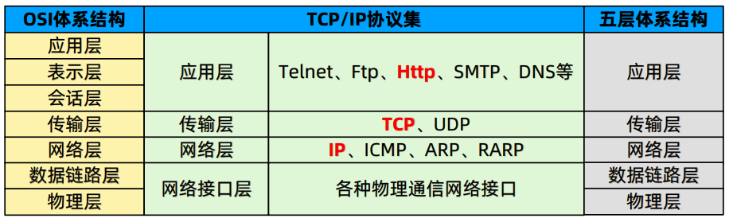
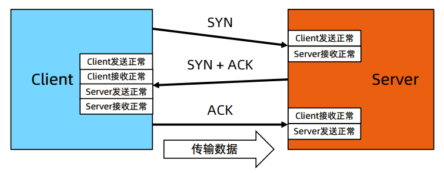
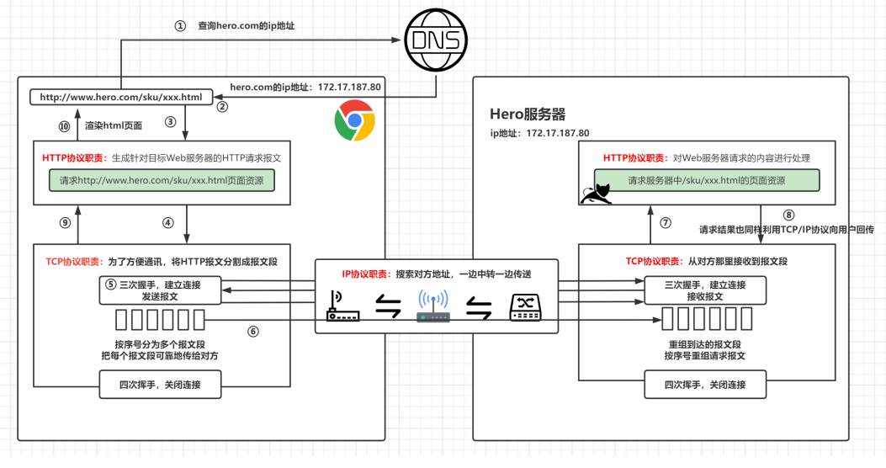
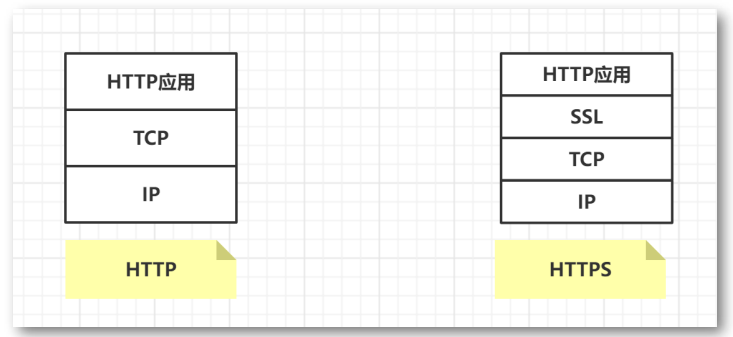

# 网络编程

## TCP/IP协议

- 互联网相关联的协议集的总称：**TCP/IP**
- 全称传输控制协议/因特网互联协议(Transmission Control Protocol/Internet Protocol)

-  是最基本、应用最广泛的一套互联网协议，定义了计算机如何接入互联网，数据在互联网如何传输

- TCP/IP四层体系结构：针对应用开发者的OSI体系结构简化版

  - OSI七层体系结构：物理 + 数据链路 + 网络层 + 传输层 + 会话层 + 表示层 + 应用层
  - 五层协议体系结构：网络接口层分为数据链路层 + 物理层

  

## TCP/UDP协议

**什么是TCP？**

- **传输控制协议(Transmission Control Protocol)：** 可以保证传输数据的安全，相对于UDP 
- **面向连接** 的协议，先建立连接，再传输数据，传输的过程中还会保障传输数据的可靠性
- 建立连接 **三次握手** ，关闭连接 **四次挥手**
- 应用场景：http请求都基于TCP进行数据传输，浏览网页，图片，下载文档

**什么是UDP?**

- **用户数据报送协议(User Datagram Protocol):** 不保证数据传输的安全
- 面向 **无连接** 的协议，传输数据不需要建立连接，不管对方服务是否启动，发数据包就完了
- 传输数据速度快，安全性差，可能会丢失数据包
- 应用场景：视频会议，语音通话，视频直播

### TCP的三次握手

​	**三次握手：TCP协议在发送数据的准备阶段，客户端与服务器之间的三次交互，以保证连接的可靠性**	

- **第一次握手：** Client发送带有SYN标志的数据包给Server
- **第二次握手：** Server发送带有SYN/ACK标志的数据包给Client
- **第三次握手：** Client发送带有ACK标志的数据包给Server

​	**为什么要三次握手？**

- 三次握手的目的是 **建立可靠的通信通道**， 双方确认自己与对方的发送与接收是正常的
  - 第一次握手：Client什么都不能确认，Server确认 **对方发送正常，自己接收正常**
  - 第二次握手：Client确认 **自己发送接收正常，对方发送接收正常**
  - 第三次握手：Server确认 **自己发送正常，对方接收正常**

### TCP的四次挥手

​	**数据传输完毕，断开一个TCP连接则需要四次挥手**

- 第一次挥手：Client发送一个FIN给Server
- 第二次挥手：Server收到这个FIN后给Client发回一个ACK
- 第三次挥手：Server发送一个FIN给Client
- 第四次挥手：Client收到这个FIN后给Server发回一个ACK

**为什么要四次挥手？**

- 数据传输完毕，任何一方都可以发送结束连接的通知，然后进入半关闭状态。另一方没有数据在发送的时候，则发 出结束连接的通知，对方确认后，完全关闭连接

## URL传输协议

​	URL（Uniform Resource Locator）协议是一种标准化的格式，用于在网络中定位和访问特定的资源。它是由万维网联盟（W3C）制定的标准，作为统一资源标识符（URI）的一个子集。

一个完整的URL通常包含以下三个部分：

1. **协议（或称方案）**：这是URL的第一部分，用于指定访问资源所使用的协议。常见的协议有HTTP、HTTPS、FTP、mailto等。例如，`https://` 表示使用安全的超文本传输协议（Hypertext Transfer Protocol Secure）。
2. **主机名（或服务器地址）**：这部分是URL的第二部分，指定了托管资源的服务器的域名或IP地址。例如，`www.example.com` 是一个域名，而 `192.0.2.42` 是一个IPv4地址。
3. **路径**：这部分指定了在服务器上具体要访问的资源的位置。路径可以是一个文件名，也可以是一系列目录。例如，`/path/to/resource.html` 就是指向服务器上的某个HTML文件。

除了这三个主要部分，URL还可以包含其他可选元素，如端口号（如果非默认）、查询参数（以问号 `?` 开始的一系列键值对）、片段标识符（以井字号 `#` 开始，用于指向文档内的某个位置）等。

URL协议的重要性在于它提供了一种通用的方式来表示和访问互联网上的各种资源，无论是网页、图像、视频，还是应用程序服务。浏览器和其他客户端软件能够解析URL，并使用相应的协议来请求和接收资源数据。

### 输入URL地址到显示网页经历了哪些过程

过程：

1. 浏览器查找域名对应IP
2. 浏览器向web服务器发送http请求
3. 服务器处理请求
4. 服务器返回HTML
5. 浏览器渲染HTML

使用到的协议：

- DNS协议：获取域名对应IP
- HTTP协议：使用HTTP协议访问网页
- TCP协议：建立服务器的TCP连接并传输数据
- IP协议：传输数据在网络层依靠IP协议

## HTTP1.0与HTTP1.1的区别

- **长连接：** 
  - HTTP/1.0默认使用短连接，HTTP1.1默认使用长连接，Connection: keep-alive
  - HTTP/1.1长连接有 非**流水线** 方式和 **流水线(pipelining)** 方式
- **错误状态码：**
  - HTTP1.1新增了24个错误状态响应码
- **缓存：**
  - HTTP1.0缓存判断标准单一
  - HTTP1.1引入了更多的缓存控制策略
- **断点续传：**
  - HTTP1.0不支持断点续传，浪费带宽
  - HTTP1.1加入断点续传支持，允许只请求资源的某一部分，充分利用带宽和连接

## HTTP与HTTPS的区别

- **端口：**
  - HTTP默认端口80
  - HTTPS默认端口443
- **协议：**
  - HTTP的协议：http://
  - HTTPS的协议：https://
- **安全性与资源消耗：**
  - HTTP安全性没有HTTPS高(HTTP是明文发送数据的，而HTTPS是加密发送数据)，资源消耗相比于HTTPS更低
  - HTTPS是身披SSL外壳的HTTP， **HTTPS = HTTP + 加密 + 认证 + 完整性保护** 
  - HTTPS传输内容加密使用 **对称加密算法**， 对称加密的密钥采用 **非对称加密** 

