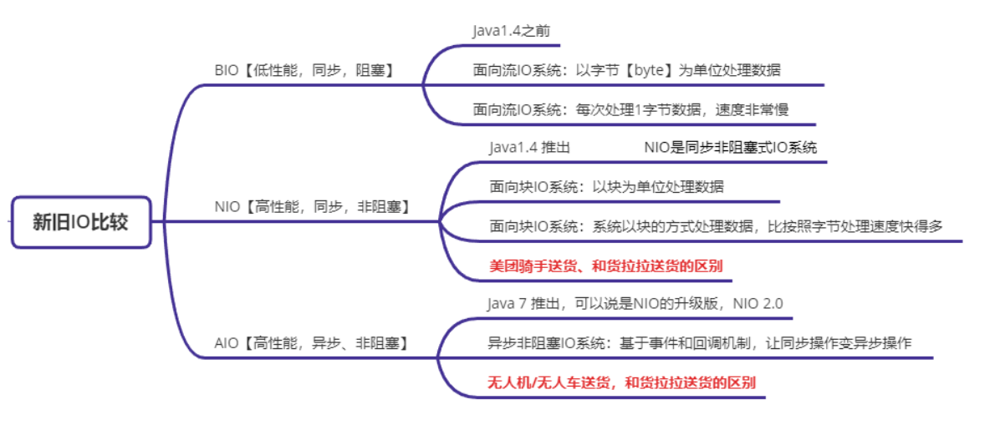
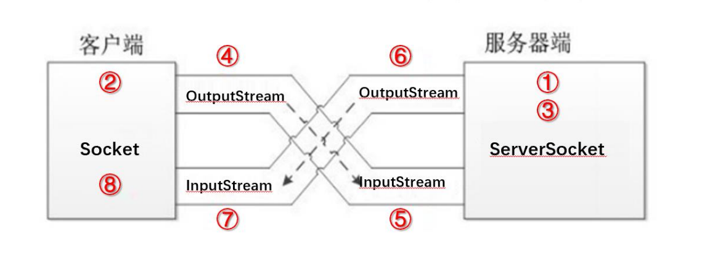
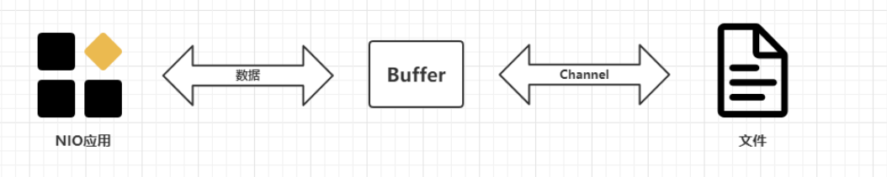
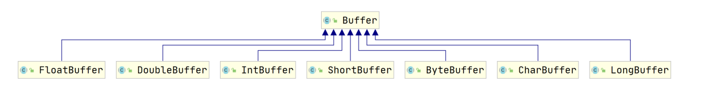
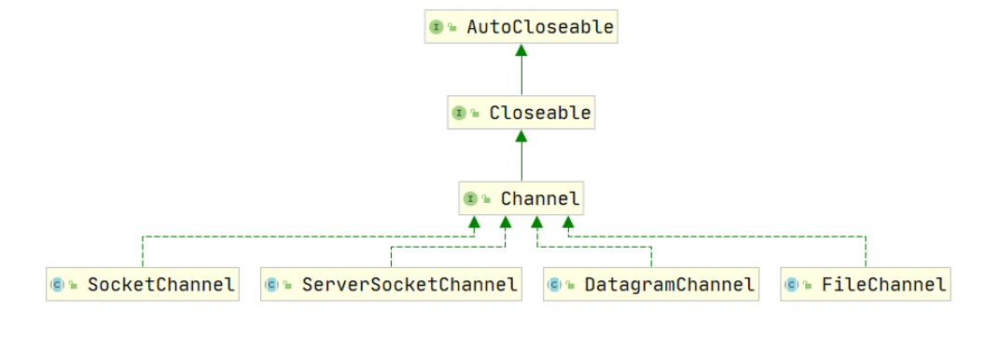
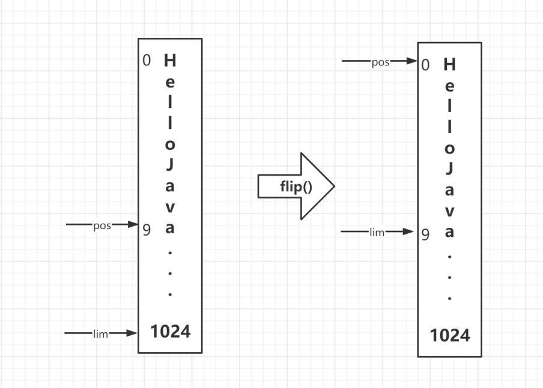
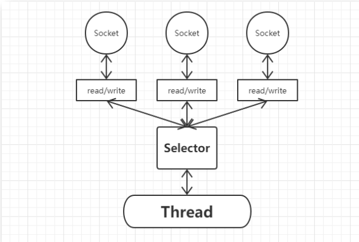
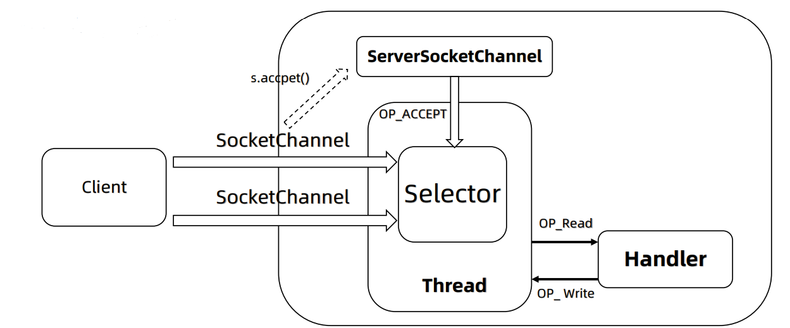
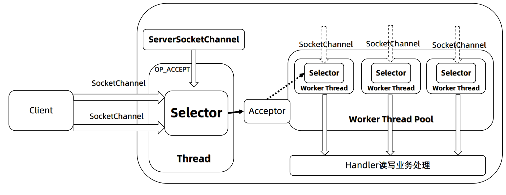
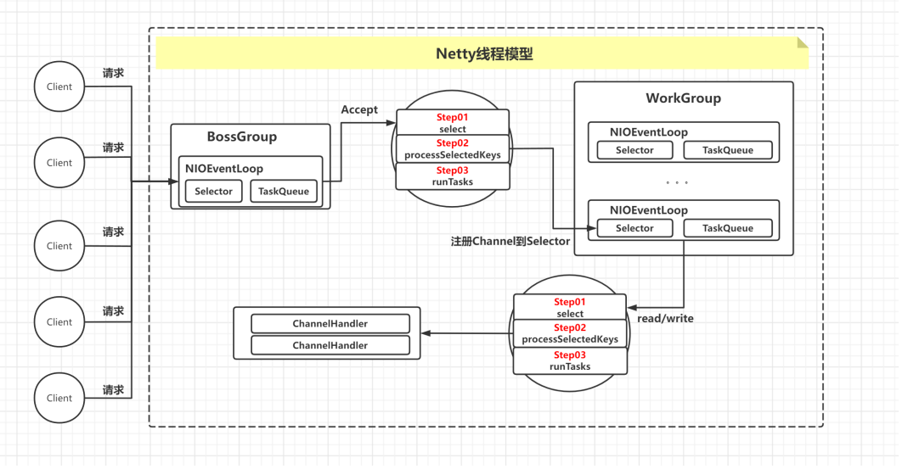

# 网络编程

## TCP/IP协议

- 互联网相关联的协议集的总称：**TCP/IP**
- 全称传输控制协议/因特网互联协议(Transmission Control Protocol/Internet Protocol)

-  是最基本、应用最广泛的一套互联网协议，定义了计算机如何接入互联网，数据在互联网如何传输

- TCP/IP四层体系结构：针对应用开发者的OSI体系结构简化版

  - OSI七层体系结构：物理 + 数据链路 + 网络层 + 传输层 + 会话层 + 表示层 + 应用层
  - 五层协议体系结构：网络接口层分为数据链路层 + 物理层

  


## TCP/UDP协议

**什么是TCP？**

- **传输控制协议(Transmission Control Protocol)：** 可以保证传输数据的安全，相对于UDP 
- **面向连接** 的协议，先建立连接，再传输数据，传输的过程中还会保障传输数据的可靠性
- 建立连接 **三次握手** ，关闭连接 **四次挥手**
- 应用场景：http请求都基于TCP进行数据传输，浏览网页，图片，下载文档

**什么是UDP?**

- **用户数据报送协议(User Datagram Protocol):** 不保证数据传输的安全
- 面向 **无连接** 的协议，传输数据不需要建立连接，不管对方服务是否启动，发数据包就完了
- 传输数据速度快，安全性差，可能会丢失数据包
- 应用场景：视频会议，语音通话，视频直播


### TCP的三次握手

​	**三次握手：TCP协议在发送数据的准备阶段，客户端与服务器之间的三次交互，以保证连接的可靠性**	

- **第一次握手：** Client发送带有SYN标志的数据包给Server
- **第二次握手：** Server发送带有SYN/ACK标志的数据包给Client
- **第三次握手：** Client发送带有ACK标志的数据包给Server

​	**为什么要三次握手？**

- 三次握手的目的是 **建立可靠的通信通道**， 双方确认自己与对方的发送与接收是正常的
  - 第一次握手：Client什么都不能确认，Server确认 **对方发送正常，自己接收正常**
  - 第二次握手：Client确认 **自己发送接收正常，对方发送接收正常**
  - 第三次握手：Server确认 **自己发送正常，对方接收正常**


### TCP的四次挥手

​	**数据传输完毕，断开一个TCP连接则需要四次挥手**

- 第一次挥手：Client发送一个FIN给Server
- 第二次挥手：Server收到这个FIN后给Client发回一个ACK
- 第三次挥手：Server发送一个FIN给Client
- 第四次挥手：Client收到这个FIN后给Server发回一个ACK

**为什么要四次挥手？**

- 数据传输完毕，任何一方都可以发送结束连接的通知，然后进入半关闭状态。另一方没有数据在发送的时候，则发 出结束连接的通知，对方确认后，完全关闭连接


## URL传输协议

​	URL（Uniform Resource Locator）协议是一种标准化的格式，用于在网络中定位和访问特定的资源。它是由万维网联盟（W3C）制定的标准，作为统一资源标识符（URI）的一个子集。

一个完整的URL通常包含以下三个部分：

1. **协议（或称方案）**：这是URL的第一部分，用于指定访问资源所使用的协议。常见的协议有HTTP、HTTPS、FTP、mailto等。例如，`https://` 表示使用安全的超文本传输协议（Hypertext Transfer Protocol Secure）。
2. **主机名（或服务器地址）**：这部分是URL的第二部分，指定了托管资源的服务器的域名或IP地址。例如，`www.example.com` 是一个域名，而 `192.0.2.42` 是一个IPv4地址。
3. **路径**：这部分指定了在服务器上具体要访问的资源的位置。路径可以是一个文件名，也可以是一系列目录。例如，`/path/to/resource.html` 就是指向服务器上的某个HTML文件。

除了这三个主要部分，URL还可以包含其他可选元素，如端口号（如果非默认）、查询参数（以问号 `?` 开始的一系列键值对）、片段标识符（以井字号 `#` 开始，用于指向文档内的某个位置）等。

URL协议的重要性在于它提供了一种通用的方式来表示和访问互联网上的各种资源，无论是网页、图像、视频，还是应用程序服务。浏览器和其他客户端软件能够解析URL，并使用相应的协议来请求和接收资源数据。


### 输入URL地址到显示网页经历了哪些过程


过程：

1. 浏览器查找域名对应IP
2. 浏览器向web服务器发送http请求
3. 服务器处理请求
4. 服务器返回HTML
5. 浏览器渲染HTML

使用到的协议：

- DNS协议：获取域名对应IP
- HTTP协议：使用HTTP协议访问网页
- TCP协议：建立服务器的TCP连接并传输数据
- IP协议：传输数据在网络层依靠IP协议


## HTTP1.0与HTTP1.1的区别

- **长连接：** 
  - HTTP/1.0默认使用短连接，HTTP1.1默认使用长连接，Connection: keep-alive
  - HTTP/1.1长连接有 非**流水线** 方式和 **流水线(pipelining)** 方式
- **错误状态码：**
  - HTTP1.1新增了24个错误状态响应码
- **缓存：**
  - HTTP1.0缓存判断标准单一
  - HTTP1.1引入了更多的缓存控制策略
- **断点续传：**
  - HTTP1.0不支持断点续传，浪费带宽
  - HTTP1.1加入断点续传支持，允许只请求资源的某一部分，充分利用带宽和连接


## HTTP与HTTPS的区别

- **端口：**
  - HTTP默认端口80
  - HTTPS默认端口443
- **协议：**
  - HTTP的协议：http://
  - HTTPS的协议：https://
- **安全性与资源消耗：**
  - HTTP安全性没有HTTPS高(HTTP是明文发送数据的，而HTTPS是加密发送数据)，资源消耗相比于HTTPS更低
  - HTTPS是身披SSL外壳的HTTP， **HTTPS = HTTP + 加密 + 认证 + 完整性保护** 
  - HTTPS传输内容加密使用 **对称加密算法**， 对称加密的密钥采用 **非对称加密** 


## URI和URL的区别是什么

​	**URI(Uniform Resource Identifier) 统一资源标志符：**

- 资源抽象的定义，不管用什么方法表示，只要能定位一个资源就叫URI
  -  **URL(Uniform Resource Locator) 统一资源定位符**， 是一种具体的URI，在用地址定位
  -  **URN(Uniform Resource Name) 统一资源名称**， 也是一种具体的URI，在用名称定位


## BIO与NIO



### BIO

​	BIO全称是Basic（基本） IO，有的称之为 block(阻塞) IO，主要应用于文件 IO 和网络 IO，Java1.4之前建立网络连接只能使用BIO，处理数据是以字节为单位

​	在 JDK1.4 之前，我们建立网络连接的时候只能采用 BIO，需要先在服务端启动一个ServerSocket，然后 在客户端启动 Socket 来对服务端进行通信，默认情况下服务端需要对每个请求建立一个线程等待请求， 而客户端发送请求后，先咨询服务端是否有线程响应，如果没有则会一直等待或者遭到拒绝，如果有的 话，客户端线程会等待请求结束后才继续执行，这就是阻塞式IO。



```java
/**
 * TCP-Server
 * - 说明：先启动Server类，不然客户端连接会被拒绝
 *
 * @author NieHong
 * @date 2023/12/03
 */
public class Server {
    @SneakyThrows
    public static void main(String[] args) {
        System.out.println(((char) 97));
        @Cleanup ServerSocket serverSocket = new ServerSocket(9999);
        System.out.println("服务器已启动，监听端口：9999");
        while (true) {
            @Cleanup Socket accept = serverSocket.accept();
            byte[] bytes = new byte[1024];
            accept.getInputStream().read(bytes);
            System.out.println(new String(bytes).trim());

            OutputStream os = accept.getOutputStream();
            os.write("你是谁".getBytes());
        }
    }
}


/**
 * TCP-Client
 *
 * @author NieHong
 * @date 2023/12/03
 */
// 忽略IDEA里无限循环的警告
@SuppressWarnings("InfiniteLoopStatement")
public class Client {
    @SneakyThrows
    public static void main(String[] args) {
        while (true) {
            @Cleanup Socket socket = new Socket("127.0.0.1", 9999);
            OutputStream os = socket.getOutputStream();
            os.write(new Scanner(System.in).nextLine().getBytes());

            byte[] bytes = new byte[1024];
            InputStream is = socket.getInputStream();
            is.read(bytes);

            System.out.println(new String(bytes).trim());
        }
    }
}
```


### NIO

​	全称Java Non-Blocking IO，JDK1.4开始，改进后的IO，NIO和BIO的目的和作用相同，但是实现方式不同

- **效率不同：** BIO以字节单位处理数据，NIO以块为单位处理数据
- **是否阻塞：** BIO是阻塞式的，NIO是非阻塞式的
- **数据流向：** BIO单向、NIO双向


#### **NIO三个核心概念**

- Channel通道
- Buffer缓冲区
- Selector选择器

NIO基于Channel和Buffer进行操作，数据总是从Channel读取到Buffer中，或从Buffer写入到Channel Selector监听多个Channel的事件，使用单个线程就可以监听多个客户端Channel


#### NIO-文件IO




**Buffer(缓冲区)：** 是一个缓存容器(底层是数组) 内置了一些机制能够跟踪和记录缓冲区的状态变化

**Channel(通道)：** 提供从文件、网络读取数据的通道，读取或写入数据都必须经由Buffer


**Buffer**



在 NIO 中，Buffer 是一个顶层父类，它是一个抽象类，Channel读写数据都是放入Buffer中进行的，常用的 Buffer 子类有：

- FloatBuffer，存储小数到缓冲区
- DoubleBuffer，存储小数到缓冲区
- IntBuffer，存储整数数据到缓冲区
- ShortBuffer，存储短整型数据到缓冲区
- ByteBuffer，存储字节数据到缓冲区
- CharBuffer，存储字符数据到缓冲区
- LongBuffer，存储长整型数据到缓冲区


对于 Java 中的基本数据类型， 都有一个 Buffer 类型与之相对应，最常用的自然是ByteBuffer 类（字节 缓冲），该类的主要方法如下所示：

**主要方法：**

- ByteBuffer put(byte[] b); 存储字节数据到Buffer
- byte[] get(); 从Buffer获得字节数据
- byte[] array(); 把Buffer数据转换为字节数组
- ByteBuffer allocate(int capacity); 设置缓冲区的初始容量
- ByteBuffer warp(byte[] array); 把一个现成数组放到缓冲区中使用
- **Buffer flip(); 翻转缓冲区，重置位置到初始位置**


**Channel**

​	

NIO中Channel是一个借口，表示通道，通道是双向的，可以切换读或写数据

- **FileChannel 文件数据读写**
- DatagramChannel 用于UDP数据读写
- **ServerSocketChannel 和 SocketChannel 用于TCP数据读写**

**FileChannel主要方法**

- int read(ByteBuffer dst); 从Channel读取数据并放到Buffer中
- int write(ByteBuffer src); 把Buffer的数据写到Channel中
- public long transferFrom(ReadableByteChannel src, long position, long count); 从目标通道中 复制数据到当前通道 
- public long transferTo(long position, long count, WritableByteChannel target); 把数据从当前 通道复制给目标通道

```java
    /**
     * 文件写入
     * - 当前项目文件下新建“nio.txt”文件，并写入内容“NIO，HELLO”
     */
    @Test
    @SneakyThrows
    public void fileWrite() {
        @Cleanup FileOutputStream fs = new FileOutputStream("nio.txt");
        FileChannel channel = fs.getChannel();

        // 分配一个新的字节缓冲区
        ByteBuffer buffer = ByteBuffer.allocate(1024);
        // 向缓冲区添加数据
        buffer.put("NIO，HELLO".getBytes());
        // 翻转缓冲区
        buffer.flip();

        // 往通道写入数据
        int write = channel.write(buffer);
        System.out.println(write != 0 ? "字符串写入成功" : "字符串写入失败");
    }
```

​	NIO 中的通道是从输出流对象里通过 getChannel 方法获取到的，该通道是双向的，既可以读，又可以 写。在往通道里写数据之前，必须通过 put 方法把数据存到 ByteBuffer 中，然后通过通道的 write 方法 写数据。 **在 write 之前，需要调用 flip 方法翻转缓冲区** ，把内部重置到初始位置，这样在接下来写数据 时才能把所有数据写到通道里

​	flip()方法的作用：翻转缓冲区，在缓冲区里有一个指针从头（pos）写到尾（lim）。默认的pos是缓冲 区内元素size，lim是缓冲区大小。当从缓冲区向通道去写时，是从pos位置去写，写到lim，这样就得不 到数据。所以要将pos=lim，pos=0再写

方法源码：

```java
public final Buffer flip() {
    limit = position;
    position = 0;
    mark = -1;
    return this;
}
```



```java
    /**
     * 文件读取
     */
    @Test
    @SneakyThrows
    public void fileRead() {
        @Cleanup FileInputStream is = new FileInputStream("nio.txt");

        FileChannel channel = is.getChannel();
        ByteBuffer buffer = ByteBuffer.allocate(is.available());

        channel.read(buffer);
        System.out.println(new String(buffer.array()));
    }

    /**
     * 文件复制
     */
    @Test
    @SneakyThrows
    public void fileCopy() {
        // 被拷贝文件的输入流(从哪里拷贝)
        @Cleanup FileInputStream srcFis = new FileInputStream("nio.txt");
        // 目标文件的输出流(拷贝到哪里去)
        @Cleanup FileOutputStream targetFos = new FileOutputStream("nio-copy.txt");

        // 分别拿到对应的Channel
        FileChannel srcFisChannel = srcFis.getChannel();
        FileChannel targetFosChannel = targetFos.getChannel();

        // 执行文件拷贝
        targetFosChannel.transferFrom(srcFisChannel, 0, srcFisChannel.size());
    }
```


#### NIO-网络IO

​	Java NIO中网络通道是 **非阻塞式IO，基于事件驱动，** 很适合需要维持大量连接，但数据交换量不大的场景，例如：RPC、即时通讯、web服务器等

​	**Java编写网络应用，有以下几种模式**

- **为每个请求创建线程：** 一个客户端连接用一个线程， **阻塞式IO**
  - 优点：程序编写简单
  - 缺点：随着连接数的增加，分配的线程也会非常多，服务器可能会因为资源耗尽而崩溃
- **线程池：** 创建固定数量线程的线程池，来接收客户端连接， **阻塞式IO**
  - 优点：程序编写相对简单，可以处理大量的连接
  - 缺点：线程的开销非常大，连接数非常多的时候，排队现象会比较严重
- **Java-NIO：** **可以是阻塞，也可以是非阻塞式IO**
  - **优点：** 一个线程就可以处理大量的客户端连接
  - **缺点：** 代码复杂度较高


#### NIO-Selector

- NIO三大核心组件之一
- 用于检测多个注册Channel上是否有时间发生(读、写、连接)如果有就获取事件，并对每个事件进行处理，可以简单的理解为给Channel添加一个监听器
- 只需一个单线程就可以管理多个Channel，也就是多个连接
- 只有连接真正有读写事件时，才会调用方法来处理，大大降低了系统分配线程与线程上下文切换的开销



**常用方法：**

- Selector open(); 开启一个 **Selector**

- int select(long timeout); 监控所注册的通道

- selectedKeys(); 从Selector获取所有SelectionKey

  - **selectionKey: 代表了Selector和网络SocketChannel的注册关系**
  - 注册关系共有四种，如下
    - **OP_ACCEPT：** 有新的网络连接可以accept
    - **OP_CONNECT：** 代表连接已经建立
    - **OP_READ：** 代表读操作
    - **OP_WRITE：** 代表写操作

  

  **selectionKey常用方法：**

  - Selector selector(); 得到与之关联的Selector对象
  - selectableChannel channel(); 得到与之关联的通道
  - Object attachment(); 得到与之关联的共享数据
  - boolean isAcceptable(); 是否可接入
  - boolean isReadable(); 是否可以读
  - boolean isWhitable(); 是否可以写


#### NIO-网络通信API

​	**ServerSocketChannel:**  **用来在Server端监听新的Client的Socket连接，常用方法如下：**

-  ServerSocketChannel open(); 开启一个ServerSocketChannel通道
-  ServerSocketChannel bind(SocketAddress local); 设置Server端口号
-  SelectableChannel configureBlocking(block); 设置阻塞模式，false表示采用非阻塞模式
-  SocketChannel accept(); 接受一个连接，返回值代表这个连接的Channel对象
-  SelectionKey register(Selector sel, int ops); 注册Selector并设置监听事件

​	**SocketChannel:**  **网络IO通道，具体负责读写操作，常用方法如下：**

- SocketChannel open(); 得到一个SocketChannel通道
- SelectableChannel configureBlocking(block); 设置阻塞模式，false表示采用非阻塞模式
- boolean connect(SocketAddress remote); 连接服务器
- boolean finishConnect(); 如果connect连接失败，接下来就要通过本方法完成连接
- int write(ByteBuffer src); 往通道里写数据
- int read(ByteBuffer dst); 往通道里读数据
- SelectionKey register(Selector sel, ops, att); 注册Selector并设置监听事件
- void close(); 关闭通道


## Netty

​	**Netty 是一个被广泛使用的，基于NIO的 Java 网络应用编程框架**。 Netty框架可以帮助开发者快速、简单的实现客户端和服务端的网络应用程序。“快速”和“简单”并不用产生维护性或性能上的问题。Netty 利 用 Java 语言的NIO网络编程的能力，并隐藏其背后的复杂性，从而提供一个易用的 API，基于这些API， 我们可以快速编写出一个客户端/服务器网络应用程序。 

​	Netty 成长于用户社区，像大型公司 Facebook 和 Instagram 以及流行的开源项目（Apache Cassandra、Apache Storm、Elasticsearch、Dubbo等等），都利用其强大的对于网络抽象的核心代 码实现网络通信。


**特点：**

- API简单易用：支持阻塞和非阻塞式的socket
- 基于事件模型：可扩展性和灵活性更强
- 高度定制化的线程模型：支持单线程和多线程
- 高通吐、低延迟、资源占用率低
- 完整支持SSL和TLS
- 学习难度低


### 线程模型

#### 单线程模型

**特点：**

- 通过IO多路复用，一个线程搞定所有Client连接，代码简单，清晰明了 
- 如果Client连接数量过多则无法支撑

​	


#### 线程池模型

**特点：**

- 服务端用一个线程专门处理客户端连接请求，用一个线程池负责 IO 操作。在绝大多数场景下，该模型都 能满足网络编程需求。




#### Netty线程模型

​	Netty的线程模型并不是一成不变的，它实际取决于用户的启动参数配置。通过设置不同的启动参数，Netty可以同时支持Reactor单线程模型、多线程模型和主从Reactor多线程模型

​	Netty官方推荐的是基于主从Reactor线程模型实现的NioEventLoopGroup线程模型

```java
NioEventLoopGroup bossGroup = new NioEventLoopGroup();
NioEventLoopGroup workerGroup = new NioEventLoopGroup();
```




#### 各组件关系

- Netty 抽象出两组线程池： **BossGroup、WorkerGroup**

  - BossGroup 专门负责接收客户端请求
  - WorkerGroup 专门负责网络读写、业务处理
  - BossGroup 和 WorkerGroup 类型都是 **NioEventLoopGroup**， 相当于一个事件循环组，这个组里有多个事件循环，称为NioEventLoop，类似于线程池和中间的线程的关系

- NioEventLoopGroup 可以有多个线程，即含有多个NioEventLoop，可以通过构造函数指定，默认是CPU核心数✖2

  ```java
  NioEventLoopGroup eventLoopGroup1 = new NioEventLoopGroup(3);// 通过构造函数指定线程数
  ```

  

- **NioEventLoop 表示一个不断循环的执行处理任务的线程**

  - 每个 NioEventLoop 中包含有一个 Selector，一个 taskQueue
    - **Selector 上可以注册监听多个 NioChannel，也就是监听Socket网络通信**
    - **每个 NioChannel 只会绑定在唯一的 NioEventLoop 上**
    - **每个 NioChannel 都绑定有一个自己的 ChannelPipeline**
  - NioEventLoop 内部采用串行化（Pipeline）设计：责任链模式
    - 消息读取 ==> 解码 ==> 处理（handlers） ==> 编码 ==> 发送，始终由IO线程 NioEventLoop 负责


#### 一个Client连接的执行流程

**Boss的NioEventLoop循环执行步骤**

- select：轮询注册在其上的ServerSocketChannel的accept事件（OP_ACCEPT）
- processSelectedKeys：处理accept事件，与client事件建立连接，生成NioSocketChannel，并将其注册到某个worker NIoEventLoop上的selector上
- runAllTasks：再循环处理任务队列的任务

**Worker的NioEventLoop循环执行步骤**

- 轮询注册在其上的NioSocketChannel的read、write 事件
- 在对应NioSocketChannel中，处理业务相关操作（ChannelHandler）
- 处理任务队列的任务，即 runTasks

每个Worker NioEventLoop处理业务时，会通过pipeline（管道），pipeline中包含了channel，管道中维护了很多的处理器，数据会在管道中的各个处理器间进行流转、处理。
