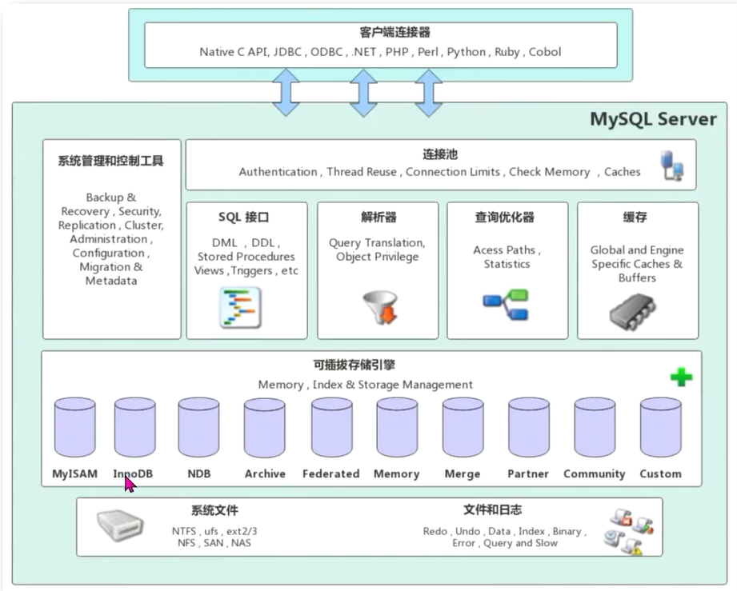
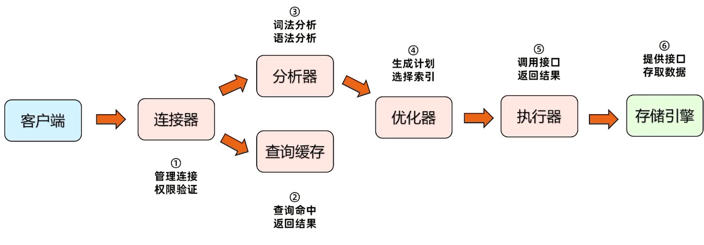
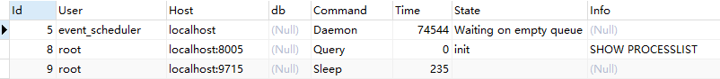
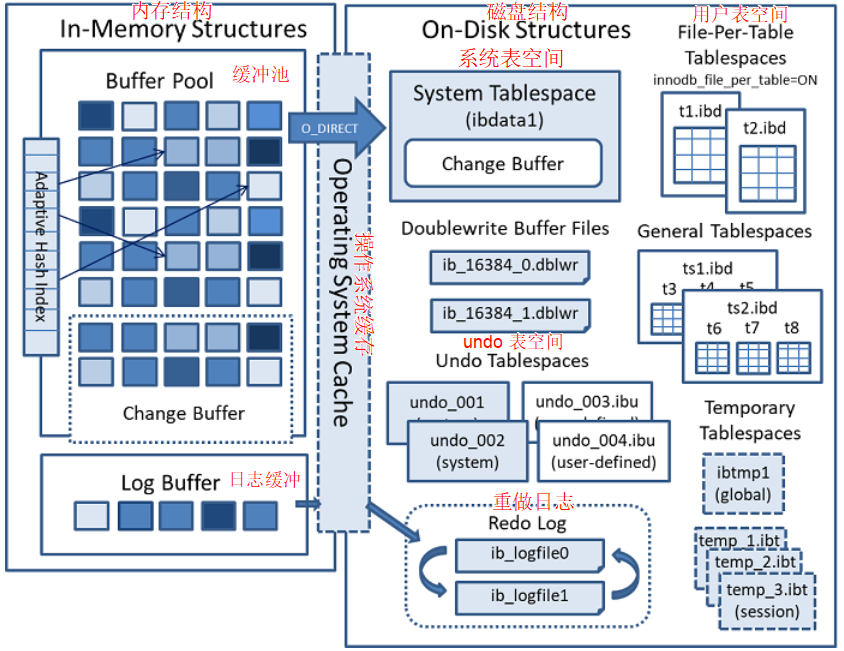

# MySQL学习笔记

## 基础知识

#### 什么是SQL语言

* SQL是用于访问和处理数据的标准的计算机语言。 
* SQL语言分类：DML（数据操作语言）、DCL（数据控制语言）、DDL（数据定义语言）。
* DML: 添加、修改、删除、查询； DCL：用户、权限、事务； DDL: 数据库、数据表、视图、索引。
* SQL语句不区分大小写，但建议关键字大写，非关键字小写。
* SQL语句必须以分号结尾。
* SQL语句中空格和换行没有限制。

#### SQL语句的两种注释

* \# 这是第一种注释（常用于单行注释）
* /* 这是第二种注释 */（常用于多行注释）

#### 创建数据库

```sql
            语法： CREATE DATABASE 数据库名称;
            
            例： CREATE DATABASE user_face_info;
```

#### 显示所有数据库

```sql
            语法： SHOW DATABASES;
```

#### 删除数据库

```sql
            语法： DROP DATABASE 数据库名称;
                
            例： DROP DATABASE user_face_info;
```


### MYSQL基本使用

#### 创建数据表

```sql
            语法： CREATE TABLE 数据表名称(
            字段名1 数据类型 [约束] [COMMENT 注释],
            字段名2 数据类型 [约束] [COMMENT 注释],
            ......
            ) [COMMENT 注释];
            
            例： CREATE TABLE student(
            id INT UNSIGNED PRIMARY KEY COMMENT '学生id',
            name VARCHAR(40) NOT NULL COMMENT '学生姓名') COMMENT '学生信息表';
            注：[]表示非必需项。
```

#### 为数据表插入数据

```sql
			语法： INSERT 数据表名 VALUES('字段1的值','字段2的值'......);
			
			例： INSERT student VALUES(1, '小张');
```

#### 显示当前数据库中的所有数据表

```sql
			语法： SHOW TABLES;
```

#### 查看数据表的表结构

```sql
			语法： DESC 数据表名;
			
			例： DESC student;
```

#### 显示数据表的建表语句

```sql
			语法： SHOW CREATE TABLE 数据表名;
			
			例： SHOW CREATE TABLE student;
```

#### 为已有数据表新增字段

```sql
			语法： ALTER TABLE 数据表名 
			ADD 字段名称 数据类型 [约束] [COMMENT '注释'],
			ADD 字段名称 数据类型 [约束] [COMMENT '注释'],
			......;
			
			例： ALTER TABLE student
				ADD home_tel CHAR(11) NOT NULL COMMENT '家庭电话';
```

#### 修改已有字段数据类型及约束

```sql
			语法： ALTER TABLE 数据表名 
			MODIFY 要修改的字段名 新的数据类型 [约束] [COMMENT '注释'],
			MODIFY 要修改的字段名 新的数据类型 [约束] [COMMENT '注释'],
			......;
			
			例： ALTER TABLE student
			MODIFY home_tel VARCHAR(11) NOT NULL COMMENT '家庭电话号码';
```

#### 修改已有字段名称

```sql
			语法： ALTER TABLE 数据表名 
			CHANGE 原来的字段名 新的字段名 数据类型 [约束] [COMMENT '注释'],
			CHANGE 原来的字段名 新的字段名 数据类型 [约束] [COMMENT '注释'],
			......;
			
			例： ALTER TABLE student
			CHANGE home_tel home_phone CHAR(11) NOT NULL COMMENT '住宅电话';
```

#### 删除已有字段

```sql
			语法： ALTER TABLE 数据表名
			DROP 要删除的字段名1,
			DROP 要删除的字段名2,
			......;
			
			例： ALTER TABLE student
			DROP home_phone;
```

#### 删除数据表

```sql
			语法： DROP TABLE 数据表名;
			
			例： DROP TABLE student;
```


### 数据库的范式及字段约束

* 数据库的范式：

  * 构造数据库必须遵循一定的规则，这种规则就是范式。
  * 关系型数据库有6种范式，一般情况下，只满足第三范式即可。

* 第一范式：原子性

  * 第一范式是数据库的基本要求，不满足这一点就不是关系数据库。

  * 数据表的每一列都是不可分割的基本数据项，同一列中不能有多个值，也不能存在重复的属性。

  * 反例：不符合第一范式（因为班级字段里的数据还能继续拆分）

    | 学号  | 姓名 |     班级     |
    | :---: | :--: | :----------: |
    | 10001 | 小天 | 高三年级一班 |

  * 正例：

    | 学号  | 姓名 | 年级 | 班级 |
    | :---: | :--: | :--: | :--: |
    | 10001 | 小天 | 高三 | 一班 |


* 第二范式：唯一性

  ​		数据表中的每条记录必须是唯一的。为了实现区分，通常要为表加上一个列用来存储唯一标识，这个唯一属性列被习惯性称作主键列。


* 第三范式：关联性

  * 每列都与主键有直接关系，不存在传递依赖。

  * 反例：不符合第三范式

    | 爸爸 | 儿子 |  女儿  | 女儿的玩具 | 女儿的衣服 |
    | :--: | :--: | :----: | :--------: | :--------: |
    | 陈华 | 陈浩 | 陈婷婷 |  海绵宝宝  |    校服    |

  * 正例：应该将女儿的玩具和衣服字段以女儿为主键新建一张数据表。

    * 第一张表：

      | 爸爸 | 儿子 |  女儿  |
      | :--: | :--: | :----: |
      | 陈华 | 陈浩 | 陈婷婷 |

    * 第二张表：

      |  女儿  | 女儿的玩具 | 女儿的衣服 |
      | :----: | :--------: | :--------: |
      | 程婷婷 |  海绵宝宝  |    校服    |

    

* 字段约束

| 约束名称 |     关键字      |          描述          |
| :------: | :-------------: | :--------------------: |
| 主键约束 | **PRIMARY KEY** |  字段值唯一且不为NULL  |
| 非空约束 |  **NOT NULL**   |    字段值不能为NULL    |
| 唯一约束 |   **UNIQUE**    | 字段值唯一且可以为NULL |
| 外键约束 | **FOREIGN KEY** |  保持关联数据的逻辑性  |

  * 主键约束（PRIMARY KEY）

    * 主键约束要求字段的值在全表中必须唯一，而且不能为NULL值。

    * 建议主键一定要使用数字类型，因为数字类型的检索速度非常快。

    * 如果主键是数字类型，那么我们应该为该列设置自动增长，关键字为  **AUTO_INCREMENT**。

      ```sql
      			例： CREATE TABLE student(
      				id INT UNSIGNED PRIMARY KEY AUTO_INCREMENT,
      				name VARCHAR(40) NOT NULL);
      ```

* 非空约束（NOT NULL）

  * 非空约束要求字段的值不能为NULL值。

  * NULL值时没有值，而不是空字符串。

    ```sql
                例： CREATE TABLE student(
                                id INT UNSIGNED PRIMARY KEY AUTO_INCREMENT,
                                name VARCHAR(40) NOT NULL);
    ```

* 唯一约束（UNIQUE）

  * 唯一约束要求字段值如果不为NULL，那么在全表中必须唯一。

  * 例：将每个学生的电话号码字段约束设置为唯一约束

    ```sql
    			例： CREATE TABLE student(
                    id INT UNSIGNED PRIMARY KEY AUTO_INCREMENT,
                    name VARCHAR(40) NOT NULL,
                    gender ENUM('男','女') DEFAULT '男',
                    graduate BOOLEAN DEFAULT false,
                    tel VARCHAR(11)  NOT NULL UNIQUE
                 );
    ```

  * 外键约束

    ​	一般不考虑使用该约束，因为容易形成外键闭环，这样的话就会导致我们无法删除任何一张表的记录。


### 索引

​		当数据库中的记录越来越多，怎么样提高检索速度就显得重要了。而索引机制，就是为了提高数据检索速度的。

* 如何创建索引（INDEX）

  ```sql
  			语法： CREATE TABLE 数据表名(
  				......,
                    INDEX [索引名称] (字段),
                    ......
  			);
  ```

  例：我们为数据表student中的name字段添加索引，索引名称就是字段名称

  ```sql
  			例： CREATE TABLE student(
                  id INT UNSIGNED PRIMARY KEY AUTO_INCREMENT,
                  name VARCHAR(40) NOT NULL,
                  gender ENUM('男','女') DEFAULT '男',
                  graduate BOOLEAN DEFAULT false,
                  tel VARCHAR(11)  NOT NULL UNIQUE,
                  INDEX (name)
              );
  ```

  ​	注：如果我们填写了索引名称，那么索引就是名称，如果没有填写索引名称，那么默认就是字段名称，例如在上面的SQL语句中，INDEX(name)，就表示我们要为name字段创建索引，并且索引的名称就是name。

* 如何为已有数据表添加或删除索引

  添加索引

  ```sql
  			语法一： CREATE INDEX 索引名称 ON 数据表名(要添加索引的字段名);
  			
  			语法二： ALTER TABLE 数据表名 ADD INDEX [索引名称](要添加索引的字段名);
  ```

  查看某一数据表中索引列表

  ```sql
  			语法： SHOW INDEX FROM 数据表名;
  ```

  删除索引

  ```sql
  			语法： DROP INDEX 索引名称 ON 数据表名;
  ```

* 索引的使用原则

  * 数据量很大，而且经常被查询的数据表可以设置索引。
  * 如果数据表的写入量远远大于查询量时不适合使用索引。
  * 索引只添加在经常被用作检索条件的字段上面。
  * 不要在大字段上创建索引，例如字段长度超过50个字符。


### MySQL常用数据类型

* 数字

```sql
           	 类型                 大小           说明
           	 TINYINT			1字节			小整数
           	 SMALLINT			2字节			普通整数
           	 MEDIUMINT			3字节			普通整数
           	 INT				4字节			较大整数
           	 BIGINT				8字节			大整数
           	 FLOAT				4字节			单精度浮点数
           	 DOUBLE				8字节			双精度浮点数
           	 DECIMAL			-----		  DECIMAL(10,2)
```

注：当对数据精度要求很高时，应使用DECIMAL类型，而不是FLOAT或DOUBLE。

* 字符串类型

```sql
           	 类型                 大小           说明
           	 CHAR			 1~255字符		固定长度字符串
           	 VARCHAR		 1~65535字符		不固定长度字符串
           	 TEXT			 1~65535字符		不确定长度字符串
           	 MEDIUMTEXT		 1~1千6百万字符     不确定长度字符串
           	 LONGTEXT		 1~42亿字符		不确定长度字符串
```

* 日期类型

```sql
           	 类型                 大小           说明
           	 DATE			  	3字节			日期
           	 TIME				3字节			时间
           	 YEAR				1字节			年份
           	 DATETIME			8字节			日期时间
           	 TIMESTAMP			4字节			时间戳
```

* 枚举类型(ENUM)

```sql
           	语法： CREATE TABLE student(
                id INT UNSIGNED PRIMARY KEY AUTO_INCREMENT,
                name VARCHAR(40) NOT NULL,
                gender ENUM('男','女') DEFAULT '男');
```

注：枚举类型用关键字ENUM表示，枚举值之间用多个，分开，DEFAULT关键字表示该列的默认值是什么。

* 布尔类型(BOOLEAN)

  ​		实际上在MySQL中，该类型是用tinyint(1)来表示的，在SQL语句中的TRUE和FALSE分别用数字1和0代替。

```sql
			语法： CREATE TABLE student(
                id INT UNSIGNED PRIMARY KEY AUTO_INCREMENT,
                name VARCHAR(40) NOT NULL,
                gender ENUM('男','女') DEFAULT '男',
                graduate BOOLEAN DEFAULT false
             );
```


### 数据表的基本查询

* 普通查询

```sql
			语法： SELECT 字段名1,字段名2...... FROM 要查询的数据表名;
			
			例： SELECT id, name, tel FROM student;
			
			注： 如果要显示表中所有字段名可用*代替
			例： SELECT * FROM student;
```

* 使用例别名

  ​		通常情况下，SELECT子句中使用了表达式，那么这列的名字就默认为表达式，因此就需要对该列名重命名，也就是为该列名起一个别名。

  ```sql
  			语法 SELECT 字段名1 AS 别名1, 字段名2 AS 别名2...... FROM 要查询的数据表名;
  			
  			例： SELECT id AS student_id, name, tel FROM student;
  ```

  我们先来看这种情况是怎么发生的

  ```sql
              表结构： CREATE TABLE staff_salaries(
                                          id INT UNSIGNED PRIMARY KEY AUTO_INCREMENT,
                                          name VARCHAR(50) NOT NULL,
                                          salaries DECIMAL(20,5) NOT NULL,
                                          tel VARCHAR(11) NOT NULL
                                       );
  
              表数据： INSERT staff_salaries VALUES
                  (1, '程勋', 5600.00, '13954685278'),
                  (2, '谢诚', 5800.00, '18845782154');
  
              通过表达式计算出每个员工年收入：
              	SELECT id, name, salaries*12，tel FROM staff_salaries;
  
              备：此时我们就能很明显的看出原本列名为salaries变成了salaries*12了，所以就需要给该列名起别名。
  
              修改后： 
              	SELECT id, name, salaries*12 AS yearly_salaries, tel  FROM staff_salaries;
      			
    
  ```

  注： 为列名起别名是针对于结果集的，而不是修改原本数据表中的字段名称。


 * 数据分页

   ​		如果结果集中的记录很多，则可以使用LIMIT关键字限定结果集数量。

   ```sql
   			语法： SELECT ...... FROM 要查询的数据表名 LIMIT 起始值, 偏移量;
   			
   			例： CREATE TABLE staff_salaries(
                       id INT UNSIGNED PRIMARY KEY AUTO_INCREMENT,
                       name VARCHAR(50) NOT NULL,
                       salaries DECIMAL(20,5) NOT NULL,
                       tel VARCHAR(11) NOT NULL
               	  );
               	  
   			表数据：
                       INSERT staff_salaries VALUES
                       (1, '程勋', 5600.00, '13954685278'),
                       (2, '谢诚', 5800.00, '18845782154'),
                       (3, '陈涛', 4600.00, '15325468574'),
                       (4, '王媞', 6500.00, '13524510879'),
                       (5, '田海', 5300.00, '15587451254'),
                       (6, '戴妃', 8500.00, '13541542654');
                       
   			要查询第一条到第三条的记录：
   				  SELECT * FROM staff_salaries LIMIT 0, 3;
   				  
   			要查询第四条到第六条的记录：
   				  SELECT * FROM staff_salaries LIMIT 3, 3;
   		
   		备： 要分页查询时，一般改变的是起始值，而偏移量一般都是固定不变的，注意起始值是从0开始的。
   
   ```


* 结果集排序

  ​		如果想让结果集按照某种顺序排列，就必须使用ORDER BY子句。

  ```sql
  			语法： SELECT ......FROM ...... ORDER BY 列名 [ASC | DESC];
  			备： ASC表示升序排序(默认)； DESC表示降序排序
  				
  			例：按员工工资的降序排序：
  				  SELECT * FROM staff_salaries ORDER BY salaries DESC;
  			
  ```

  ​		如果排序列是数字类型，那么就按照数字大小排序，如果是日期类型就按照日期大小排序，如果是字符串就按照字符集序号排序。

  

  

  * 多字段组合排序

    ​		如果两条数据排序字段内容相同，那么默认是按照主键的升序来排序的。

  ```sql
  			语法： SELECT ......FROM ...... ORDER BY 列名 [ASC | DESC], 列名 [ASC | DESC]......;
  			
  			例： 按员工工资的升序排列，若果工资相同，则按id值降序排序
  				  SELECT * FROM staff_salaries ORDER BY salaries, id DESC;
  				  
  			例： 按员工工资的升序排列，若果工资相同，则按id值降序排序，并限定结果集为3个
  			  SELECT * FROM staff_salaries ORDER BY salaries, id DESC LIMIT 0, 3;
  ```

  * 去除重复记录

  ```sql
  			语法： SELECT DISTINCT 字段 FROM 数据表名;
  			
  			例：CREATE TABLE employee(
                      id INT UNSIGNED PRIMARY KEY AUTO_INCREMENT,
                      name VARCHAR(50) NOT NULL,
                      job ENUM('总经理','部门经理','员工') DEFAULT '员工'
                  );
                  
               表数据： INSERT employee VALUES
                          (1, '王涛', '总经理'),
                          (2, '丁康', '员工'),
                          (3, '何帅', '员工'),
                          (4, '田铎', '部门经理');
                          
               查询数据表中有多少个不同的职位信息：
               		  SELECT DISTINCT job FROM employee;
               
               备：
               	1. 使用DISTINCT的SELECT子句中只能查询一列数据，如果查询多列，去除重复记录就会失效。
               	2. DISTINCT关键字只能在SELECT子句中使用一次。
               	
  
  ```


* 条件查询

  ​		有时候用户只是要取出满足指定条件的记录，这类条件要用WHERE子句来实现数据的筛选。

* 使用WHERE子句时，条件执行的顺序是从左到右的，所以我们应该优先把索引条件，或者筛选掉记录最多的条件写在最左侧。

  ```sql
  			语法： SELECT ...... FROM 数据表名 WHERE 条件 [AND | OR] 条件......;
  			
  			例： 查询出id值为1的员工记录
  				  SELECT id, name, job FROM employee WHERE id = 1;
  				  
  				逻辑与：
  				  SELECT id, name, job FROM employee WHERE id = 1 AND job = '总经理';
  			  
  				逻辑或：
  			  	  SELECT id, name, job FROM employee WHERE job = '员工' OR job = '总经理';
  ```

  * WHERE子句中的条件运算会用到以下四种运算符：

    | 序号 |   运算符   |
    | :--: | :--------: |
    |  1   | 数学运算符 |
    |  2   | 比较运算符 |
    |  3   | 逻辑运算符 |
    |  4   | 按位运算符 |

  

  

  * 数学运算符

    ​	数学运算符分为+，-，*，/, %这五种。

  

  

  * 比较运算符

  | 序号 |   表达式    |    意义    |
  | :--: | :---------: | :--------: |
  |  1   |      >      |    大于    |
  |  2   |     >=      |  大于等于  |
  |  3   |      <      |    小于    |
  |  4   |     <=      |  小于等于  |
  |  5   |      =      |    等于    |
  |  6   |     !=      |   不等于   |
  |  7   |     IN      |    包含    |
  |  8   |   NOT IN    |   不包含   |
  |  9   |   IS NULL   |    为空    |
  |  10  | IS NOT NULL |   不为空   |
  |  11  | BETWEEN AND |    范围    |
  |  12  |    LIKE     |  模糊查询  |
  |  13  |   REGEXP    | 正则表达式 |

  ```sql
  			例： 查找出序号2和4两条记录中工资高于3000的人员记录
  				SELECT * FROM employee WHERE id IN(2,4) AND salaries > 3000;
  			
  			例： 查找出工资为NULL值的所有员工信息
  				SELECT * FROM employee WHERE salaries IS NULL;
  				
  			例： 查找出工资不为NULL值的所有员工信息
  				SELECT * FROM employee WHERE salaries IS NOT NULL;
  			备： 使用“字段名=NULL”或“字段名!=NULL”来判断字段值是否为NULL或不为NULL是不对的，请务必注意。
  			
  			例： 查找出工资范围在4500到6500范围的所有员工信息（BETWEEN AND方式）
  				SELECT * FROM employee WHERE salaries BETWEEN 4500 AND 6500;
  				等价于下列SQL语句：
  				SELECT * FROM employee WHERE salaries >= 4500 AND salaries <= 6500;
  			
  			例： 查找出姓名为“田”的所有员工信息
  				SELECT * FROM employee WHERE name LIKE '田%'; 
  				备：“%”表示任意字符，也就是说，只要是姓田的员工信息全查询出来。
  			
  			例： 查找出姓名最后一位以“涛”结尾的所有员工信息
  				SELECT * FROM employee WHERE name LIKE '%涛'; 
  			
  			例： 查找出姓名为2个字的所有员工记录（一个下划线表示一个占位符）
  				SELECT * FROM employee WHERE name LIKE '__'; 
  ```

  * 逻辑运算符

  | 序号 | 表达式 |   意义   |
  | :--: | :----: | :------: |
  |  1   |  AND   |  逻辑与  |
  |  2   |   OR   |  逻辑或  |
  |  3   |  NOT   |  逻辑非  |
  |  4   |  XOR   | 逻辑异或 |

  ```sql
  			例：查找出工资高于5600且职位是“员工”的所有人员信息
  				SELECT * FROM employee WHERE job = '员工' AND salaries > 5600;
  			
  			例： 查找出职位为“员工”或者为“总经理”的所有人员信息
  				SELECT * FROM employee WHERE job = '员工' OR  job = '总经理';
  			
  			例： 查找出除“员工”职位以外的所有人员信息
  				SELECT * FROM employee WHERE NOT job = '员工';
  ```

  注： XOR（逻辑异或）在MySQL中基本不会用到，所以没有举相关的例子。它表示的含义为：当任意一个操作数为NULL时,返回值为NULL，对于非NULL的操作数,如果两个的逻辑真假值相异，则返回结果为1，否则为0,就是两个不能同时成立,也不能同时不成立,只成立其中一个条件。


### 数据表的高级查询（一）

 * 聚合函数

   * 聚合函数在数据的查询分析中，应用十分广泛。集合函数可以对数据求和、求最大值、最小值、求平均值等等。
   * 聚合函数中的AVG函数和SUM函数只能用于数字类型，如果用于字符类型的统计结果为0，日期类型统计结果是转为毫秒级再统计。
   * 聚合函数中的MAX函数和MIN函数可以用于日期类型的统计。
   * COUNT函数有两种用法，一种是统计表中所有的记录，不管记录中的字段值是否为NULL，语法为：COUNT(*)；另一种是显式的指定列名，该方式会排除掉该列含NULL值的记录。

   | 序号 | 函数名称 |   意义   |
   | :--: | :------: | :------: |
   |  1   |  AVG()   | 求平均值 |
   |  2   |  SUM()   |   求和   |
   |  3   |  MAX()   | 求最大值 |
   |  4   |  MIN()   | 求最小值 |
   |  5   | COUNT()  | 求记录数 |

   

```sql
			例： 查询出公司人员的平均工资是多少（AVG函数）
				SELECT AVG(salaries) AS average_salaries FROM employee;
			
			例： 查询出公司需要支出的总工资是多少（SUM函数）
				SELECT SUM(salaries) AS total_salaries FROM employee;
			
			例： 查询出公司员工最高工资是多少（MAX函数）
				SELECT MAX(salaries) AS max_salaries FROM employee;
				
			例： 查询出公司员工最低工资是多少（MIN函数）
				SELECT MIN(salaries) AS MIN_salaries FROM employee;
				
			例： 查询出公司最早入职的员工信息
				SELECT MIN(hiredate) FROM employee;
			
			例： 查询出公司有多少名员工
				SELECT COUNT(*) FROM employee;
			
			例： 查询出公司中有多少名员工并排除工资异常的记录
				SELECT COUNT(salaries) FROM employee;
```


* 分组查询（GROUP BY）

  ​		为什么要分组？ 因为默认情况下聚合函数是对全表范围内的数据做统计。 而有时候我们的需求可能是先分组在统计，比如我们要统计每个部门的员工平均薪资是多少，这时候就应该先将各部门分组后再对各部门薪资取平均值。

  ​		GROUP BY子句的作用是通过一定的规则将一个数据集划分成若干个分组，然后针对每个分组分别进行数据汇总处理。

  ```sql
  			例： 查询出每个部门的平均薪资是多少
  				SELECT job, AVG(IFNULL(salaries, 0))  FROM employee GROUP BY job;
  				
  			例： 查询出每个部门里同一天入职的员工平均薪资是多少
  				SELECT job, AVG(IFNULL(salaries, 0)), COUNT(*)  FROM employee GROUP BY job, hiredate;
  ```

  

  **注：SELECT子句中含有GROUP BY子句时，那么SELECT子句中的内容就 必须遵守规定：SELECT子句中可以包括聚合函数，或者GROUP BY子句的分组列，其余内容均不可以出现在SELECT子句中。**

  ```sql
  			正例： SELECT job, COUNT(*) FROM employee GROUP BY job;
  			备： job字段满足规定中的第二个条件，即是GROUP BY子句的分组列，count(*)是聚合函数，也满足规定。
  			
  			反例： SELECT name, COUNT(*) FROM employee GROUP BY job;
  			备：name字段不满足规定，在实际测试中，MySQL版本为8.0.26时，该SQL语句可以执行成功，但是我们很清楚该SQL是不正确的，因为GROUP BY子句是按照字段值进行分组的，这意味着每组的记录一定不唯一，而这里的name字段只能拿到每个分组里的第一条记录。
  ```

* 对分组结果集再次做汇总计算

```sql
				例： 将员工信息按职位分组后计算出每种职位的平均薪资，并计算出公司所有员工的平均薪资和所有公司员工人数
					SELECT job, COUNT(*), AVG(salaries) FROM employee GROUP BY job WITH ROLLUP;
```

* GROUP_CONCAT函数

  ​		GROUP_CONCAT函数可以把分组查询中的某个字段拼接成一个字符串。

```sql
				例：查询出每种职位薪资高于4000的员工人数和员工姓名
					SELECT job, COUNT(*), GROUP_CONCAT(name) FROM employee WHERE salaries >= 4000 GROUP BY job;
				通过结果很明显的看到，满足条件的员工姓名被拼接在了name字段上了，这就是GROUP_CONCAT函数的作用。也就是将满足条件的记录通过字符串拼接的方式拼接后组成一条记录。
```


* Having子句

  ​		当分组时需要用到聚合函数来作为条件时，就需要用到Having子句了，需要注意的是，Having子句是依赖于GRUOP BY子句存在的。在MySQL里，如果查询条件里有聚合函数作为条件只能使用Having实现，WHERE子句不能处理带有聚合函数的查询条件，如果查询条件中没有涉及聚合函数那使用WHERE子句足以。

  ```sql
  		表结构： CREATE TABLE employee(
                  id INT UNSIGNED PRIMARY KEY AUTO_INCREMENT COMMENT 'id主键',
                name VARCHAR(50) NOT NULL COMMENT '员工姓名',
                  tel VARCHAR(11) UNIQUE COMMENT '员工电话',
                  job ENUM('董事长', '总经理', 'Java后端开发工程师', 'WEB开发工程师', 'Android开发工程师', '未知') DEFAULT '未知' COMMENT '职位',
                  salary DECIMAL(20, 8) NOT NULL DEFAULT 0
              );
          表数据： INSERT employee VALUES
                  (1, '王浩', '13587458752', 'WEB开发工程师', 7000),
                  (2, '田东', '18981608382', 'WEB开发工程师', 6500),
                  (3, '董蝶', '16654571330', 'WEB开发工程师', 7500),
                  (4, '李东', '18754771505', 'WEB开发工程师', 7000),
                  (5, '孟涛', '15326478580', 'WEB开发工程师', 8000),
                  (6, '白迪', '15524157563', 'Java后端开发工程师', 10000),
                  (7, '张腾', '13325452016', 'Java后端开发工程师', 12000),
                  (8, '刘强', '19875426487', 'Java后端开发工程师', 11000),
                  (9, '卤蛋', '15365612542', 'Android开发工程师', 13000),
                  (10, '陶鑫', '14658741251', 'Android开发工程师', 15000);
                  
          例： 查找出各职位平均薪资高于8000的所有员工姓名，职位和人数
          	SELECT GROUP_CONCAT(name) AS '员工姓名', job AS '职位', COUNT(*) AS '人数' FROM employee GROUP BY job HAVING AVG(salary) >= 8000;
          
          例： 查找出各职位员工工资薪资在7000及以上并且人数大于2的职位名称和员工姓名
              SELECT job AS '职位', GROUP_CONCAT(name) AS '姓名' FROM employee WHERE salary >= 7000 GROUP BY job HAVING count(*) > 2;
  ```


### 数据表的高级查询（二）

* 表连接查询
  * 从多张表中提取数据，必须制定关联的条件。如果不指定关联条件就会出现无条件连接，两张表的数据回交叉连接。产生笛卡尔积。
  * 表连接分为两种，**内连接**和**外连接**。内连接是结果集中只保留符合连接条件的记录；外连接是不管符不符合连接条件，记录都要保留在结果集中。


   * 内连接

     * 内连接是最常见的一种表连接，用于查询多张关系表符合连接条件的记录。

     ```sql
     			语法： SELECT ...... FROM 数据表1
     				[INNER] JOIN 数据表2 ON 连接条件
     				[INNER] JOIN 数据表3 ON 连接条件
     				......;
     				备：[]为非必填项，在实际开发中，我们常常省略INNER关键字。
     				
     			其它内连接语法形式(使用WHERE子句代替ON子句)：
     				SELECT ...... FROM 数据表1 JOIN 数据表2 WHERE 连接条件;
     				
     			其它内连接语法形式(省略JOIN关键字用逗号代替)：
     				SELECT ...... FROM 数据表1, 数据表2 ON 连接条件;	
     ```

     * 内连接示例：

     ```sql
     		新建一张员工考勤表：
     			表结构： CREATE TABLE attendance(
                     id INT UNSIGNED PRIMARY KEY AUTO_INCREMENT COMMENT 'id主键',
                     e_id INT UNSIGNED NOT NULL COMMENT '员工id',
                     sign_in_time TIMESTAMP COMMENT '打卡时间'
                 );
     
                 表数据： INSERT attendance VALUES
                         (1, 1,'2021-12-01 17:24:13'),
                         (2, 1,'2021-12-22 13:17:23'),
                         (3, 1,'2021-12-15 15:52:03'),
                         (4, 2,'2021-12-01 12:38:05'),
                         (5, 2,'2021-12-12 16:25:59'),
                         (6, 2,'2021-12-25 13:37:23'),
                         (7, 3,'2021-12-05 12:27:02');
                         
                 使用内连接将两张表连接起来，连接条件为员工信息表里的id字段与考勤表里的e_id字段相等：
                 	SELECT name, attendance.sign_in_time FROM employee INNER JOIN attendance ON employee.id = attendance.e_id;
                 备：在实际开发中，常常会给一个表起别名，那样的话整体的SQL语句书写量就会少很多了。
                 	
                 将上面的SQL语句中的表名用别名代替后：
                 SELECT name, a.sign_in_time FROM employee e INNER JOIN attendance a ON e.id = a.e_id;（employee后面的e就是我们起的别名，要为哪张表起别名，就在表名加空格后起别名就行）
                 备： 需要注意的是，如果两张表里有同名的字段，请显式的指定出来
                 例：我们要显示employee里的id、name、及attendance里的sign_in_time字段：
                 反例： SELECT id, name, a.sign_in_time FROM employee e INNER JOIN attendance a ON e.id = a.e_id;
                 正例：	SELECT e.id, name, a.sign_in_time FROM employee e INNER JOIN attendance a ON e.id = a.e_id;(显示的指定id我们要显示的id字段是employee表里的)
                
     ```

       * 练习
          查找和“王浩”相同职位的员工姓名有哪些

     ```sql
     		子查询写法： SELECT name FROM employee WHERE job = 
     				(SELECT job FROM employee WHERE name = '王浩') AND name != '王浩';  
     
     		解析：子查询就是将查询语句作为条件嵌套在另一个查询语句中，将要作为子查询的查询语句用()包裹起来即可，在上面的SQL语句中，我们先查询出“王浩”的职位作为筛选条件后，就能得到与王浩相同职位的其它员工信息，然后在排除掉“王浩”本人的记录。
     		缺点： 因为筛选条件是子查询，所以当表中记录很多时，效率可能会不好。
     		
     		表连接写法： SELECT e2.name FROM employee e1 
                         JOIN employee e2 ON e1.job = e2.job
                         WHERE e1.name = '王浩' AND e2.name != '王浩';
             解析： 表连接查询是可以与本表连接的，这里我们用职位作为连接条件后可以得到针对于相同职位的笛卡尔积结果集，所以我们在筛选条件中再次指定是第一张表姓名为“王浩”的员工，这样就能得到和“王浩”职位相同的所有人员信息，最后再排除掉“王浩”本人的记录。
     ```

       * 练习
          查找出薪资高于公司平均薪资的员工姓名

     ```sql
     		SELECT name FROM employee JOIN (SELECT AVG(salary) AS avg_salary FROM employee) avg_employee ON employee.salary > avg_employee.avg_salary; 
     		
     		备： 表连接不仅可以连接实际存在的表，也可以连接利用SELECT子句查询出来的结果集，也称为临时表，使用方式是（SELECT ...... FROM 表名） 别名， 然后就可以用别名来指代临时表了。
     ```


* 外连接

  * 除了显示符合连接条件的记录之外，结果集中还会保留不符合条件的记录。

  * 连接两张表时，对于不符合连接条件的记录需要保留的情况就只能使用外连接了。例如现在有两张表，一张为员工信息表，员工信息表里姓名为“王浩”的记录部门编号缺失（为NULL值），一张为部门信息表，两张表的连接条件是员工信息表的部门编号与部门信息表的id相同，如果这时用内连接，那么姓名为“王浩”的记录就会被筛选掉，这显然是不合理的。

  ```sql
  			例： 查询出所有员工考勤情况，没考勤的员工考勤记录用NULL值代替。
  				SELECT e.name, a.sign_in_time FROM employee e LEFT JOIN attendance a ON e.id = a.e_id;
  ```

  * 左连接与右连接

    ​		左外连接就是保留左表所有的记录，与右表做连接。如果右表有符合条件的记录就与左表连接。如果右表没有符合条件的记录，就用NULL与左表连接。右外连接则相反，总之，我们要保留哪张表，就用指向该表方向的外连接即可。

  

  * UNION

    ​		UNION关键字可以将多个查询语句的结果集进行合并（必须保证多个结果集的字段是匹配的，否则不能合并）

    ```sql
    		例： 将两个查询语句的结果集进行合并
            	(SELECT name FROM employee WHERE name = '王浩') 
            		UNION 
            	(SELECT name FROM employee WHERE name = '田东');
            备：在外连接中，如果两个表中的记录无论是否匹配都要查询出来，那么就只能通过UNION关键字合并由左外连接和右外连接组成的SQL语句。
            
            例： 查询出所有员工的考勤信息（包括无法匹配的考勤信息）
            (SELECT * FROM employee e LEFT JOIN attendance a ON e.id = a.e_id)
            	UNION
            (SELECT * FROM employee e RIGHT JOIN attendance a ON e.id = a.e_id);
    ```

  * 外连接注意事项

    ​		内连接只保留符合条件的记录，所以查询条件写在ON子句和WHERE子句中的效果是相同的。但是在外连接中，条件写在WHERE子句中，不符合条件的记录是会被过滤掉的，而不是保留下来。

    ```sql
    		例： 查找出员工姓名“王浩”的所有考勤记录
    			SELECT * FROM employee e LEFT JOIN attendance a ON e.id = a.e_id AND e.name = '王浩';	
    		备： 我们用左外连接查询时，对于姓名字段不是“王浩”的记录也保留下来了，接下来我们尝试将条件放在WHERE子句中。
    		
    		用WHERE子句后：
    			SELECT * FROM employee e LEFT JOIN attendance a ON e.id = a.e_id WHERE e.name = '王浩';
    		备： 运行后我们可以看见，对于不满足WHERE子句条件的记录已经被过滤掉了。
    ```

  

  

  * 子查询

    * 子查询就是在查询语句中嵌套查询的语句。
    * 子查询可以写在三个地方：WHERE子句、FROM子句、SELECT子句，但是只有FROM子句子查询是最可取的。

    

    * WHERE子查询

      ​	这种子查询最简单，最容易理解，但是确是效率很低的子查询，本质是将子查询的结果作为另一个查询语句的筛选条件，这也意味着表中有多少条记录就会重复执行多少次，所以不推荐使用该子查询。

      ```sql
      	例： 查找出所有与“王浩”相同职位的员工信息
      		SELECT * FROM employee WHERE job = (SELECT job FROM employee WHERE name = '王浩') AND name != '王浩';
      ```

    * FROM子查询

      ​	这种子查询只会执行一次，所以查询效率很高，推荐使用该子查询。

      ```sql
      	例： 查找出所有与“王浩”相同职位的员工信息
      		SELECT * FROM employee e JOIN (SELECT job FROM employee WHERE name = '王浩') t ON e.job = t.job AND e.name != '王浩';
      ```

    * SELECT子查询

      ​	这种子查询会在每次查询时执行一次，所以和WHERE子查询一样，是效率很低的子查询，都不推荐使用。

      ```sql
      	例： 查找出所有员工的姓名及第一次打卡的打卡记录
      		SELECT name, (SELECT sign_in_time FROM attendance WHERE e_id = e.id LIMIT 0, 1) FROM employee e;
      ```

    

    * 单行子查询和多行子查询

      * 单行子查询的结果集只有一条记录，多行子查询结果集有多行记录。
      * 多行子查询只能出现在WHERE子句和FROM子句中。

      

      

      * WHERE子句中的多行子查询

        ​	WHERE子句中，可以使用IN、ALL、ANY、EXISTS关键字来处理多行表达式结果集的条件判断。

        ​	IN关键字类似逻辑表达式中的逻辑或，只要等于多行子查询的结果集中任何一个即可。

        ```sql
        	例： 查找出"王浩"和"白迪"的所有同事信息
        		WHERE多行子查询写法:
        			SELECT name, job FROM employee WHERE job IN (SELECT job FROM employee WHERE name IN('王浩', '白迪')) AND name NOT IN ('王浩', '白迪');
        	
        		FROM多行子查询写法：
        			SELECT name, e.job FROM employee e JOIN (SELECT job FROM employee WHERE name IN ('王浩', '白迪')) t ON e.job = t.job AND e.name NOT IN ('王浩', '白迪');
        		
        		
        		
        ```

        ​	ALL关键字表示得同时满足所有多行子查询结果集

        ```sql
        	例： 查找出工资比"王浩"和"白迪"都高的员工信息
        		SELECT * FROM employee WHERE salary > ALL (SELECT salary FROM employee WHERE name IN ('王浩', '白迪'));
        ```

        ​	ANY关键字表示只要满足任意一行子查询结果集

        ```sql
        	例： 查找出工资比"王浩"或者比"白迪"高的员工信息
        		SELECT * FROM employee WHERE salary > ANY (SELECT salary FROM employee WHERE name IN ('王浩', '白迪'));
        ```

        


### 数据表的数据添加

​		INSERT语句用于向数据库表写入记录，可以是一条记录，也可以是多条记录。

```sql
			语法： 
				单条记录添加：
					INSERT [IGNORE] [INTO] 数据表名(字段1, 字段2, ......) VALUES(值1, 值2, ......);
				多条记录添加：
					INSERT [INTO] 数据表名(字段1, 字段2,......) VALUES(值1, 值2, ......), (值1, 值2, ......)......;
					
			例： 在员工信息表中新增一条记录
					INSERT INTO employee(name, job, salary) VALUES('张', 'Java后端开发工程师', 5600.00);
			备： 为了INSERT语句执行效率达到最高，请务必显式的告诉数据库我们要为哪些字段写入记录，而不是让MySQL通过词法分析后去数据库里帮我们查询表结构再补全字段。
			
			添加数据时嵌套子查询：
				INSERT INTO employee(name, job, salary) VALUES('李', (SELECT id FROM attendance WHERE id = 1), 6300.00);
			备： 只能是单行子查询且只能是一个字段，不然会不匹配，子查询不能查询当前添加数据的目标表。
			反例： INSERT INTO employee(name, job, salary) VALUES('李', (SELECT id FROM employee WHERE id = 1), 6300.00);
			
			IGNORE关键字：
				添加数据时为数据表添加该关键字后，会自动忽略掉冲突的数据，不会影响其他不冲突数据的添加。
			例： INSERT IGNORE INTO employee(id, name, tel, job, salary) VALUES(1, '肖锋', '13525465549', '5', 7800),(2, '肖锋', '13525465549', '5', 7800);
			
			有时我们可能需要的并不是自动忽略冲突的数据，而是覆盖掉它，那么可以使用另一种语句完成。
			语法： REPLACE INTO ......
			该语句在新增时如果发现已有相同的主键值记录存在，则先删除掉该记录，然后添加新数据，否则直接添加新数据。
```


### 数据表的数据更改

​		UPDATE语句用于更改数据库表中的记录。

```sql
			语法： UPDATE [IGNORE] 数据表名 SET 字段1 = 值1, 字段2 = 值2, ......
				[WHERE 条件 ......] 指定要更改的记录筛选条件
				[ORDER BY ......] 按指定规则排序
				[LIMIT ......] 按指定的限定值执行更改
				
			例： 更改“王浩”的职位为“Java后端开发工程师”
					UPDATE employee set job = 'JAVA后端开发工程师' WHERE name = '王浩';
				
				所有员工的id值加1
					反例： UPDATE employee SET id = id + 1;
					解析： 因为id字段为主键字段，不允许重复。id字段一般都是自增的数字类型，所以当第一条记录的id增加后，势必要与第二条记录的id值冲突。
					正例： 使用ORDER BY DESC （这样排序后id字段就不会产生冲突的情况了）
						  UPDATE employee SET id = id + 1 ORDER BY id DESC;
			
			例： 把公司员工工资排名前三位的员工工资降低500元
					UPDATE employee set salary = salary - 100 ORDER BY salary DESC LIMIT 3;（注意，这里的LIMIT不能指定起始值，起始值固定为0，只能指定偏移量）
					
			例： 将薪资低于公司平均薪资的员工薪资增加150元（连接临时表）
					UPDATE employee e JOIN (SELECT AVG(IFNULL(salary, 0)) AS avg FROM employee) t ON e.salary < t.avg SET salary = IFNULL(salary, 0) + 150;
			备： 在UPDATE语句中，我们可以使用表连接方式指定要更新的记录值是哪些。例如在上面的例子中，我们先通过临时表的方式查询出公司的平均薪资，然后在连接条件中指定员工薪资低于公司平均薪资的员工记录更新薪资字段。
			
			例： 将“王浩”记录中的name字段更改为“王小浩”, 并将该员工的所有考勤记录往前一天(表连接并同时更新多张表数据)
					UPDATE employee e JOIN attendance a SET e.name = '王小浩', a.sign_in_time = DATE_SUB(a.sign_in_time, INTERVAL 1 day) WHERE e.id = a.e_id AND e.name = '王浩';
			备： 不仅可以使用内连接，也可以根据具体业务需求使用外连接。
					·

```


### 数据表的数据删除

​		DELETE语句用于删除数据库表中的记录。

```sql
			语法： DELETE [IGNORE] FROM 数据表名
			[WHERE 条件 ......] 指定要删除的记录筛选条件
			[ORDER BY ......] 按指定规则排序
			[LIMIT ......] 按指定的限定值执行删除
			
			例： 删除员工信息表中姓名为“李东”的员工信息
					DELETE FROM employee WHERE name = '李东';
					
			例： 删除员工信息表中薪资低于公司平均薪资的员工信息
					DELETE e FROM employee e JOIN (SELECT AVG(salary) avg_salary FROM employee) t WHERE e.salary < t.avg_salary;
			解析： 对于公司平均薪资我们可以先用子查询得到，再当作临时表与employee表连接，将连接条件设置后便能锁定出要删除的员工信息时哪些（因为我们连接了另一张表，所以需要显示的告诉MySQL要删除的是哪张表里的记录，所以就有了“DELETE e FROM employee e”， 其中e表示我们要删除的是employee表中满足条件的记录，如果连接的是两张不同的表，那么也可以通过指定多张表来达到一条DELETE语句同时删除多张表的记录）。
			
			例： 将姓名为“王小浩”的员工信息与考勤信息记录删除
					DELETE e, a FROM employee e JOIN attendance a WHERE e.id = a.e_id AND e.name = '王小浩';
```


快速删除表中所有记录

```sql
			语法： TRUNCATE TABLE 要清空的数据表名;
			
			备：如果使用的是DELETE FROM 数据表名,也能达到同样的效果，但是使用TRUNCATE语句是在事务机制之外删除记录，而且使用该语句清空记录后，自动递增的主键值会重置，而DELETE语句不会。
```


### MySQL常用函数

* IFNULL()

  * 当要计算的某个字段的值为NULL值时，我们就用一个值去代替。

  ```sql
  			语法： IFNULL(字段名, 代替的值)
  			
  			例：计算出每个员工的年收入
  			表结构： CREATE TABLE employee(
                          id INT UNSIGNED PRIMARY KEY AUTO_INCREMENT,
                          name VARCHAR(50) NOT NULL,
                          salaries DECIMAL(15,6),
                          job ENUM('总经理','部门经理','员工') DEFAULT '员工',
                          hiredate DATETIME
                		 );
                		 
                表数据： INSERT employee (id, name, salaries, job) VALUES
                          (1, '王涛', NULL, '总经理'),
                          (2, '丁康', 5600.0034, '员工'),
                          (3, '何帅', 6500, '员工'),
                          (4, '田铎', 4500, '部门经理');
                          
                通过IFNULL将可能出现NULL值的字段处理，如果为NULL值，就用0代替。
                SQL语句如下：
                	SELECT id, name, IFNULL(salaries,0)*12, job, hiredate FROM employee;
  ```

  * 为什么要这样做呢？那是因为如果该字段值为NULL值，那么在该值的基础上做的所有运算都为NULL。如下所示：

  ```sql
  			NULL值运算测试：
  				SELECT 1 + NULL AS 'NULL值加法运算';
  				SELECT 1 - NULL AS 'NULL值减法运算';
  				SELECT 1 * NULL AS 'NULL值乘法运算';
  				SELECT 1 / NULL AS 'NULL值除法运算';
  				SELECT 1 % NULL AS 'NULL值取模运算';
               所有测试结果都为NULL，这在有些情况下可能并不符合我们的要求，所以可以考虑用IFNULL函数处理该情况。
  ```


* NOW()、CURDATE()、CURTIME()、DATEDIFF()......

  ```sql
  			1. NOW()函数在MySQL表示取到当前日期和时间，格式为：yyyy-MM-dd hh:mm:ss。
  			
  			2. CURDATE()函数在MySQL表示取到当前日期，格式为yyyy-MM-dd。
  			
  			3. CURTIME()函数在MySQL表示取到当前时间，格式为：hh:mm:ss。
  			
  			4. DATEDIFF函数表示计算两个日期之间相隔了多少天。
  				语法： DATEDIFF(时间1, 时间2)
  				例： SELECT DATEDIFF(NOW(), '2021-12-10 00:15:03');
  			
  			5. 日期格式化函数：
  				DATE_FORMAT()函数用于格式化日期，返回用户想要的日期格式。
                      语法： DATE_FORMAT(日期，表达式);
                      表达式取值：
                          %Y 年份			   %m 月份				     日期
                          %w 星期（数字）		%W 星期（名称）			%j 本年第几天
                          %U 本年第几周		 %H 小时（24）			  %h 小时（12）
                          %i 分钟			   %s 秒					  %r 时间（12）
                          %T时间（24）
                      例： 查询1992年上半年入职的员工有哪些
                              SELECT name FROM employee WHERE DATE_FORMAT(hiredate,'%Y') = 1992 AND DATE_FORMAT(hiredate,'%m')<= 6;
  			
  				注： MySQL数据库中，两个日期不能直接加减，日期也不能与数字加减，语法没有错，但执行的结果是错误的，这是因为MySQL会将日期类型的数据转为数字类型后再与数字类型数据加减。
  			
  			6. DATE_ADD()函数可以实现日期的偏移计算，类似数字类型的加法运算，如果想计算之前的日期，则可以加上一个负的偏移量，也可以使用DATE_SUB()函数。
  				语法： DATE_ADD(日期, INTERVAL 偏移量 时间单位);
  				时间单位取值常见的是：SECOND、MINUTE、HOUR、DAY、WEEK、MONTH、YEAR
  				
  				例： 下个月第3天是几月几日
  					SELECT DATE_FORMAT(DATE_ADD(DATE_ADD(NOW(), INTERVAL 1 MONTH), INTERVAL 3 day), '%Y年%m月%d日');
  				备： 这里同时使用了多个函数，并且函数之间是可以嵌套使用的。
  ```


* 常用字符函数

  | 函数名称  |      功能      |             用例             |
  | :-------: | :------------: | :--------------------------: |
  |   LOWER   | 转换为小写字符 |         LOWER(MYSQL)         |
  |   UPPER   | 转换为大写字符 |         UPPER(mysql)         |
  |  LENGTH   |  返回字符长度  |        LENGTH(mysql)         |
  |  CONCAT   |   连接字符串   |     CONCAT('￥', salary)     |
  |   INSTR   | 字符出现的位置 |     INSTR('MySQL', 'y')      |
  |  INSERT   | 插入/替换字符  |  INSERT('王浩', 2, 0, '小')  |
  |  REPLACE  |    替换字符    | REPLACE('mySQL', 'my', 'No') |
  |  SUBSTR   |   截取字符串   |    SUBSTR('abcde', 1, 3)     |
  | SUBSTRING |   截取字符串   |   SUBSTRING('abcde', 2, 2)   |
  |   LPAD    |  左侧填充字符  |   LPAD('123456', 10, '#')    |
  |   RPAD    |  右侧填充字符  |   RPAD('123456', 10, '#')    |
  |   TRIM    |  去除收尾空格  |        TRIM(' trim ')        |

  ```sql
  			例：
  				将'LOSER'转为小写		SELECT LOWER('LOSER');
  				将'loser'转为大写		SELECT UPPER('loser');
  				统计'mysql'为多少个字符   SELECT LENGTH('mysql');
  				连接'My'、'SQL'、'DataBase'  SELECT CONCAT('My', 'SQL', 'DataBase');
  				查找's'在字符串中第一次出现的位置  SELECT INSTR('mysqls', 's');
  				将'  你好  '首尾空格去掉   SELECT TRIM('  你好  ');
  				
  			INSERT()函数： 
  				参数说明： INSERT(要处理的字符串, 从哪里开始替换或插入, 该值为0表示为插入大于0则表示为替换, 要替换或插入的字符串);
  				例： 新增字符'Data'在字符'MySQL'的前面
                  		SELECT INSERT('MySQL', 1, 0, 'Data');
                  	替换'MySQL'中的'My'为'No'
                  		SELECT INSERT('MySQL', 1, 2, 'No');
                  		
              REPLACE()函数：
              	参数说明： REPLACE(要处理的字符串, 要替换的字符串, 新的字符串);
  				例： 替换'MySQL'中的'My'为'No'
  						SELECT REPLACE('MySQL', 'My', 'No');
  			
  			SUBSTRING()函数：
  				参数说明： SUBSTRING(要处理的字符串, 从哪里开始截取， 截取多少个字符);
  				例： 截取'MySQL'中的'SQ'
  						SELECT SUBSTRING('MySQL', 3, 2);
  						
  			LPAD()函数与RPAD()函数：
  				参数说明：LPAD(要处理的字符串, 填充后的总字符长度, 填充字符串);
  				例： 将'abcdefg'前四位用'*'号填充
  						SELECT LPAD(SUBSTRING('abcdefg', 5, 3), 7, '*');
  				例： 将'15599227075'后四位用'*'填充
  						SELECT RPAD(SUBSTRING('15599227075', 1,7), 11, '*');
  					
  						
  				
  ```

  

* FLOOR()、CEIL()、ROUND()

  ```sql
  			FLOOR(): 表示对数据向下取整，也就是不管小数点后的小数是多少，都舍去小数部分
  			例： SELECT FLOOR(3.9);
  			
  			CEIL(): 表示对数据向上去整，也就是不管小数点后的小数是多少，都向前进1。
  			例： SELECT CEIL(4.1);
  			
  			ROUND(): 表示对数据进行四舍五入。 
  			例： SELECT ROUND(4.4); SELECT ROUND(4.5);
  			
  		备： 如果我们要精确到小数点几位时，那么可能先乘以多少再除以多少实现。 例SELECT ROUND(3.1415 * 1000) / 1000; 表示精确到小数点后3位。
  ```


### 数据库的事务机制

​		MySQL的事务机制是在5.0版本后才有的。事务日志分为redo log和undo log两种。

​        (1)、对于事务日志中未正常提交的事务，会记录到undo log中，因为事务未正确执行完，因此必须回滚，从而保证数据一致性。

​        (2)、对于事务日志中已正常提交但未同步到持久化存储上时，会记录到redo log中，因此MySQL会重新执行一遍事务，然后让数据存储到磁盘上，从而保证数据一致性。


**事务机制（Transaction）**

​	[RDBMS](https://baike.baidu.com/item/%E5%85%B3%E7%B3%BB%E6%95%B0%E6%8D%AE%E5%BA%93%E7%AE%A1%E7%90%86%E7%B3%BB%E7%BB%9F/11032386?fromtitle=RDBMS&fromid=1048260&fr=aladdin) = SQL语句 + 事务 ([ACID](https://baike.baidu.com/item/acid/10738?fr=aladdin))

​	在事务机制下，将一个或者多个SQL语句当作一个整体，要么全部执行成功，要么全都执行失败。 

​	事务的ACID属性：原子性、一致性、隔离性、持久性。

​			原子性：一个事务中的所有操作要么全部完成，要么全部失败。事务执行后，不允许提留在中间某个状态。

​			一致性：不管在任何给定的时间、并发事务有多少，事务必须保证运行结果的一致性。

​			隔离性： 每个事务不受其他并发事务的影响，如同在给定的时间内，该事务是数据库唯一运行的事务。

​			持久性： 事务一旦提交，结果便是永久性的。即便发生宕机，仍然可以依靠事务日志完成数据的持久化。


**管理事务**

​		默认情况下，MySQL执行每条SQL语句都会自动开启和提交事务。

​		为了让多条SQL语句纳入到一个事务之下，可以手动管理事务。

```
			开启事务：
				START TRANSACTION;
			提交事务：
				COMMIT;
			回滚事务：
				ROLLBACK；
```


## 进阶知识

MySQL逻辑架构图




### MySQL的日志文件

​	MySQL从物理结构上可以分为 **日志文件** 和 **数据及索引文件**， MySQL通过日志记录了数据库操作信息和错误信息

​	**常见日志文件**

- 错误日志error.log
- 二进制日志mysql-bin
- 通用查询日志general_query.log
- 慢查询日志slow_query_log.log
- 重做日志Redolog
- 中继日志relaylog
- Undo log

如何查看MySQL日志信息

```mysql
SHOW VARIABLES LIKE 'log_%';
```


#### 错误日志

- 默认开启，记录运行过程中 **所有严重的错误信息**， 每次启动和关闭的详细信息
- 通过log_error和log_warnings配置
  - log_error: 日志文件存储位置
  - log-warnings: 配置警告信息级别，0表示不记录告警日志，大于等于1表示记录告警日志

**配置示例**

```mysql

```


#### 二进制日志

- 默认关闭，需通过配置开启，记录数据库所有的DDL，DML语句，不包括DQL语句
- 主要用于实现主从复制、数据备份、数据恢复
- 通过log-bin配置

**配置示例**

```mysql

```


#### 通过查询日志

-  默认关闭，记录用户的所有操作，包含增删改查等详细信息。不建议开启
- 通过general_log和general_log_file配置
  - general_log: 日志开关
  - general_log_file: 日志文件存储位置

**配置示例**

```mysql

```


#### 慢查询日志

- 默认关闭，记录SQL执行时间超过设定阈值的所有查询
- 通过slow_query_log、long_query_time和slow_query_log_file配置
  - slow_query_log: 慢查询日志开关
  - long_query_time: 慢查询阈值
  - slow_query_log_file: 日志文件存储位置

**配置示例**

```mysql

```


### MySQL数据文件

#### 存放目录查询

```mysql
SHOW VARIABLES LIKE '%datadir%';
```


#### 目录文件说明

- **ibdata文件** 
  - 使用 **系统表空间** 存储表数据和索引信息，那么数据存储在一个或多个ibdata文件中
- **InnoDB存储引l擎的数据文件**
  - 表名.frm文件：主要存放与表相关的元数据信息，包括：**表结构的定义信息**
  - 表名.ibd文件：一张表一个ibd文件，存储表数据和索引l信息
- **MyISAM存储引I擎的数据文件**
  - 表名.frm文件：主要存放与表相关的元数据信息，包括：**表结构的定义信息**
  - 表名.myd文件：主要存放数据
  - 表名.myi文件：主要存放索引l


### 案例：分析一条SQL语句的完整执行流程


待分析SQL语句如下

```sql
SELECT u_id, name FROM user WHERE u_id = 9;
```

大体来说，MySQL可以分为 **Server层** 和 **存储引擎层** 两部分

1. **Server层**
   - 包括：连接器、查询缓存、分析器、优化器、执行器等
   - 涵盖MySQL的大多数核心服务功能
   - 所有的内置函数（如日期、时间、数学和加密函数等），所有跨存储引擎的功能都在这一层实现
     - 比如：存储过程、触发器、视图等
2. **存储引擎层**
   - 负责数据的存储和提取
   - 可插拔式存储引擎：InnoDB、MylSAM、Memory等
   - 最常用存储引擎是InnoDB
   - 从MySQL5.5版本开始，默认存储引擎是InnoDB



#### 执行流程

##### ① 连接数据库

​	首先建立与MySQL服务器的连接

```sql
-- 连接命令 指定ip,端口，连接时使用的用户名
mysql -h127.0.0.1 -P3306 -uroot -p
```

​	连接完成后，如果你没有后续的动作，这个连接就处于空闲状态。客户端如果太长时间没请求，连接器就会自动断开与它的连接。这个时间是由参数wait_timeout控制的，默认值是28800秒，也就是8小时

```sql
-- 查看wait_timeout参数值
SHOW VARIABLES LIKE 'wait_timeout';
```

​	可通过“SHOW PROCESSLIST”来查看当前MySQL服务器所持有的所有客户端连接信息，可通过对应信息查看连接的状态信息等

```sql
SHOW PROCESSLIST;
```

**执行截图**



| 列名        | 说明                                                         |
| ----------- | ------------------------------------------------------------ |
| **Id**      | 连接mysql 服务器线程的唯一标识，可以通过kill来终止此线程的链接 |
| **User**    | 当前线程链接数据库的用户                                     |
| **Host**    | 显示这个语句是从哪个ip 的哪个端口上发出的。可用来追踪出问题语句的用户 |
| **db**      | 线程链接的数据库，如果没有则为null                           |
| **Command** | 显示当前连接的执行的命令，一般就是休眠或空闲（sleep），查询（query），连接（connect） |
| **Time**    | 线程处在当前状态的时间，单位是秒                             |
| **State**   | 显示使用当前连接的sql语句的状态，很重要的列，后续会有所有的状态的描述，请注意，state只是语句执行中的某一个状态，一个 sql语句，已查询为例，可能需要经过copying to tmp table，Sorting result，Sending data等状态才可以完成 |
| **Info**    | 线程执行的sql语句，如果没有语句执行则为null。这个语句可以使客户端发来的执行语句也可以是内部执行的语句 |


##### ② 查询缓存

​	这里需要分两种情况，在MySQL8.0，已经废弃了查询缓存功能，以下命令是在常用的5.7版本中操作

​	查询缓存默认是关闭的状态，也不建议使用该功能

查询是否开启查询缓存及缓存命中次数

```mysql
-- 查看是否开启缓存功能
SHOW VARIABLES LIKE 'query_cache_type';

-- 查看缓存命中次数
SHOW status LIKE 'qcache_hits';
```

**如何开启缓存**

​	在MySQL配置文件中，修改query_cache_type参数，值为“0或OFF”表示禁止使用缓存，值为“1或ON”将启用缓存，但以“SELECT SQL_NO_CACHE”开头的语句除外；值为“2或DEMAND”时，只缓存以“SELECT SQL_CACHE”开头的语句

**清空查询缓存**

```sql
-- 清理查询缓存内存碎片
FLUSH QUERY CACHE;

-- 从查询缓存中移除所有查询
RESET QUERY CACHE;

-- 关闭所有打开的表，同时该操作将会清空查询缓存中的内容
FLUSH TABLES
```


为什么不建议使用MySQL**查询缓存**

- **成本高：** 查询缓存的失效非常频繁，只要对一个表有更新，那么这个表对应的所有查询缓存都会被清空
- **命中率：** 对于数据更新压力大的数据库来说，查询缓存的命中率会非常低
- **功能不如其他专业的缓存工具：** redis、memcache


##### ③ 分析SQL

​	如果查询缓存没有命中，接下来就需要进入分析器的环节了，客户端程序发送过来的只是一个字符串而已，所有MySQL需要识别出里面的字符串分别是什么，代表什么。判断请求的语法是否正确，然后从字符串中将要查询的表、列和各种查询条件都提取出来，本质上是对一个SQL语句编译的过程，涉及 **词法解析、语法分析、预处理器** 等

- **词法分析：** 就是把一个完整的SQL语句分割成一个个的字符串
- **语法分析：** 根据词法分析的结果做语法检查，判断你输入的SQL语句是否满足SQL语法，如果语法有误，就会收到来自MySQL服务器提示“You have an error in your SQL syntax...”，要关注的是紧接“use near”的内容
- **预处理器：** 预处理器则会进一步去检查解析树是否合法，比如表名是否存在，语句中表的列是否存在等，在这一步MySQL会检验用户是否有表的操作权限


##### ④ 优化SQL

​	对查询进行优化，作用是根据解析树生成不同的执行计划，然后选择最优的执行计划

​	MySQL 里面使用的是基于成本模型的优化器，哪种 **执行计划Explain** 执行时成本最小就用哪种。而且它是io_cost和cpu_cost的开销总和，它通常也是我们评价一个查询的执行效率的一个常用指标


**优化器可以做哪些优化**

1. 当有多个索引可用的时候，决定使用哪个索引
2. 在一个语句有多表关联(join)的时候，决定各个表的连接顺序，以哪个表为基准表

 注意：优化器作用很有限，我们的SQL语句不能依赖于MySQL的优化器去调优，如果SQL语句垃圾，那优化器也没有优化空间，比如优化器可以决定使用哪个索引，但要是数据表根本就没有索引那也谈不上使用索引了，优化SQL的根本在于掌握MySQL分析与调优知识


##### ④ 执行SQL语句

###### 	判断执行权限

​	开始执行SQL语句之前，MySQL会先判断一下当前连接的用户对于要操作的数据表有没有相应的权限，如果没有，就会返回没有权限的错误

###### 	调用存出引擎接口查询

​	如果有权限，就是用指定的存储引擎打开表开始查询，执行器会根据表的引擎定义，去使用这个引擎提供的查询接口提取数据

- **主键执行流程**
  - 调用InnoDB引擎接口，从主键索引中检索对应的值
  - 主键索引等值查询只会查询出一条记录，直接将该记录返回客户端，语句执行结束
- **不是主键执行流程(意味着会进行全表扫描)**
  - 调用InnoDB引擎接口取这个表的第一行，判断对应的列上的值是否与条件相等，如果不相等则跳过，如果相等则将这行结果缓存到结果集中；
  - 调用引擎接口取“下一行”，重复相同的判断逻辑，直到取到这个表的最后一行
  - 执行器将上述遍历过程中所有满足条件的行组成的结果集返回给客户端


### 存储引擎

 	MySQL默认存储引擎是InnoDB，这是一种支持事务的存储引擎，一般我们都不会更改存储引擎，可通过“show engines”查看MySQL支持的存储引擎列表

```sql
show engines;
```

| 存储引擎   | 说明                                                         |
| ---------- | ------------------------------------------------------------ |
| **InnoDB** | **5.5版本后MySQL默认数据库存储引擎，支持事务和行级锁**，比MyISAM处理速度稍慢 |
| **MyISAM** | 高速引擎，拥有较高的插入，查询速度，但 **不支持事务**        |
| ISAM       | MyISAM的前身，MySQL5.0以后不再默认安装                       |
| MRG_MyISAM | 将多个表联合成一个表使用，在超大规模数据存储时很有用         |
| **Memory** | **内存存储引擎，拥有极高的插入，更新和查询效率**<br/>但是会占用和数据量成正比的内存空间，只在内存上保存数据，意味着数据可能会丢失 |
| Falcon     | 一种新的存储引擎，支持事务                                   |
| Archive    | 将数据压缩后进行存储，非常适合存储大量的独立的、作为历史记录的数据，但是只能进行插入和查询操作 |
| CSV        | CSV引擎是基于CSV格式文件存储数据(应用与跨平台的数据交换)     |

> Falcon是MySQL的一个实验性的存储引擎，旨在提高写入性能。Falcon在设计时确实支持事务处理能力。然而，值得注意的是，尽管Falcon最初被认为是InnoDB的一个潜在替代品，但该项目并没有成为主流的MySQL存储引擎，并且其开发已经停滞多年。
>
> 最新的MySQL版本中并未包含Falcon存储引擎。由于缺乏维护和更新，如果你正在考虑使用Falcon，可能会遇到兼容性和稳定性问题。因此，对于生产环境来说，使用官方支持并且经过充分测试的存储引擎，如InnoDB，通常是一个更好的选择。

总结就是：**除非需要用到某些InnoDB不具备的特性，并且是在没有其他办法可以代替的情况下，才应该考虑更换存储引擎**


#### InnoDB VS MyISAM

| 比较     | InnoDB                                    | MyISAM                                           |
| -------- | ----------------------------------------- | ------------------------------------------------ |
| 存储文件 | .frm表定义文件<br/>.ibd数据文件和索引文件 | .frm表定义文件<br/>.myd数据文件<br/>.myi索引文件 |
| 锁       | 表锁、行锁                                | 表锁                                             |
| 事务     | 支持                                      | 不支持                                           |
| CRUD     | 读写均可，系统崩溃后数据自动恢复          | 读多写少，崩溃后数据无法安全恢复                 |
| 索引结构 | B+ Tree                                   | B+ Tree                                          |

只有InnoDB存储引擎支持事务、行锁、表锁

在选择时尽可能使用InnoDB引擎

- MyISAM: 早期版本默认的存储引擎
- Memory所有的数据都是保存在内存中

```sql
-- 使用其他存储引擎，在mysql中默认使用InnoDB，一个数据库中不同的表可以使用不同的引擎
create table u_salary(s_id bigint PRIMARY KEY...) engine=myisam;
```


#### InnoDB

**架构图**



- **内存结构**
  1. Buffer Pool缓冲池
  2. Change Buffer修改缓冲
  3. Adaptive Hash Index 自适应哈希索引
  4. Log Buffer日志缓冲
- 磁盘结构
  1. System TablesSpace系统表空间
  2. File-per-table TablesSpaces独立表空间
  3. General TablesSpaces通用表空间


##### 缓冲池-Buffer Pool

- **缓冲池Buffer Pool用于加速数据的访问和修改**

- 默认大小为128M

- 缓存数据到内存，最大限度减少磁盘IO，加速热点数据的读和写

- 由于内存有限，Buffer Pool仅能容纳最热点的数据

- 使用LRU算法(最近最少使用)淘汰非热点数据页

  - LRU：根据页数据的历史访问来淘汰数据， **如果数据最近被访问过，那么将来被访问的几率也更高**， 优先淘汰最近没有被访问到的数据

  > MySQL的InnoDB存储引擎在其Buffer Pool中使用了一种经过改良的LRU（Least Recently Used，最近最少使用）算法。传统的LRU算法简单地将最近最不常使用的数据从缓存中移除，以便为新的数据腾出空间。然而，在数据库系统中，这种简单的策略可能不够高效。
  >
  > InnoDB对LRU算法进行了以下改进：
  >
  > 1. **适应性哈希索引**（Adaptive Hash Index, AHI）：
  >    - 除了LRU列表之外，InnoDB还会根据访问模式自动创建和维护一个哈希索引。
  >    - 哈希索引可以提供O(1)的查找性能，加速某些查询。
  > 2. **双链表结构**：
  >    - InnoDB的LRU列表实际上是一个双链表结构，包含两个区域：New（新）区域和Old（旧）区域。
  >    - New区域用于存放最近访问的数据，而Old区域则存放较早访问但还不是很老的数据。
  >    - 当Buffer Pool满时，会先尝试从Old区域淘汰数据，而不是直接从LRU头部开始淘汰。
  > 3. **缓冲池预读机制**：
  >    - InnoDB的预读机制会在读取某个页时预测性地将相邻的页也加载到Buffer Pool中。
  >    - 这种机制有助于减少磁盘I/O，提高性能。
  > 4. **老化区**：
  >    - InnoDB引入了一个老化区的概念，当某一页被移除LRU列表后，并不会立即释放该页的内存，而是放入老化区等待一段时间。
  >    - 如果在老化期间有其他请求需要访问这个页，则它会被重新放回LRU列表，避免了不必要的磁盘I/O。
  > 5. **脏页管理**：
  >    - InnoDB中的LRU列表同时包含了干净页和脏页。
  >    - 脏页是指在Buffer Pool中被修改过的页，它们需要定期刷新到磁盘以确保数据一致性。
  >
  > 这些改进使得InnoDB的LRU算法能够更好地适应数据库的工作负载，降低磁盘I/O，提高整体性能。

- Buffer Pool中的数据 **以页为存储单位**， 数据结构是 **单向链表**
