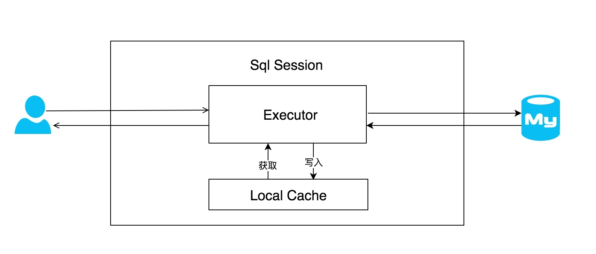

# Mybatis-Plus 笔记

## Mabatis

### Mybatis-缓存机制分析

> MyBatis默认提供一级缓存方案，如果是相同的SQL语句，会优先命中一级缓存，避免直接对数据库进行查询，提高性能。具体执行过程如下图所示。

**如上图所示 ：** 每个SqlSession中持有了Executor，每个Executor中有一个LocalCache。当用户发起查询时，MyBatis根据当前执行的语句生成 MappedStatement ，在Local Cache进行查询，如果缓存命中的话，直接返回
结果给用户，如果缓存没有命中的话，查询数据库，结果写入 Local Cache ，最后返回结果给用户。

具体实现类的类关系图如下图所示。

