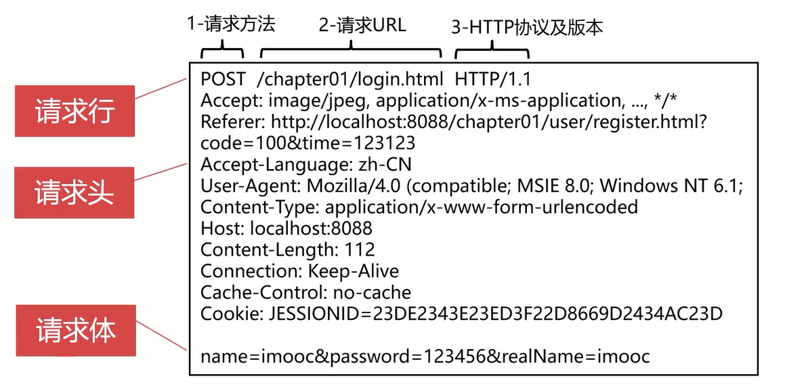
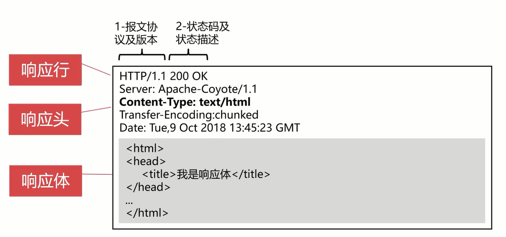
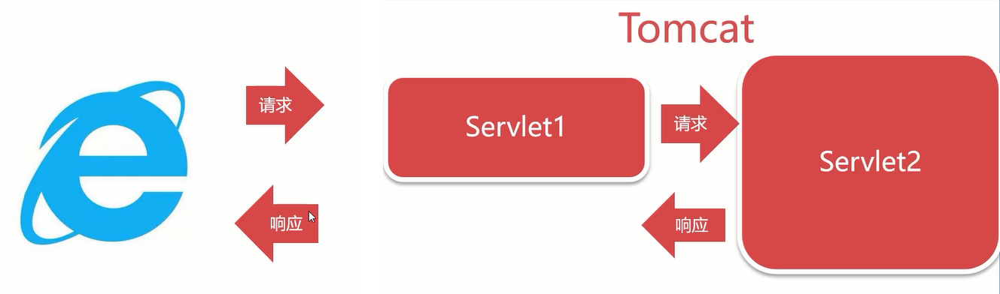
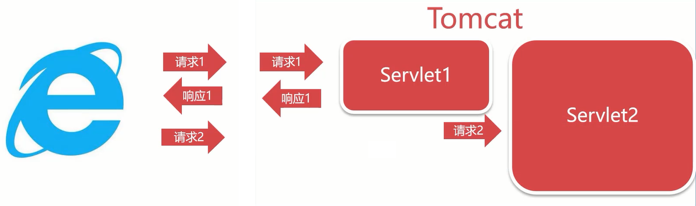

# 面试相关笔记


## 自我介绍

- 我是谁
- 我做过什么
- 我的优势在哪里


## 谈谈你的职业规划

​	


## JavaSE常见面试题

### JDK、JRE、JVM有什么区别

​	JDK是针对Java程序员的开发工具包，JRE是Java的运行时环境，JVM用于运行字节码文件，也是java语言跨平台的核心


### Servlet执行流程

Servlet的执行流程主要包括以下几个步骤：

1. **请求发起**：
   - 客户端（通常是Web浏览器）通过URL向Web服务器发送HTTP请求。
   - 根据URL，浏览器与服务器建立TCP连接。
2. **请求接收**：
   - Web服务器接收到HTTP请求后，根据配置找到对应的Web应用上下文。
   - 服务器解析请求报文，将请求行、请求头和请求体封装到一个`ServletRequest`对象中。
3. **映射查找**：
   - 服务器根据`web.xml`配置文件或其他配置方式（如注解），找到与请求URL路径相匹配的Servlet映射。
   - 如果Servlet还没有实例化，则服务器会反射创建Servlet实例，并调用其无参构造函数初始化。
4. **实例化和初始化**：
   - 对于首次访问或服务器启动后的第一个请求，服务器会调用Servlet的`init()`方法进行一次性初始化，通常在这个方法中可以做一些全局资源的设置。
5. **请求处理**：
   - 服务器调用Servlet的`service()`方法来处理请求。`service()`方法根据请求类型（GET、POST等）调用相应的doGet()或doPost()方法。
   - 在这些方法内部，Servlet从`ServletRequest`对象获取请求参数，处理业务逻辑，并可能访问数据库、其他系统资源等。
   - 处理完成后，Servlet准备响应信息，这通常包括设置响应状态码、响应头和响应体，它们会被封装到一个`ServletResponse`对象中。
6. **响应生成**：
   - Servlet通过`ServletResponse`对象写入响应内容，比如HTML页面、JSON数据等。
   - 当响应输出完成后，Servlet可能会执行一些清理工作，但通常不会在每次请求时都执行清理操作。
7. **销毁阶段**：
   - 当Web应用程序被卸载或者服务器关闭时，服务器会调用Servlet的`destroy()`方法释放资源，这是Servlet生命周期中的最后一个阶段。
8. **断开连接**：
   - 服务器完成响应消息的封装并将其发送给客户端，然后关闭与客户端的TCP连接。
9. **后续请求复用**：
   - 对于后续的请求，如果Servlet是多线程模型且没有达到容器配置的最大并发数，那么服务器将重用已存在的Servlet实例，直接调用其`service()`方法处理新请求，而不是重新实例化。

注意：Servlet是采用的单例多线程来达到并发环境下的访问的


### Servlet的生命周期

1. 装载-web.xml
2. 创建Servlet-构造函数
   - 在客户端第一次访问Servlet地址的时候创建
3. 初始化-init()
4. 提供服务
   - service()：doGet、doPost等
5. 销毁-destroy()
   - 在Web应用程序重启或关闭时执行


​	在Servlet容器（如Tomcat）中，Servlet默认情况下采用的是单例模式，即对于每一个Servlet类，在整个应用程序的生命周期内通常只会创建一个实例。为了处理并发请求，Servlet容器并不为每个请求创建新的Servlet对象，而是通过多线程技术来实现并发处理。

具体做法如下：

1. **线程池**：Servlet容器维护一个线程池，当接收到客户端请求时，从线程池中取出一个空闲线程。
2. **请求分配**：将请求与Servlet实例关联起来，由这个线程调用Servlet实例的`service()`方法或者其他HTTP方法（如`doGet()`、`doPost()`等）来处理请求。
3. **线程安全**：由于多个请求会共享同一个Servlet实例，因此需要确保Servlet内部的数据操作是线程安全的。如果存在成员变量被多个请求同时访问的情况，开发人员需要自行保证线程安全性，比如使用同步代码块或原子类等手段避免数据竞争和状态不一致问题。

另外，早期Servlet规范提供了`SingleThreadModel`接口，表示该Servlet支持一次只处理一个请求的方式。但即便实现了此接口，Servlet容器仍然可能复用实例，只是在每次请求到来时都创建一个新的线程来执行服务方法，而不是让多个请求在一个Servlet实例上并发执行。不过，现代Servlet规范已经不推荐使用`SingleThreadModel`，因为它会导致不必要的资源消耗，并且不能解决所有线程安全问题，更好的方式是遵循线程安全编程原则，减少或消除成员变量的共享状态。


### http的结构

#### 请求-request

​	包含三部分：请求行，请求头，请求体



**注意：** 在get请求中是没有请求体的，get请求体的内容会附加在url后面


#### 响应-response

​	包含三部分：响应行、响应头、响应体




### 请求转发和重定向的区别

- 请求转发是服务器跳转，只会产生一次请求

  - 代码：request.getRequestDispatcher().forward()

  

- 响应重定向是浏览器跳转，会产生两次请求

  - 代码：response.sendRedirect()

  


### statement和PreparedStatement的区别

- PreparedStatement是预编译的SQL语句，效率高于Statement
- PreparedStatement支持?操作符，相对于Statement更加灵活，可读性更好
- PreparedStatement可以防止SQL注入，安全性高于Statement


### JDBC的使用步骤

1. 加载JDBC驱动
2. 创建数据库连接(Connection)
3. 创建命令(Statement)
4. 处理结果(ResultSet)
5. 关闭连接

```java
	/**
     * 驱动名称
     */
    public static final String DRIVER_NAME = "com.mysql.cj.jdbc.Driver";

    /**
     * 连接地址
     */
    public static final String URL = "jdbc:mysql://127.0.0.1:3306/java_001";

    /**
     * 数据库用户名
     */
    public static final String USERNAME = "root";

    /**
     * 数据库密码
     */
    public static final String PASSWORD = "root";


    public static void main(String[] args) throws ClassNotFoundException {

        // 1. 加载驱动
        Class.forName(DRIVER_NAME);
        // 这里使用try-with-resources语句来处理资源的关闭
        try (
             // 2. 建立连接
             Connection connection = DriverManager.getConnection(URL, USERNAME, PASSWORD);
             // 3. 创建命令
             Statement statement = connection.createStatement()) {
            
            // 4. 处理结果
            ResultSet resultSet = statement.executeQuery("select * from user");

            while (resultSet.next()) {
                System.out.println(resultSet.getString("name"));
            }
        } catch (SQLException e) {
            throw new RuntimeException(e);
        }
    }
```

​	在Java 7及更高版本中，可以使用try-with-resources语句自动管理资源的关闭，包括数据库连接、输入输出流等实现了`AutoCloseable`接口的对象。这样可以避免手动关闭资源时可能出现的资源泄露问题。在try代码块结束时（无论是否抛出异常），系统都会自动调用它们的`close()`方法来关闭资源。这种方式极大地简化了资源管理，并增强了程序的健壮性。


### MySQL编程题

```sql
drop table if EXISTS dept;
create table dept(
                     deptno int(10) UNSIGNED not NULL auto_increment,
                     dname varchar(50) CHARACTER SET utf8mb4,
                     loc varchar(50) CHARACTER SET utf8mb4,
                     PRIMARY KEY (deptno) USING BTREE
) ENGINE = INNODB CHARACTER SET = utf8mb4;


insert dept VALUES(10, 'ACCOUNTING', 'NEW YORK');
insert dept VALUES(20, 'RESEARCH', 'DALLAS');
insert dept VALUES(30, 'SALES', 'CHICAGO');

drop table if EXISTS emp;
create table emp(
                    empno int(10) UNSIGNED not NULL auto_increment,
                    ename varchar(50) CHARACTER SET utf8mb4,
                    job varchar(20) CHARACTER SET utf8mb4,
                    mgr int(10) UNSIGNED NULL default null,
                    hiredate date NULL DEFAULT null,
                    sal decimal(10,2) null default null,
                    comm decimal(7,2) null default null,
                    deptno int(10) UNSIGNED NULL DEFAULT NULL,
                    PRIMARY KEY (empno) USING BTREE,
                    INDEX deptno(deptno) USING BTREE
) ENGINE = INNODB CHARACTER SET = utf8mb4;

insert emp VALUES(7369, 'SMITH', 'CLERK', 7902, '1980-12-17', 800.00, null, 20);
insert emp VALUES(7499, 'ALLEN', 'SALESMAN', 7698, '1981-02-20', 1600.00, 300.00, 30);
insert emp VALUES(7521, 'WARD', 'SALESMAN', 7698, '1981-02-22', 1250.00, 500.00, 30);
insert emp VALUES(7566, 'JONES', 'MANAGER', 7839, '1981-04-02', 2975.00, null, 20);
insert emp VALUES(7654, 'MARTIN', 'SALESMAN', 7698, '1981-09-28', 1250.00, 1400.00, 30);
insert emp values(7698, 'BLAKE', 'MANAGER', 7839, '1981-05-01', 2850.00, null, 30);
insert emp values(7782, 'CLARK', 'MANAGER', 7839, '1981-06-09', 2450.00, null, 10);
insert emp values(7788, 'SCOTT', 'ANALYST', 7566, '1987-04-19', 3000.00, null, 20);
insert emp values(7839, 'KING', 'PRESIDENT', null, '1981-11-17', 5000.00, null, 10);
insert emp values(7844, 'TURNER', 'SALESMAN', 7698, '1981-09-08', 1500.00, 0.00, 30);
insert emp  values(7876, 'ADAMS', 'CLERK', 7788, '1987-05-23', 1100.00, null, 20);
insert emp values(7900, 'JAMES', 'CLERK', 7698, '1981-12-03', 950.00, null, 30);
insert emp values(7902, 'FORD', 'ANALYST', 7566, '1981-12-03', 3000.00, null, 20);
```


**题目及答案示例**

```sql
# 1.按照部门编号升序、工资倒序来排列员工信息
select * from emp order by deptno, sal desc;

# 2.列出deptno=30的部门名称及员工信息
select d.dname, e.* from dept d join emp e on e.deptno = d.deptno where d.deptno = 30;

# 3.列出每个部门最高、最低及平均工资
select max(sal), min(sal), avg(sal), count(*), d.dname from emp e left JOIN dept d on e.deptno = d.deptno group by e.deptno;

# 4. 列出市场部(SALES)及研发部(RESEARCH)）的员工
select d.dname, e.*  from dept d join emp e on d.deptno = e.deptno where d.dname = 'SALES' or d.dname = 'RESEARCH';

# 5. 列出人数超过3人的部门
select d.dname, count(*)  from dept d join emp e on d.deptno = e.deptno GROUP BY d.dname HAVING count(*) > 3;

# 6. 计算ALLEN年薪比SMITH高多少
select a.sal - b.sal as 'ALLEN年薪比SMITH高'  from (select sal from emp where ename = 'ALLEN')a,(select sal from emp where ename = 'SMITH')b;

# 7. 列出直接向King汇报的员工
select emp.*  from emp where emp.mgr = (select empno from emp where ename = 'KING');
select emp.* from emp,(select empno from emp where ename = "KING") t WHERE emp.mgr = t.empno;


# 8. 列出公司所有员工的工龄，并倒序排列
select *, TIMESTAMPDIFF(year,hiredate, CURRENT_DATE()) as seniority  from emp order by seniority desc;


# 9. 计算管理者与基层员工平均薪资差额
select (select avg(sal) from emp where job = 'MANAGER' or job = 'PRESIDENT') - avg(sal) from emp where job != 'MANAGER' or job != 'PRESIDENT';

select t.avg_sal - e.avg_sal from (select avg(sal) avg_sal from emp where job = 'MANAGER' or job = 'PRESIDENT') t,
(select avg(sal) avg_sal from emp where job != 'MANAGER' or job != 'PRESIDENT') e;
```


## 主流框架

### Spring

#### spring的IOC与DI的理解

- IOC指的是控制反转，是一种设计理念，要求由第三方对对象进行管理和控制，起本质是将对象创建的时机由编译期确定改为运行时确定
- DI依赖注入，是IOC的具体实现，由对象容器在运行时动态注入对象


#### spring的四种注入方式

- setter注入
- 构造器注入
- 注解注入
- Java Config注入


#### spring里Scope属性的作用于取值

​	spring管理的bean默认都采用“singleton“（单例模式）来创建，如果希望每次创建的bean对象都是新的实例而不是共享的，可将对应bean的scope属性更改为“prototype”，这样每次请求都会创建一个新的bean实例

​	创建时机不同：在singleton模式下，IOC容器初始化后，就会对该对象进行创建，而在prototype模式下，只有当我们从容器中获取该对象时，IOC容器才会去创建该对象


#### lazy-init属性的作用


#### @autowired与Resource有什么区别


### 
